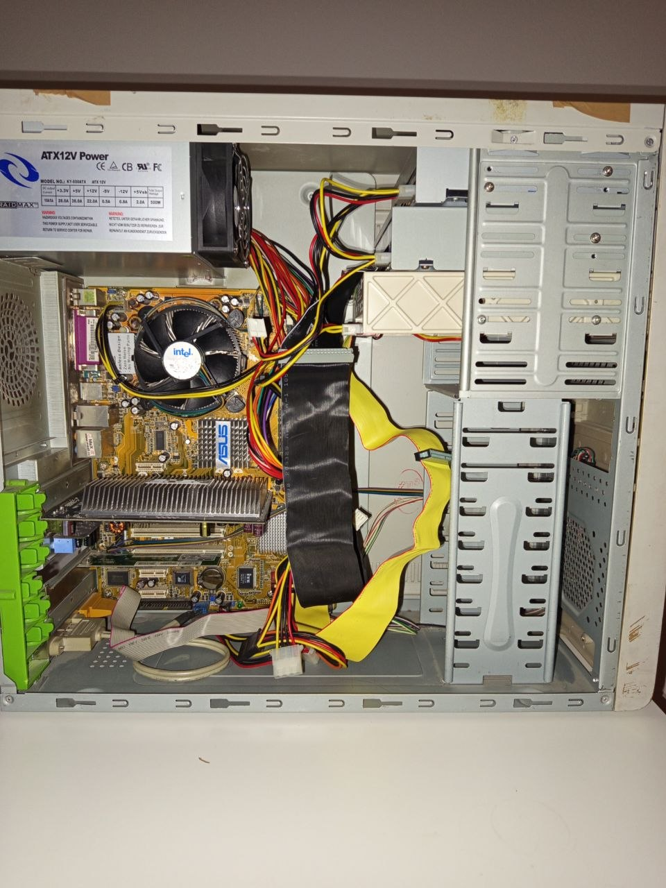
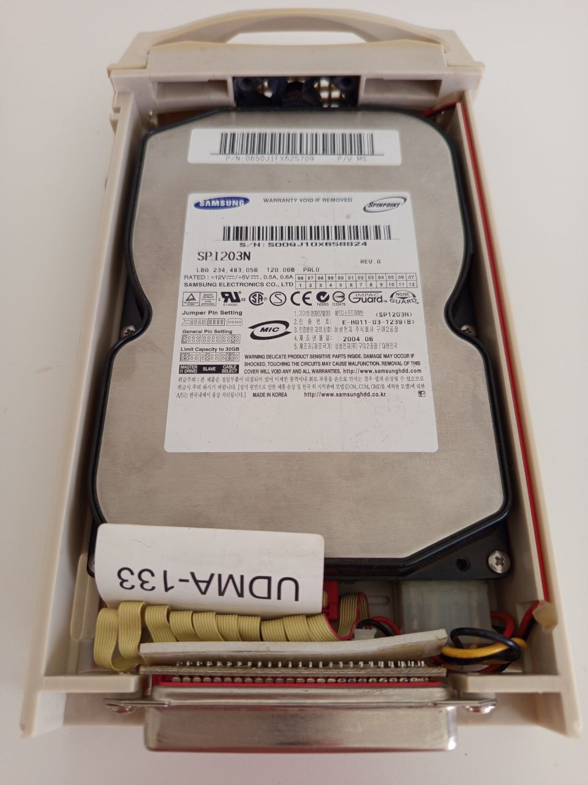
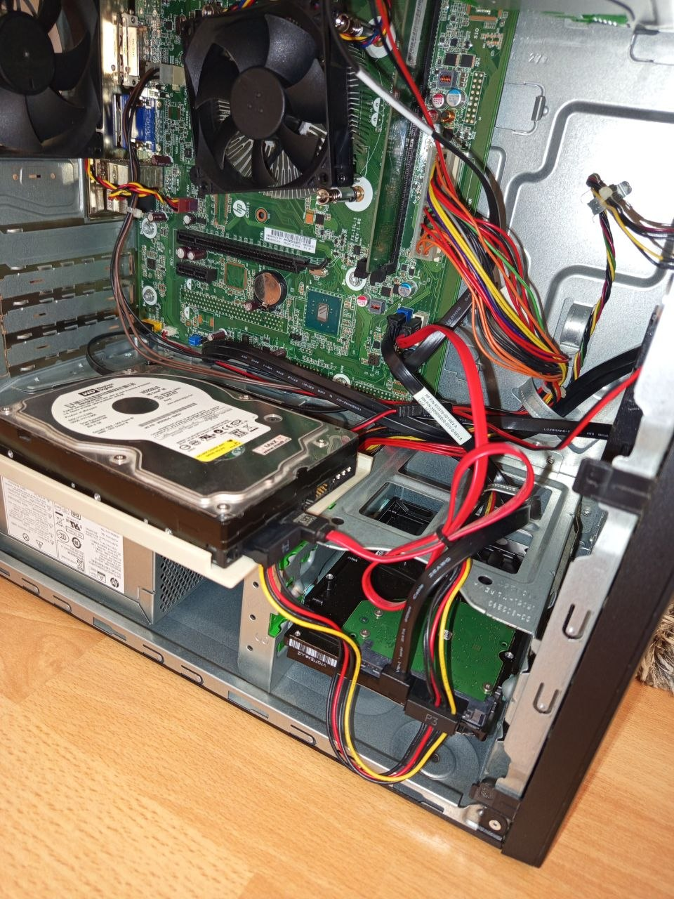
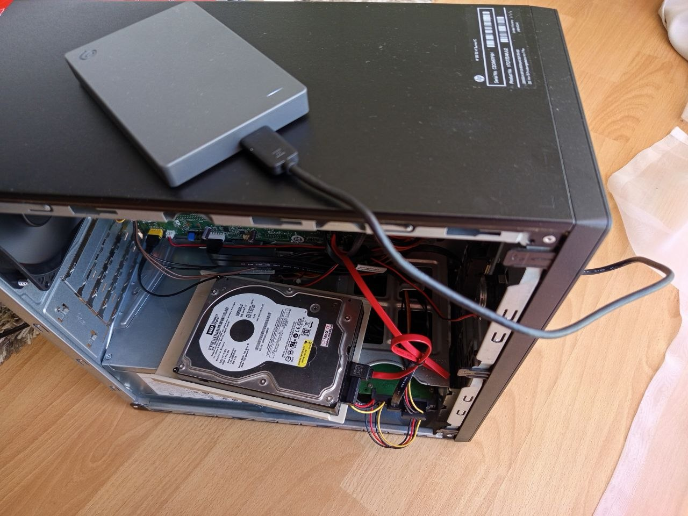

# Legacy Storage Troubleshooting and Backup

## Overview

This hardware case documents a practical troubleshooting and backup workflow using legacy desktop hardware, IDE/PATA storage, SATA storage, optical drives, and external USB backup storage.

The goal was to identify which storage devices were detected by BIOS, separate hardware connection issues from bootloader or operating system issues, and safely check old hard drives for existing data before formatting or reinstalling Windows.

## Lab Context

This case was performed as part of a beginner IT support home lab. The environment included multiple older desktop computers, internal hard drives, IDE/PATA and SATA connections, optical drives, and external storage devices.

## Devices Used

| Device | Type | Role in the case |
|---|---|---|
| Computer 1 | Legacy ASUS desktop | IDE/PATA storage testing system |
| Computer 2 | HP black desktop | Recovery, backup, and home lab workstation |
| Computer 3 - HP All-in-One | Hardware upgrade system | Used for RAM upgrade documentation and backup preparation |
| WD SATA HDD source | Legacy storage source for backup | WD SATA HDD tested in Computer 2 using SATA connection; files checked and backed up |
| Samsung SP1203N | IDE/PATA HDD | Legacy hard drive tested in Computer 1 |
| Internal Seagate SATA HDD in Computer 2 | SATA HDD | Internal system drive used to access Windows and perform recovery/backup work |
| Seagate external drive | USB storage | Backup destination |
| ASUS DRW-1608P3S | Optical drive | DVD/CD writer detected in BIOS on Computer 1 |
| LG DVD drive | Optical drive | Additional DVD/CD writer tested in Computer 1 |

## Objectives

- Identify legacy storage devices in BIOS.
- Test IDE/PATA HDD detection.
- Test SATA HDD detection and data access behaviour.
- Avoid formatting unknown drives before checking for data.
- Back up old files to external storage.
- Document a realistic first-level IT support troubleshooting process.

## Key Result

The Samsung SP1203N IDE/PATA hard drive was detected by BIOS, but the system did not boot successfully from it.  
The Western Digital SATA hard drive was tested in Computer 2 using a SATA connection. It did not boot as a standalone Windows system drive, but files were visible and are being backed up to the external Seagate USB drive.

## Files in This Case

- [01-analysis.md](01-analysis.md) - initial device and issue analysis
- [02-troubleshooting-steps.md](02-troubleshooting-steps.md) - step-by-step troubleshooting workflow
- [03-backup-and-data-check.md](03-backup-and-data-check.md) - data check and backup documentation
- [images/](images/) - photos and screenshots from the hardware case

## Skills Demonstrated

- Legacy hardware identification
- IDE/PATA and SATA storage troubleshooting
- BIOS device detection
- Boot priority configuration
- Basic data recovery precautions
- External backup workflow
- Hardware documentation
- Structured troubleshooting documentation

## Visual Documentation

### Computer 1 - Legacy ASUS desktop

### Samsung SP1203N IDE/PATA HDD

### Western Digital SATA HDD Test

### Backup to External Seagate USB Drive

