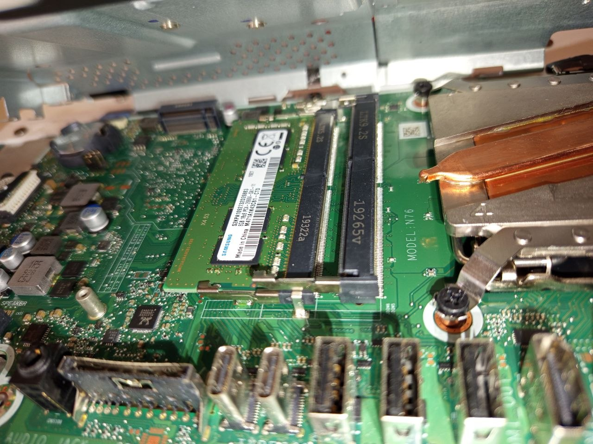
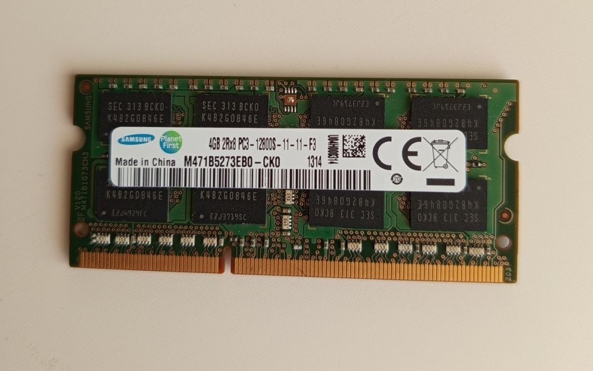
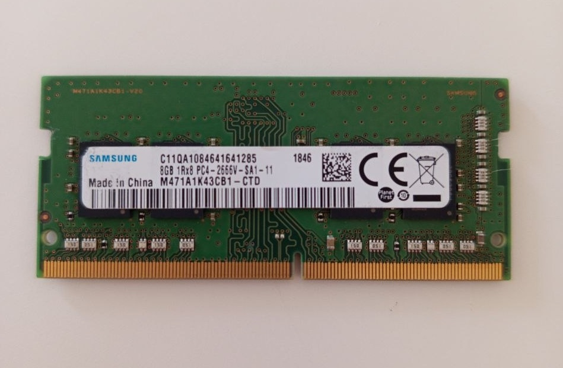

# Analysis – RAM Upgrade

---

## Overview

This document analyzes different RAM upgrade options for an HP All-in-One system.

---

## Initial Situation

- Device: HP All-in-One
- Installed RAM: 8GB DDR4 SO-DIMM (Samsung)
- One free RAM slot available

---

## Hardware Components

### Available RAM Modules

- 8GB DDR4 SO-DIMM (Samsung – already installed)

- 4GB DDR4 (Samsung – available, not selected because the form factor appeared different)

- 8GB DDR4 SO-DIMM (Samsung – new upgrade module)

---

## Upgrade Options

### Option 1: 8GB + 4GB (12GB total)

**Status:** Not selected.

**Reason:**

- The 4GB module did not appear to match the same physical RAM module format as the installed 8GB SO-DIMM.
- Because the form factor looked different, it was not treated as a suitable upgrade option.
- Using a non-matching RAM module could cause installation or compatibility issues.

### Option 2: 8GB + 8GB (16GB total)

**Pros:**

- Full dual-channel configuration
- Increased total memory
- Better system performance
- Balanced memory usage
- Stable long-term solution

**Cons:**

- Requires additional RAM purchase

---

## Decision

Selected configuration: **Option 2 — 16GB total RAM (8GB + 8GB)**

Reason:

- The new 8GB module matched the required SO-DIMM form factor
- The new 8GB module matched the existing 8GB capacity
- The 8GB + 8GB configuration enabled full dual-channel performance
- This enabled a balanced 8GB + 8GB configuration
- Matching RAM capacity provided a more stable and efficient memory configuration
- This was the safer and more suitable upgrade option than using the available 4GB module with a different-looking form factor
- The 16GB configuration was the better long-term upgrade strategy

---

## Final Installation

---

## Conclusion

- Best configuration for this system: **16GB dual-channel**
- Avoid mixing different RAM capacities when performance matters
- Matching RAM type, speed, and form factor helps reduce compatibility issues
