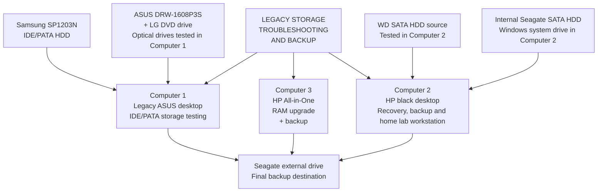

# Lab Environment Overview

---

This diagram shows the main devices and storage components used in the legacy storage troubleshooting and backup case. It gives a quick overview of which computers, hard drives, optical drives, and backup storage were involved.

It shows Computer 1 for IDE/PATA storage testing, Computer 2 for recovery work, Computer 3 for RAM-upgrade, and the external Seagate drive as the final backup destination.

---

