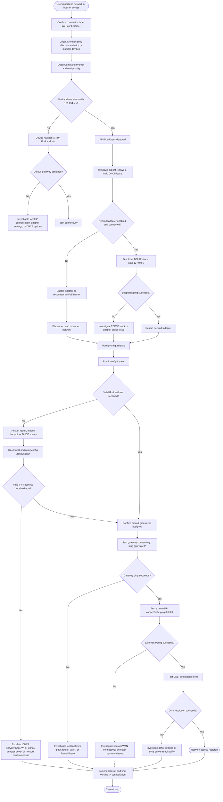

# Case 01 - No Network Access

This diagram maps the case-01 from the user symptom through ipconfig, DHCP renewal, connectivity testing, escalation paths, and final documentation.

---

```mermaid
flowchart TD
    A([User reports no network or internet access]) --> B[Confirm connection type: Wi-Fi or Ethernet]
    B --> C[Check whether issue affects one device or multiple devices]

    C --> D[Open Command Prompt and run ipconfig]
    D --> E{IPv4 address starts with 169.254.x.x?}

    E -- No --> F[Device has non-APIPA IPv4 address]
    F --> G{Default gateway assigned?}
    G -- No --> H[Investigate local IP configuration, adapter settings, or DHCP options]
    G -- Yes --> I[Test connectivity]

    E -- Yes --> J[APIPA address detected]
    J --> K[Windows did not receive a valid DHCP lease]
    K --> L{Network adapter enabled and connected?}

    L -- No --> M[Enable adapter or reconnect Wi-Fi/Ethernet]
    M --> N[Disconnect and reconnect network]

    L -- Yes --> O[Test local TCP/IP stack: ping 127.0.0.1]
    O --> P{Loopback ping succeeds?}
    P -- No --> Q[Investigate TCP/IP stack or adapter driver issue]
    P -- Yes --> R[Restart network adapter]

    N --> S[Run ipconfig /release]
    R --> S
    Q --> S
    S --> T[Run ipconfig /renew]
    T --> U{Valid IPv4 address received?}

    U -- No --> V[Restart router, mobile hotspot, or DHCP source]
    V --> W[Reconnect and run ipconfig /renew again]
    W --> X{Valid IPv4 address received now?}

    X -- No --> Y[Escalate: DHCP server/router, Wi-Fi signal, adapter driver, or network hardware issue]
    X -- Yes --> Z[Confirm default gateway is assigned]

    U -- Yes --> Z
    Z --> AA[Test gateway connectivity: ping gateway IP]
    AA --> AB{Gateway ping succeeds?}

    AB -- No --> AC[Investigate local network path, router, Wi-Fi, or firewall issue]
    AB -- Yes --> AD[Test external IP connectivity: ping 8.8.8.8]

    AD --> AE{External IP ping succeeds?}
    AE -- No --> AF[Investigate internet/WAN connectivity or router upstream issue]
    AE -- Yes --> AG[Test DNS: ping google.com]

    AG --> AH{DNS resolution succeeds?}
    AH -- No --> AI[Investigate DNS settings or DNS server reachability]
    AH -- Yes --> AJ([Network access restored])

    AI --> AK[Document result and final working IP configuration]
    AF --> AK
    AC --> AK
    Y --> AK
    AJ --> AK
    AK --> AL([Case closed])
```
