```mermaid
flowchart TD
    A([User reports websites cannot be accessed by name]) --> B[Confirm network connection is active]
    B --> C[Test internet IP connectivity: ping 8.8.8.8]
    C --> D{Ping to 8.8.8.8 succeeds?}

    D -- No --> E[Not a DNS-only issue]
    E --> F[Investigate general network, gateway, Wi-Fi, router, or ISP connectivity]
    F --> G([Escalate or continue network connectivity troubleshooting])

    D -- Yes --> H[Internet connectivity confirmed]
    H --> I[Test DNS resolution: ping google.com]
    I --> J{Ping google.com succeeds?}

    J -- Yes --> K[DNS appears functional]
    K --> L[Investigate browser cache, proxy, firewall, or specific website issue]
    L --> M([Continue application-level troubleshooting])

    J -- No --> N[DNS resolution failure confirmed]
    N --> O[Check DNS configuration: ipconfig /all]
    O --> P{DNS server missing, incorrect, or unreachable?}

    P -- No --> Q[Test DNS manually: nslookup google.com]
    P -- Yes --> R[Open Network Settings]

    Q --> S{nslookup returns valid response?}
    S -- Yes --> T[DNS server responds]
    T --> U[Flush DNS cache and retest browser]
    S -- No --> V[DNS server not responding or giving incorrect response]
    V --> R

    R --> W[Navigate to Network & Internet → Adapter Options]
    W --> X[Open network adapter Properties]
    X --> Y[Select Internet Protocol Version 4 IPv4]
    Y --> Z{Use DHCP DNS or manual DNS?}

    Z -- DHCP DNS --> AA[Set DNS to obtain automatically]
    Z -- Manual DNS --> AB[Set valid DNS server, e.g. 8.8.8.8]

    AA --> AC[Apply changes]
    AB --> AC
    AC --> AD[Flush DNS cache: ipconfig /flushdns]
    U --> AD

    AD --> AE[Test DNS again: ping google.com]
    AE --> AF{DNS resolution succeeds?}

    AF -- No --> AG[Test alternate DNS server or investigate router/DHCP DNS settings]
    AG --> AH{Issue resolved after alternate DNS or router fix?}
    AH -- No --> AI[Escalate: DNS server, DHCP scope, firewall, VPN, proxy, or ISP DNS issue]
    AH -- Yes --> AJ[Websites accessible by name]

    AF -- Yes --> AJ
    AJ --> AK[Confirm internet fully functional]
    AK --> AL[Document final DNS configuration and test results]
    AL --> AM([Case closed])
```

# Case 02 – DNS Resolution Failure

---

This diagram shows the DNS-specific logic: IP connectivity works, name resolution fails, DNS settings are checked or corrected, the DNS cache is flushed, and access is verified.

This diagram shows how to troubleshoot a DNS issue where internet connectivity works by IP address, but websites cannot be reached by name. It follows the process from testing `ping 8.8.8.8`, checking DNS resolution with `ping google.com` and `nslookup`, correcting DNS settings, flushing the DNS cache, and verifying that websites load again.

---

