```mermaid
flowchart TD
    A([User reports Access Denied when opening shared folder]) --> B[Confirm shared folder path: \\fileserver\\shared]
    B --> C[Test network connectivity: ping fileserver]
    C --> D{Ping succeeds?}

    D -- No --> E[Investigate network connectivity, DNS, firewall, or server availability]
    E --> F([Escalate or continue connectivity troubleshooting])

    D -- Yes --> G[Network connectivity confirmed]
    G --> H[Open shared path: \\fileserver\\shared]
    H --> I{Folder visible?}

    I -- No --> J[Verify share name, server path, DNS name, and share availability]
    J --> K([Correct path or server/share issue])

    I -- Yes --> L{Can user open the folder?}
    L -- Yes --> M[Access works]
    M --> N[Verify file open/modify permissions based on role]

    L -- No --> O[Access denied confirmed]
    O --> P[Verify user account]
    P --> Q[Confirm user is logged into domain]
    Q --> R[Verify correct username]
    R --> S[Check Active Directory group membership]
    S --> T{User is in correct AD group?}

    T -- No --> U[Add user to required AD security group]
    T -- Yes --> V[Check share permissions on server]

    U --> W[User logs off and logs back in or runs gpupdate if needed]
    W --> V

    V --> X{Share permission allows required access?}
    X -- No --> Y[Update share permissions, e.g. Read or Modify]
    X -- Yes --> Z[Check NTFS permissions in Security tab]

    Y --> Z
    Z --> AA{NTFS permission allows required access?}
    AA -- No --> AB[Update NTFS permissions for user or AD group]
    AA -- Yes --> AC[Permissions appear correct]

    AB --> AD[Apply permission changes]
    AC --> AE[Refresh user token: log off/log on or gpupdate]
    AD --> AE

    AE --> AF[Test access to \\fileserver\\shared again]
    AF --> AG{Access successful?}

    AG -- No --> AH[Recheck effective permissions, deny entries, inheritance, group nesting, and cached credentials]
    AH --> AI([Escalate to server or AD administration])

    AG -- Yes --> AJ[User can access shared folder]
    AJ --> AK[Verify files can be opened or modified according to permission level]
    AK --> AL[Document AD group, share permission, NTFS permission, and result]
    AL --> AM([Case closed])
```

# Case 03 – Shared Folder Access Denied

---

This diagram shows the shared-folder access workflow how to troubleshoot a shared folder permission issue in a Windows domain environment. It follows the process from confirming network connectivity and the shared path, checking the user’s domain account and AD group membership, reviewing share and NTFS permissions, applying the required permission changes, and verifying that the user can access the folder.

The important distinction here is share permissions vs. NTFS permissions vs. AD group membership.

---

