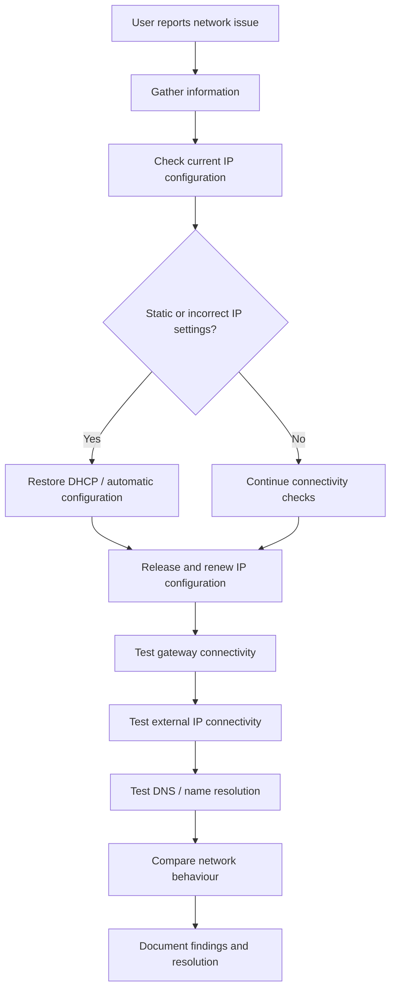

## Troubleshooting Method

This flowchart represents the structured approach used in this network troubleshooting case.

### Key Steps Explained

- **Gather information**: collect the affected device, connection type, symptoms, and recent changes.
- **Check current IP configuration**: use `ipconfig` to review IP address, subnet mask, gateway, and DNS settings.
- **Restore DHCP / automatic configuration**: remove incorrect static IPv4 or DNS settings when needed.
- **Release and renew IP configuration**: use `ipconfig /release` and `ipconfig /renew` to request a fresh DHCP configuration.
- **Test gateway connectivity**: use `ping` to check whether the device can reach the configured default gateway.
- **Test external IP connectivity**: use `ping 8.8.8.8` to check whether external network access works.
- **Test DNS / name resolution**: use `ping google.com` to check whether DNS/name resolution works.
- **Compare network behaviour**: compare Ethernet, home Wi-Fi, and mobile hotspot results.
- **Document findings and resolution**: record the issue, steps taken, test results, and final outcome.
