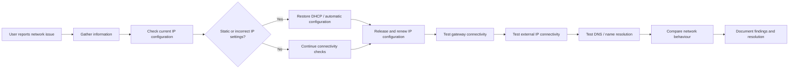

## Troubleshooting Method

This flowchart represents the structured approach used in this network troubleshooting case.

### Key Steps Explained

- **Gather information**: collect user details, environment, and symptoms  
- **Check basics**: verify connectivity, power, configuration  
- **Identify root cause**: isolate the actual issue  
- **Apply solution**: implement the fix  
- **Test solution**: confirm the issue is resolved  
- **Document case**: record the solution for future reference  
