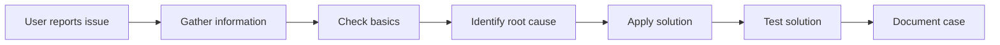

## Troubleshooting Method

This flowchart represents a structured approach to IT support troubleshooting,
based on best practices from Cisco IT Customer Support training.

```mermaid
flowchart LR
A[User reports issue] --> B[Gather information]
B --> C[Check basics]
C --> D[Identify root cause]
D --> E[Apply solution]
E --> F[Test solution]
F --> G[Document case]
```
