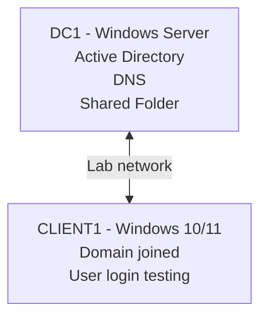
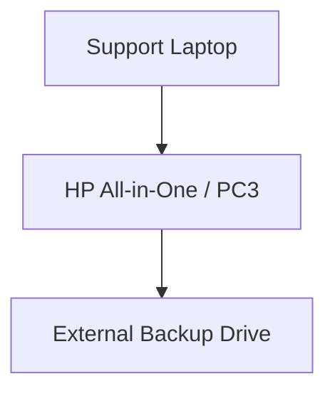
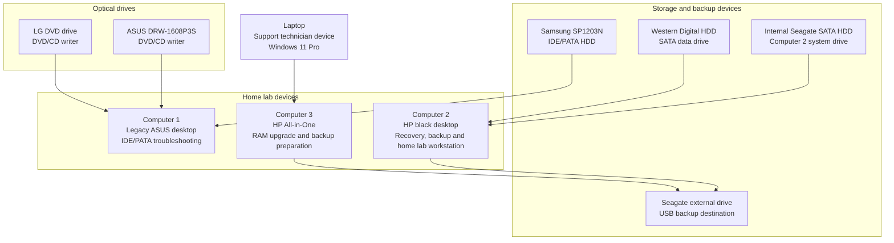

# Lab Environment Overview

---

```mermaid
flowchart TB
    DC1["DC1 - Windows Server<br/>Active Directory<br/>DNS<br/>Shared Folder"]
    CLIENT1["CLIENT1 - Windows 10/11<br/>Domain joined<br/>User login testing"]

    DC1 <-->|Lab network| CLIENT1
```

```mermaid
flowchart TB
    Laptop[Support Laptop]
    PC3[HP All-in-One / PC3]
    HDD[External Backup Drive]

    Laptop --> PC3
    PC3 --> HDD
```

# Lab environment overview

```mermaid
flowchart TB
    Laptop["Laptop<br/>Support technician device<br/>Windows 11 Pro"]

    subgraph LabDevices["Home lab devices"]
        C1["Computer 1<br/>Legacy ASUS desktop<br/>IDE/PATA troubleshooting"]
        C2["Computer 2<br/>HP black desktop<br/>Recovery, backup and home lab workstation"]
        C3["Computer 3<br/>HP All-in-One<br/>RAM upgrade and backup preparation"]
    end

    subgraph Storage["Storage and backup devices"]
        Samsung["Samsung SP1203N<br/>IDE/PATA HDD"]
        WD["Western Digital HDD<br/>SATA data drive"]
        SeagateInternal["Internal Seagate SATA HDD<br/>Computer 2 system drive"]
        SeagateExternal["Seagate external drive<br/>USB backup destination"]
    end

    subgraph Optical["Optical drives"]
        Optical1["ASUS DRW-1608P3S<br/>DVD/CD writer"]
        Optical2["LG DVD drive<br/>DVD/CD writer"]
    end

    Laptop --> C3

    Samsung --> C1
    Optical1 --> C1
    Optical2 --> C1

    SeagateInternal --> C2
    WD --> C2
    C2 --> SeagateExternal

    C3 --> SeagateExternal
```
