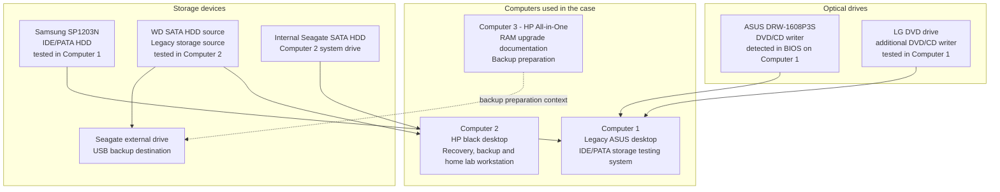

# Lab Environment Overview

---

This diagram shows the main devices and storage components used in the legacy storage troubleshooting and backup case. It gives a quick overview of which computers, hard drives, optical drives, and backup storage were involved.

---

