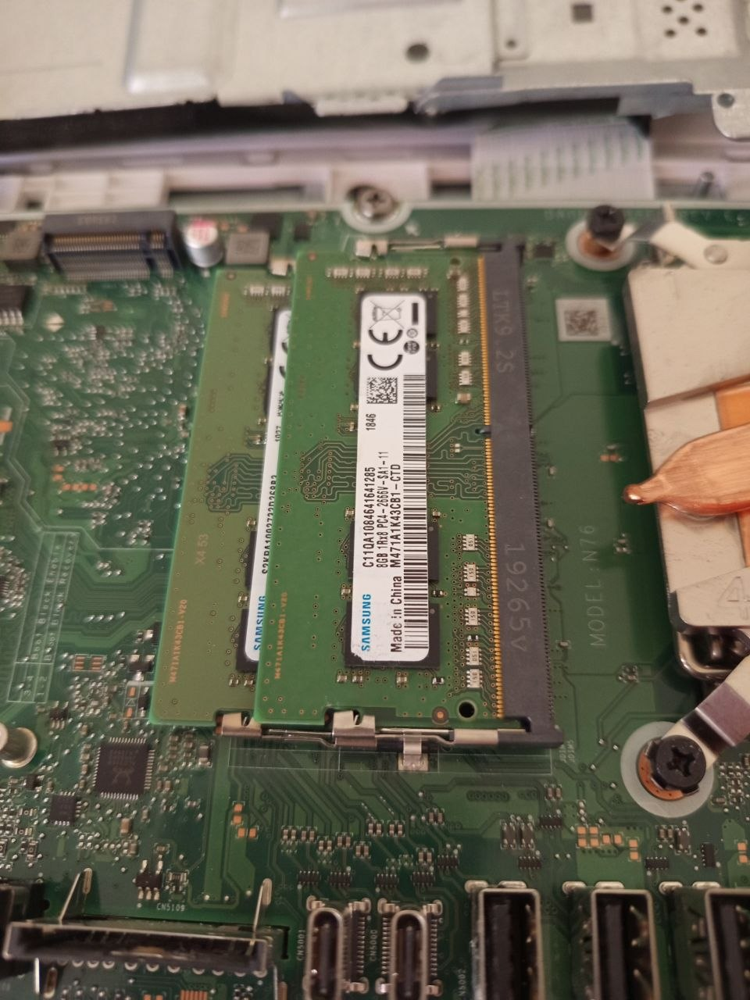

# Analysis – RAM Upgrade

## Overview

This document analyzes different RAM upgrade options for an HP All-in-One system.

## Initial Situation

- Device: HP All-in-One
- Installed RAM: 8GB DDR4 SO-DIMM (Samsung)
- One free RAM slot available

## Hardware Components

### Available RAM Modules

- 8GB DDR4 SO-DIMM (Samsung – already installed)

- 4GB DDR4 SO-DIMM (Samsung – available, not installed)

- 8GB DDR4 SO-DIMM (Samsung – new upgrade module)

## Upgrade Options

### Option 1: 8GB + 4GB (12GB total)

**Pros:**

- Increased total memory
- No additional cost

**Cons:**

- Mixed capacity
- Only partial dual-channel benefit
- Reduced performance efficiency
- Not optimal for long-term use
- Temporary solution only

### Option 2: 8GB + 8GB (16GB total)

**Pros:**

- Full dual-channel configuration
- Increased total memory
- Better system performance
- Balanced memory usage
- Stable long-term solution

**Cons:**

- Requires additional RAM purchase

## Decision

Selected configuration: **Option 2 — 16GB total RAM (8GB + 8GB)**

Reason:

- Enables full dual-channel performance
- Uses matching RAM capacity
- Provides more stable and efficient system behaviour
- Better long-term upgrade strategy

## Final Installation

## Conclusion

- Best configuration for this system: **16GB dual-channel**
- Avoid mixing different RAM capacities when performance matters
- Matching RAM type, speed, and form factor helps reduce compatibility issues
