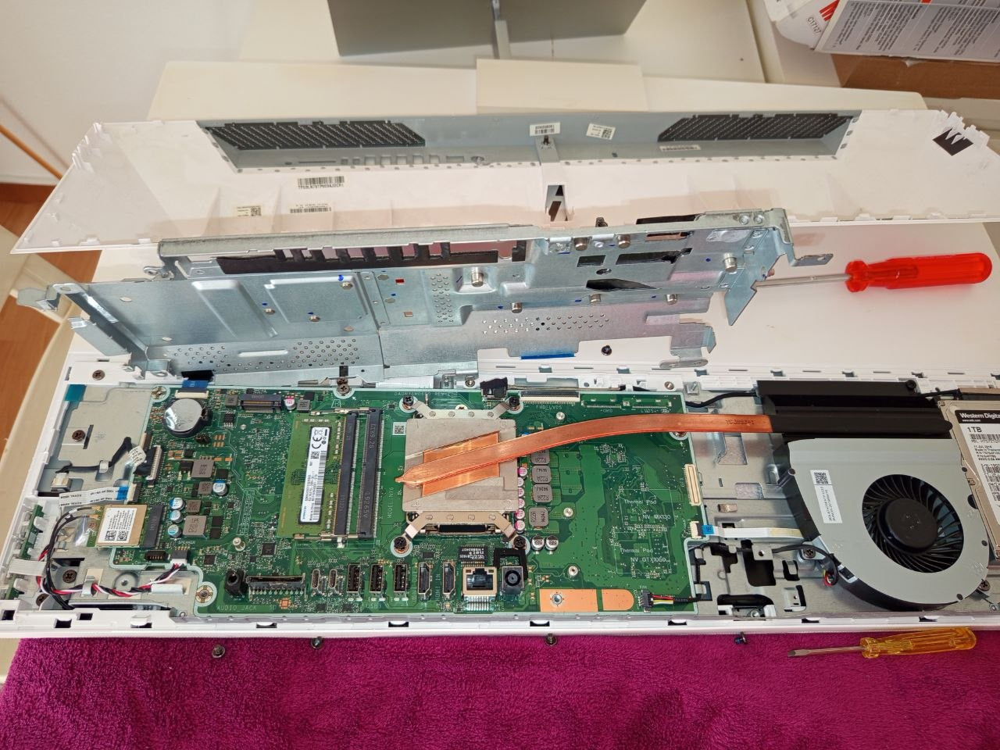

# Hardware Upgrade – RAM Installation

## Overview
This document describes the installation of an additional RAM module in an HP All-in-One system.

## Initial Situation
- Device: HP All-in-One
- Existing RAM: 8GB DDR4 SO-DIMM (Samsung)
- One free RAM slot available

## Objective
- Increase system memory from 8GB to 16GB
- Improve system performance
- Enable dual-channel memory configuration

## Preparation
- Powered off device
- Disconnected power cable
- Opened device carefully using screwdriver
- Located RAM slots on motherboard

## Device Disassembly

### Initial Setup

### Opening the Device

### RAM Slot Identification

## Hardware Installation Steps
1. Verified RAM compatibility (DDR4, SO-DIMM, 2666 MHz)
2. Inserted additional 8GB RAM module into free slot
3. Ensured correct alignment and secure fit (notch position at ~30 degrees)

> Note: The RAM module must be inserted at approximately a 30-degree angle and then pressed down until the retaining clips lock automatically.

4. Pressed RAM down until clips locked in place
5. Reassembled the device

### Initial RAM (8GB Installed)

### New RAM Installed (16GB Total)

## Verification
- Booted system successfully
- Checked system memory in OS
- Confirmed total RAM: **16GB**
- Verified system stability

## Result
- Upgrade successful
- System performance improved
- Dual-channel configuration active
- System running stable

## Skills Demonstrated
- Hardware installation
- Component compatibility verification
- Troubleshooting awareness
- Safe device handling
- System validation after upgrade

## Notes
- Matching RAM specifications is critical for compatibility
- Dual-channel memory improves performance
- Correct installation angle and pressure are critical
- Always power off the device before hardware changes
