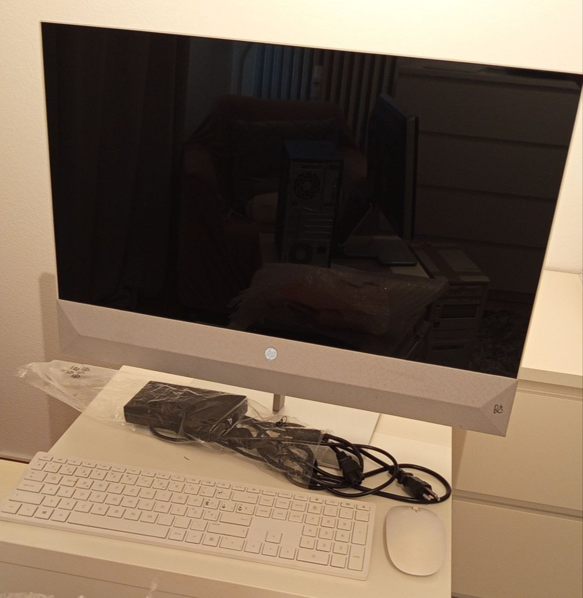
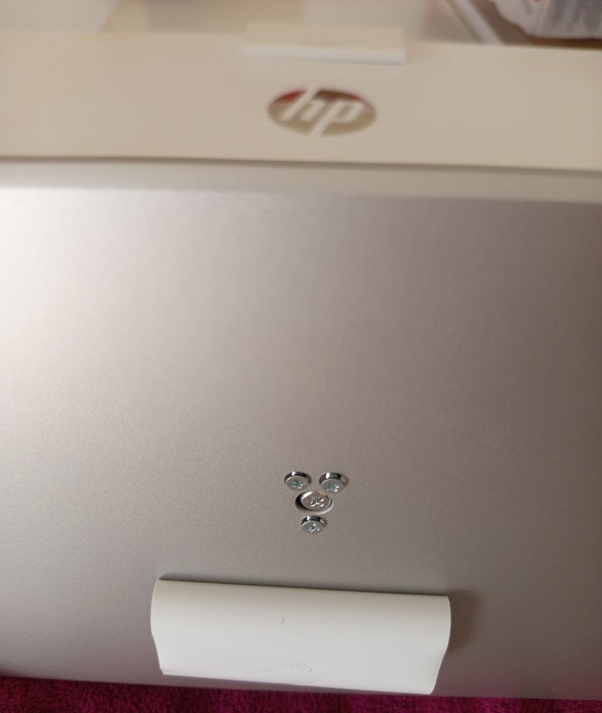
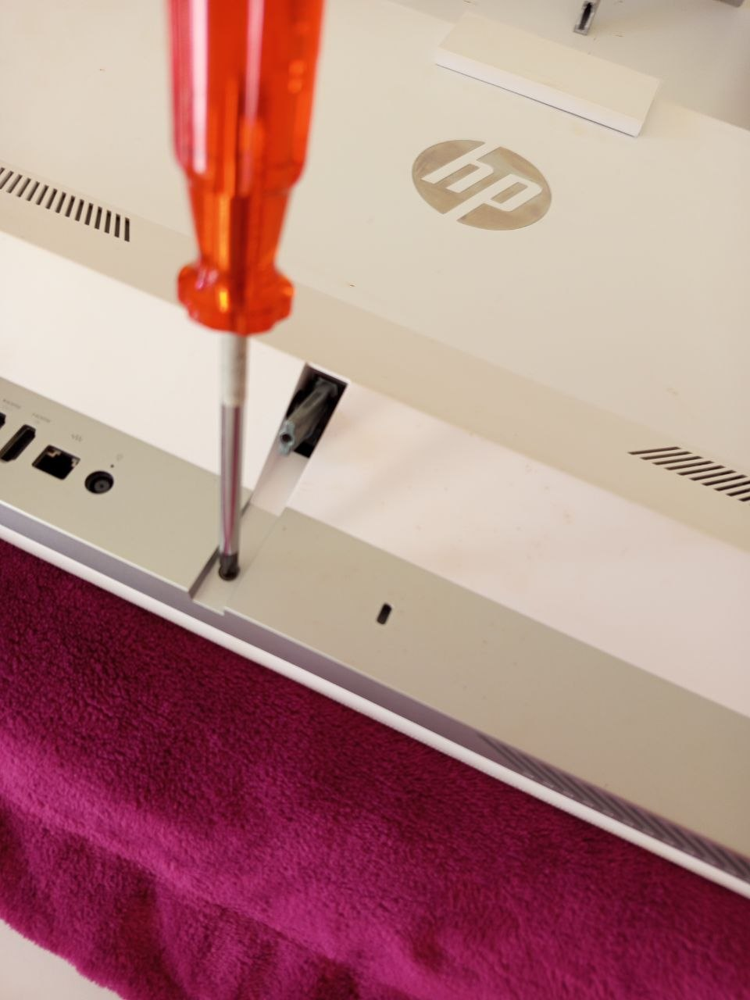
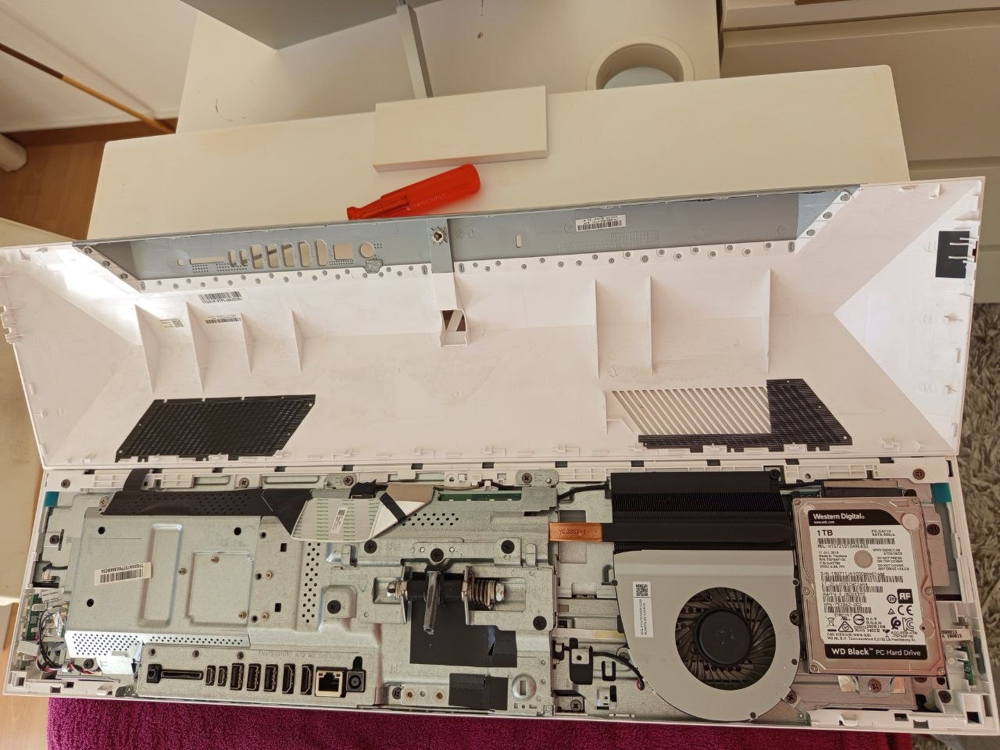
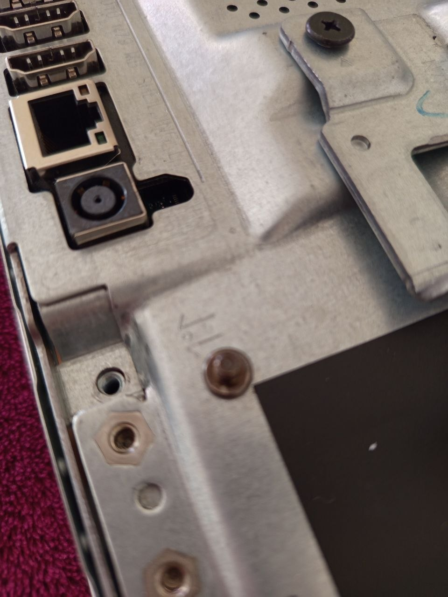
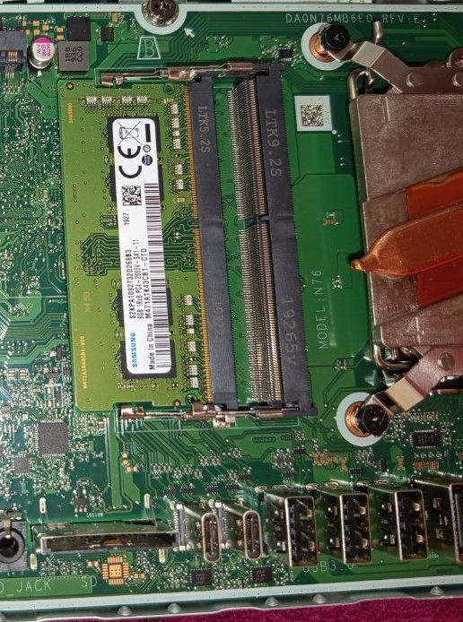
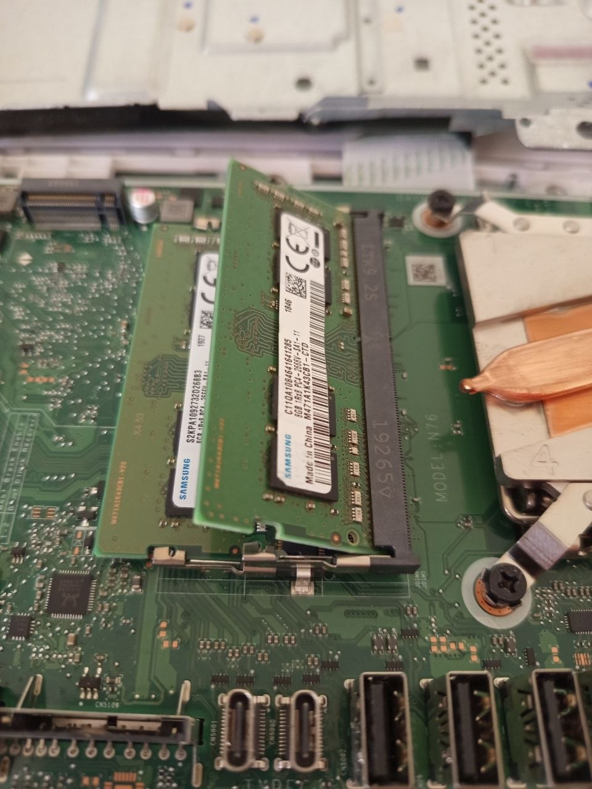

# Hardware Upgrade – RAM Installation

## Overview

This document describes the installation of an additional RAM module in an HP All-in-One system.

## Initial Situation

- Device: HP All-in-One
- Existing RAM: 8GB DDR4 SO-DIMM (Samsung)
- One free RAM slot available

## Objective

- Increase system memory from 8GB to 16GB
- Improve system performance
- Enable dual-channel memory configuration

## Preparation

- Powered off device
- Disconnected power cable
- Prepared screwdriver
- Opened device carefully
- Located RAM slots on motherboard

## Device Disassembly

### Initial Setup

### Removing Screws

### Opening the Device

### Screw and Cover Location Reference

### Internal Access

## RAM Slot Identification

The RAM area was located on the motherboard. One RAM slot was already populated with an 8GB Samsung DDR4 SO-DIMM module, and one additional slot was available for the upgrade.

## Hardware Installation Steps

1. Verified RAM compatibility: DDR4, SO-DIMM, 2666 MHz
2. Compared the existing 8GB RAM module with the new 8GB RAM module
3. Inserted the additional 8GB RAM module into the free slot
4. Ensured correct alignment using the notch position
5. Inserted the RAM module at approximately a 30-degree angle
6. Pressed the RAM module down until the retaining clips locked
7. Reassembled the device

### RAM Installation Angle

> Note: The RAM module must be inserted at approximately a 30-degree angle and then pressed down until the retaining clips lock automatically.

### New RAM Installed

## Verification

- Booted system successfully
- Checked system memory in Windows
- Confirmed total RAM: **16GB**
- Verified system stability

## Result

- Upgrade successful
- RAM upgraded from 8GB to 16GB
- Dual-channel configuration enabled
- System running stable

## Skills Demonstrated

- Comparing the existing RAM configuration with the planned upgrade
- Identifying the correct RAM type, speed, and form factor
- Installing 8GB RAM in an end-user device
- Following a structured RAM installation and verification workflow
- Verifying the memory upgrade in Windows using Task Manager and System Information to confirm the hardware upgrade
- Documenting the RAM upgrade process with clear before/after information
- Applying structured problem-solving during hardware installation

## Notes

- Matching RAM specifications is important for compatibility
- Dual-channel memory improves performance
- Correct installation angle and pressure are critical
- Always power off the device before hardware changes
