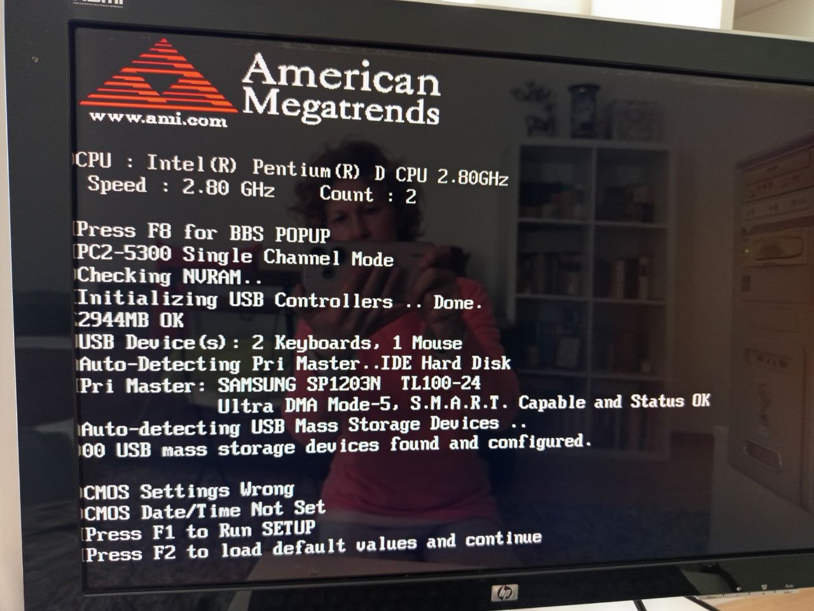
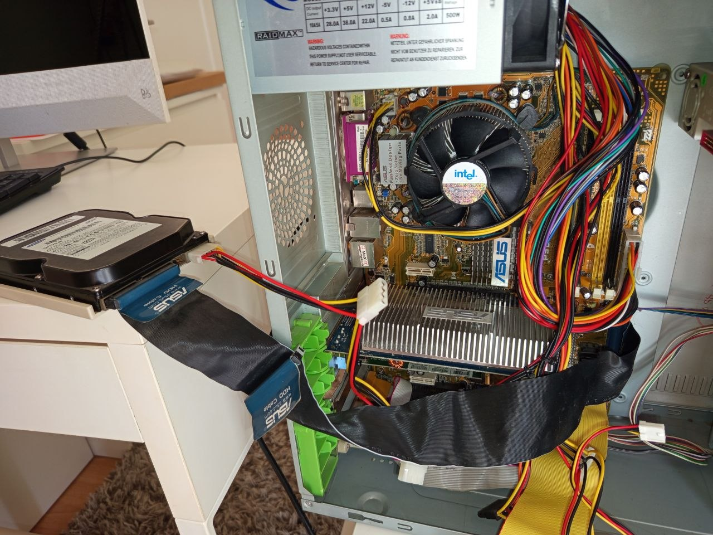
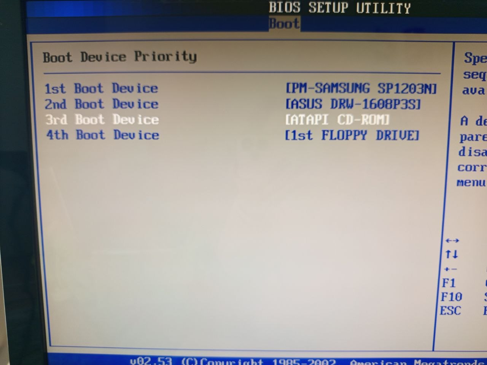
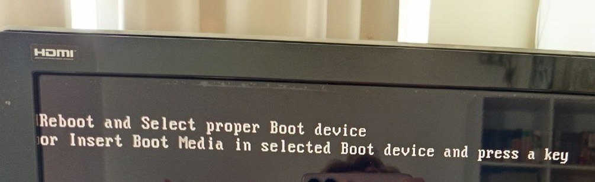

# 02 — Troubleshooting Steps

## Purpose

This document describes the troubleshooting steps used during the legacy storage and boot issue case.

The goal was to identify whether the problem was caused by hardware detection, cable configuration, BIOS boot order, or a missing/corrupted operating system boot process.

## Step 1 — Identify the Startup Problem

The ASUS legacy desktop displayed BIOS/CMOS warnings during startup:

```text
CMOS Settings Wrong
CMOS Date/Time Not Set
Press F1 to Run SETUP
Press F2 to load default values and continue
````

Later, after boot order changes, the system also displayed:

```text
Reboot and Select proper Boot device
or Insert Boot Media in selected Boot device and press a key
```

This showed that the computer could power on and enter BIOS, but it could not successfully boot into an operating system.


## Step 2 — Enter BIOS Setup

The BIOS setup utility was opened by pressing `DEL` during startup.

Inside BIOS, the following areas were checked:

* Main
* IDE Configuration
* Boot
* Boot Device Priority

This helped verify whether the hard drive and optical drives were detected by the system.

## Step 3 — Check IDE/PATA Detection

The Samsung SP1203N IDE/PATA hard drive was checked in BIOS.

The drive was detected as:

```text
Primary IDE Master: SAMSUNG SP1203N
Ultra DMA Mode-5
S.M.A.R.T. Capable and Status OK
```


This confirmed that:

* the hard drive received power
* the IDE/PATA data connection was working
* the motherboard could detect the drive
* the drive was not completely dead


## Step 4 — Reduce the Setup to Fewer Variables

To avoid confusion, the setup was reduced during testing.

The optical drives were temporarily disconnected, and the system was tested with only:

* Samsung SP1203N IDE/PATA HDD
* IDE/PATA ribbon cable
* Molex power cable



This made it easier to verify whether the hard drive alone could be detected and selected as a boot device.


## Step 5 — Check Boot Device Priority

The BIOS boot order was adjusted so that the Samsung hard drive was selected as the first boot device.

Boot order chosen during testing:

```text
1st Boot Device: PM-SAMSUNG SP1203N
2nd Boot Device: ASUS DRW-1608P3S
3rd Boot Device: ATAPI CD-ROM
4th Boot Device: Floppy Drive
```


The Samsung drive was visible as a boot option, which confirmed that BIOS could see the disk.

However, the system still did not boot successfully.


## Step 6 — Interpret the Boot Error

After saving the BIOS settings, the system displayed:

```text
Reboot and Select proper Boot device
or Insert Boot Media in selected Boot device and press a key
```


Because the hard drive was detected but did not boot, the likely causes were:

* missing operating system
* damaged or missing bootloader
* corrupted MBR
* incompatible Windows installation
* old system disk without a bootable installation
* data disk without an operating system

This was different from a basic power or cable failure.


## Step 7 — Avoid Formatting the Samsung HDD

The Samsung drive was not formatted.

This was an important safety decision because the disk could contain:

* old photos
* documents
* personal files
* previous Windows user folders
* recoverable data

The correct support decision was to avoid destructive actions until the data status was checked.


## Step 8 — Test Another Storage Device

A Western Digital SATA hard drive was tested in Computer 2 using a SATA connection.

The WD SATA HDD did not boot as a standalone Windows system drive. However, Windows was accessible through Computer 2, and existing folders/files on the WD SATA HDD were visible.

This confirmed that:

* the WD SATA HDD could be detected through the SATA connection
* the drive contained accessible files
* the drive should be treated as a data source before any formatting or repair action
* the files could be reviewed and backed up


## Step 9 — Start Backup to External Storage

Because files were visible on the WD SATA HDD, backup was started to an external Seagate USB drive.

The backup process was slow, but this was expected because:

* the hardware was older
* the source drive contained many files
* USB transfer speed can be limited
* old hard drives can have slower read performance

The correct action was to let the backup continue and avoid interrupting it unnecessarily.


## Step 10 — Keep the Samsung HDD for Later Data Recovery Check

The Samsung IDE/PATA drive could not be checked directly on the newer SATA-based computer because no IDE-to-USB adapter was available.

Decision:

* keep the Samsung HDD unchanged
* do not format it
* do not reinstall Windows on it
* buy or borrow an IDE/PATA-to-USB adapter later
* check the data before reuse


## Result

The troubleshooting process showed that the Samsung IDE/PATA drive was detected by BIOS, but was not bootable.

The Western Digital SATA drive was bootable and contained accessible data.

The safest next step was to back up visible data first and postpone destructive actions on the Samsung drive until its contents can be checked.

## Skills Demonstrated

* Legacy hardware troubleshooting
* BIOS navigation
* IDE/PATA device detection
* Boot priority configuration
* Cable and power connection testing
* Reducing variables during troubleshooting
* Distinguishing disk detection from OS boot failure
* Data protection before formatting
* Backup workflow using external USB storage
* Clear technical documentation


