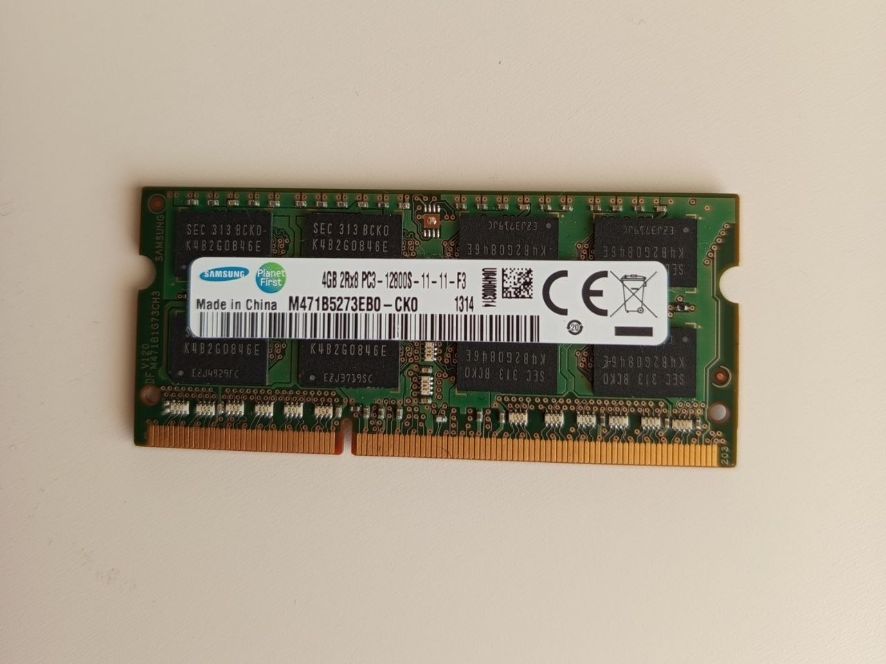

## Memory Configuration Analysis

### Available RAM Modules
- 8GB DDR4 (Samsung – installed)
- 4GB DDR4 (Samsung – not installed)
- 8GB DDR4 (Samsung – new)

## Hardware Components

### Available RAM Modules

---

## Final Installation

---

### Option 1: 8GB + 4GB (12GB total)
**Pros:**
- Increased total memory
- Uses existing hardware

**Cons:**
- Mixed capacity → partial dual-channel
- Not optimal performance
- Temporary solution only

---

### Option 2: 8GB + 8GB (16GB total)
**Pros:**
- Full dual-channel configuration
- Better performance
- Balanced memory usage
- Long-term solution

**Cons:**
- Requires additional RAM purchase

---

### Decision
- Selected: 8GB + 8GB configuration
- Reason:
  - Ensures optimal performance
  - Cleaner and more stable setup
  - Better long-term solution
