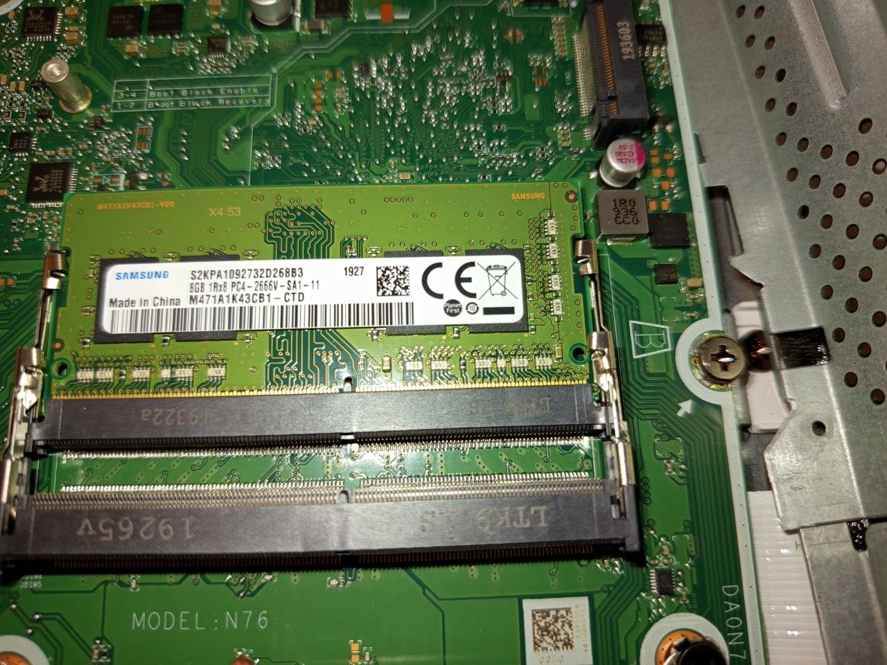
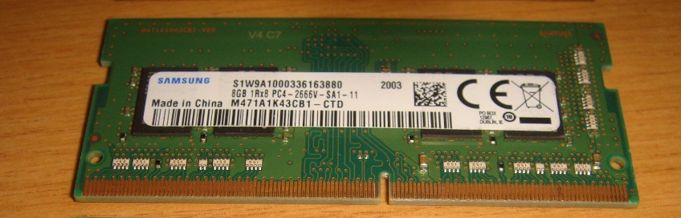

# RAM Upgrade – Analysis

## Overview
This document analyzes different RAM upgrade options for an HP All-in-One system.

---

## Initial Situation
- Device: HP All-in-One
- Installed RAM: 8GB DDR4 SO-DIMM (Samsung)
- One free RAM slot available

---

### Available RAM Modules
- 8GB DDR4 (Samsung – installed)
- 4GB DDR4 (Samsung – not installed)
- 8GB DDR4 (Samsung – new)

---

## Hardware Components

### Available RAM Modules

---

## Upgrade Options

### Option 1: 8GB + 4GB (12GB total)

**Pros:**
- Increased total memory
- No additional cost

**Cons:**
- Mixed capacity → only partial dual-channel
- Reduced performance efficiency
- Not optimal for long-term use
- Temporary solution only

---

### Option 2: 8GB + 8GB (16GB total)

**Pros:**
- Full dual-channel configuration
- Better system performance
- Balanced memory usage
- Stable long-term solution

**Cons:**
- Requires additional RAM purchase

---

## Decision
- Selected configuration: **16GB (8GB + 8GB)**
- Reason:
  - Enables full dual-channel performance
  - More stable and efficient system behavior
  - Better long-term upgrade strategy

---

## Final Installation

---

## Conclusion
- Best configuration for this system: **16GB dual-channel**
- Avoid mixing different capacities when performance matters
