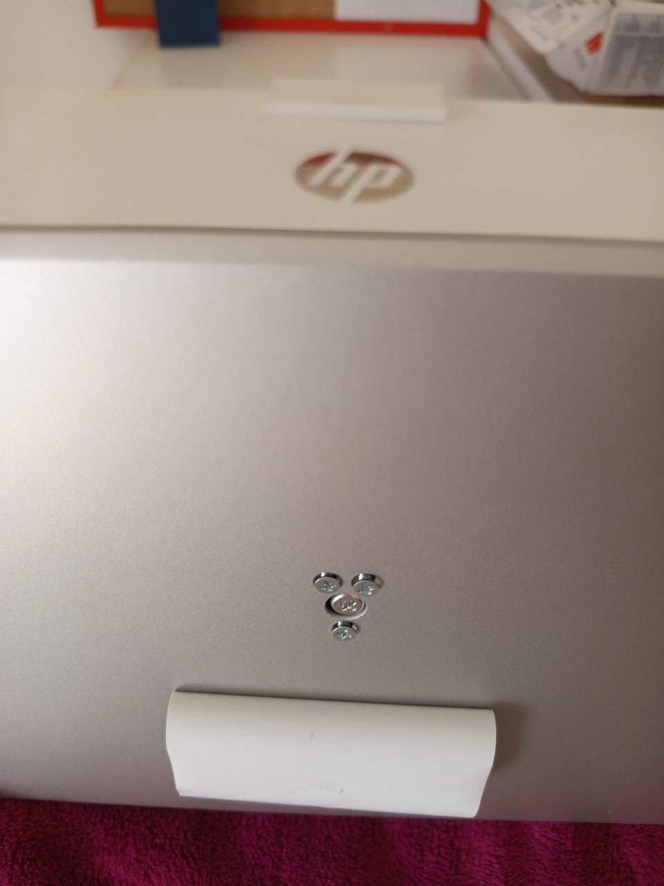
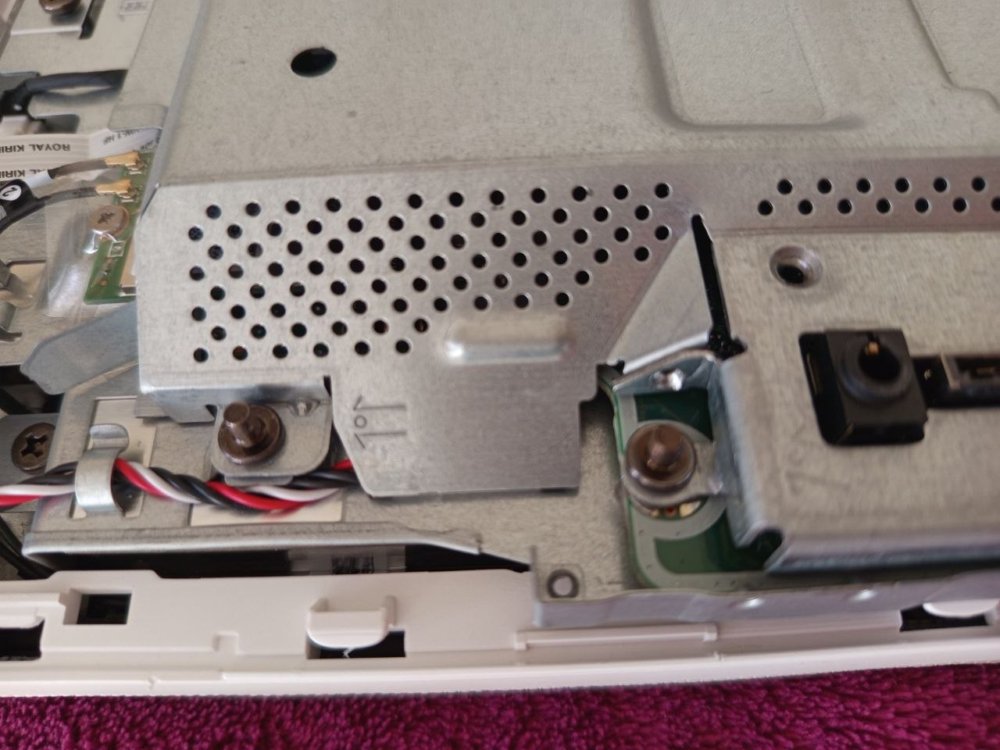
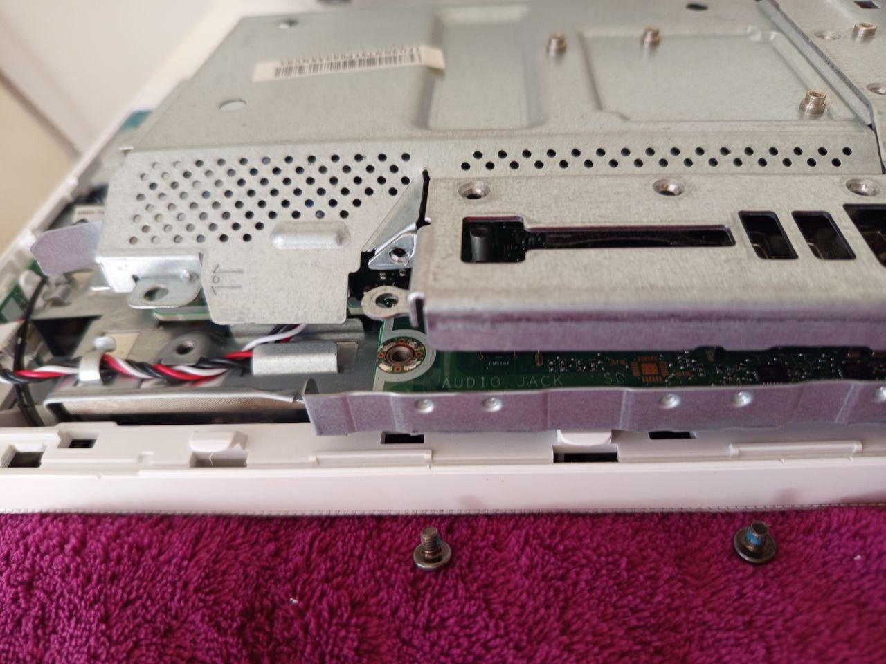

# Hardware Upgrade – RAM Installation

## Overview
This document describes the installation of an additional RAM module in an HP All-in-One system.

---

## Initial Situation
- Device: HP All-in-One
- Existing RAM: 8GB DDR4 SO-DIMM (Samsung)
- One free RAM slot available

---

## Objective
- Increase system memory from 8GB to 16GB
- Improve system performance
- Enable dual-channel memory configuration

---

## Preparation
- Powered off device
- Disconnected power cable
- Opened device carefully using screwdriver
- Located RAM slots on motherboard

---

## Device Disassembly

### Initial Setup

---

### Removing Screws

### Screw Locations

---

### Opening the Device

---

### RAM Slot Identification

---

## Installation Steps
1. Verified RAM compatibility (DDR4, SO-DIMM, 2666 MHz)
2. Inserted additional 8GB RAM module into free slot
3. Ensured correct alignment and secure fit (notch position in 30 degree)
4. Pressed RAM down until clips locked in place
5. Reassembled the device

---

## Hardware Installation

### Initial RAM (8GB Installed)

### New RAM Installed (16GB Total)

---

## Verification
- Booted system successfully
- Checked system memory in OS
- Confirmed total RAM: **16GB**
- Verified system stability

---

## Result
- Upgrade successful
- System performance improved
- Dual-channel configuration active
- System running stable

---

## Skills Demonstrated
- Hardware installation
- Component compatibility verification
- Troubleshooting awareness
- Safe device handling
- System validation after upgrade

---

## Notes
- Matching RAM specifications is critical for compatibility
- Dual-channel memory improves performance
- Correct installation angle and pressure are critical
- Always power off device before hardware changes
