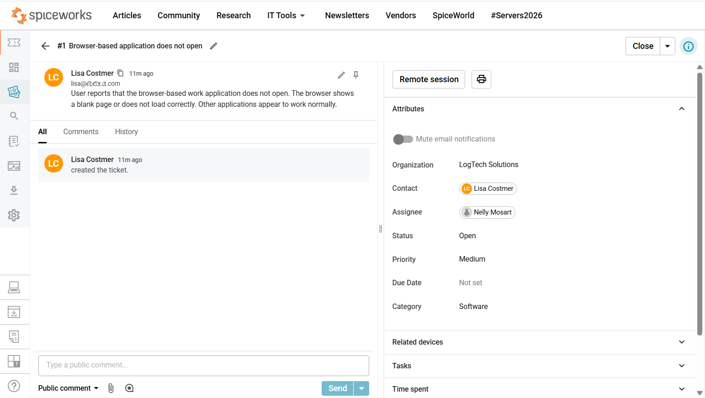
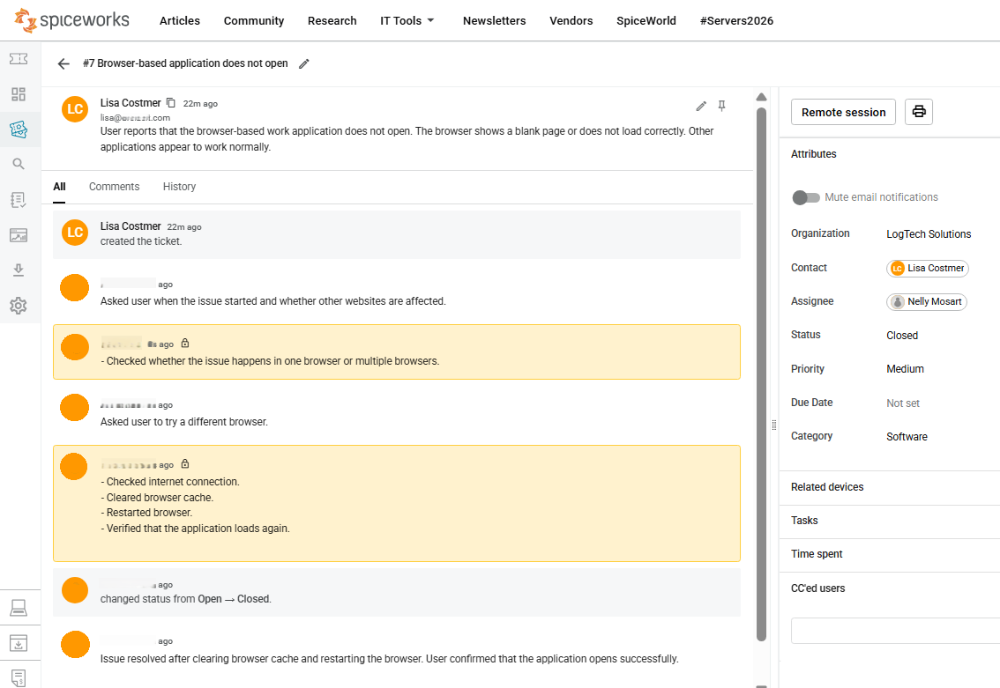

# Ticket 01 - Browser-Based Application Issue

---

<table>
<tr>
<td width="300">

</td>
<td>
<em>Help Desk Ticket Case</em>
</td>
</tr>
</table>

**Ticket title:** Browser-Based Application Issue  
**Ticket Category:** Software  
**Audience:** IT Support / Service Desk   
**Priority:** Medium  
**Final Status:** Closed  
**Requester:** Lisa Costmer  
**Assignee:** Nelly Mosart  

---

## 1. Problem

**User report:**  
User reports that the browser-based work application does not open. The browser shows a blank page or does not load correctly. Other applications appear to work normally.

---

## 2. Analysis

**Initial assessment:**  
The issue appeared to affect a browser-based work application, while other applications were reported as working normally.

The support check focused on separating a browser/application loading issue from a wider device or internet access problem.

**Scope check:**

- Affected user: One user
- Affected device: One device
- Affected service: Browser-based work application
- Business impact: Medium — one browser-based work application affected; other applications appear to work normally.

The case was checked using the "4W" scope formula:

- **Who is affected?** One user / one device
- **What is affected?** Browser-based work application
- **When did it start?** Asked user when the issue started
- **What impact does it have?** Medium — one browser-based work application affected; other applications appear to work normally.

**Possible causes:**

- Browser-related loading issue
- Browser cache issue
- Wider device or internet access problem

**Root cause:**  
The browser-based application did not load correctly because of a browser-related loading/cache issue.

---

## 3. Troubleshooting Steps

The following steps were documented in the ticket notes:

- Asked the user when the issue started and whether other websites were affected.
- Checked whether the issue happened in one browser or multiple browsers.
- Asked the user to try a different browser.
- Checked internet connection.
- Cleared browser cache.
- Restarted browser.
- Verified that the application loaded again.

**Internal support note style used:**  
Short internal activity log using neutral, past-tense support documentation.

---

## 4. Resolution / Escalation

**Resolution:**  
The issue was resolved after clearing the browser cache and restarting the browser.

**Escalation:**  
No escalation was required.

---

## 5. Result

**User confirmation:**  
User confirmed that the application opened successfully.

**Final status:**  
Closed

---

## Screenshots

### Ticket Created

Initial software ticket showing the user report, medium priority, software category, and open status.

---

### Ticket Resolved

Resolved software ticket showing troubleshooting notes, browser/cache steps, resolution note, and closed status.

---

## Skills Demonstrated

- Checking the scope of a browser-based application issue
- Separating browser/application issues from wider device or internet problems
- Documenting troubleshooting steps in ticket notes
- Documenting the root cause and resolution
- Updating ticket status after user confirmation
