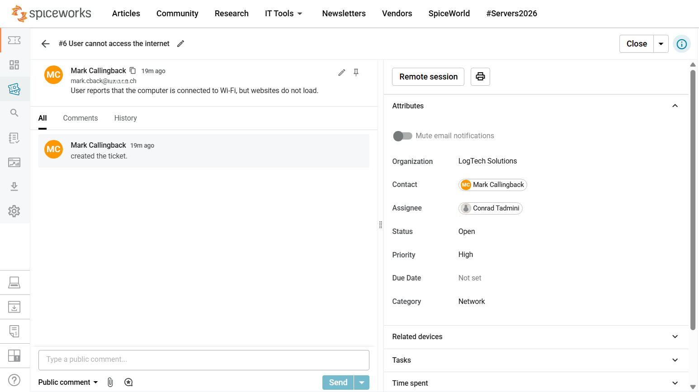
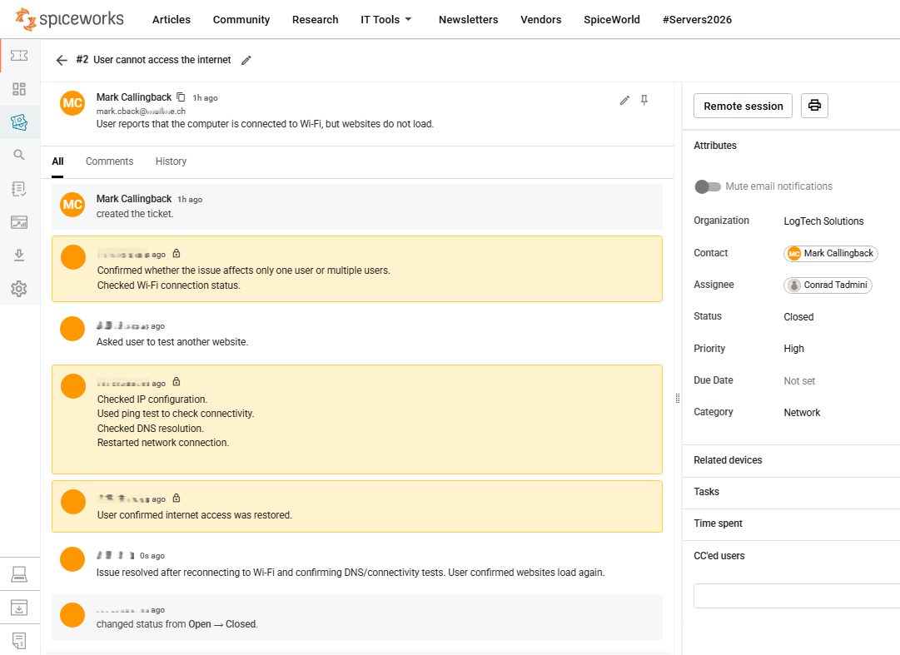

# Network Internet Access Ticket

## Problem Overview

User reports that the computer is connected to Wi-Fi, but websites do not load in the browser.

## Ticket Details

| Field | Value |
|---|---|
| Scenario | Websites do not load although Wi-Fi is connected |
| Category | Network |
| Priority | High |
| Final status | Closed |
| Requester | Mark Callingback |
| Assignee | Conrad Tadmini |
| Organization | LogTech Solutions |

## Analysis

The device showed an active Wi-Fi connection, so the issue was not treated as a simple disconnected-network problem.

The support check focused on whether the device had general network connectivity and whether domain names could be reached correctly. This helped separate Wi-Fi connectivity from a possible DNS-related browsing issue.

## Troubleshooting Steps

- Confirmed that the device was connected to Wi-Fi.
- Asked user to test more than one website.
- Checked whether the issue affected only this device.
- Checked IP configuration.
- Tested network connectivity.
- Checked DNS resolution.
- Restarted the network connection.
- Verified that websites loaded again.

## Likely Root Cause

DNS lookup failed on the affected device. Wi-Fi was connected, but websites could not be reached by domain name.

## Resolution

The issue was resolved after restarting the network connection and confirming that DNS resolution and website access worked again.

## Result

User confirmed that websites loaded again.

Final ticket status: **Closed**

## Screenshots

| Screenshot | Description |
|---|---|
|  | Initial network ticket showing the user report, high priority, network category, and open status. |
|  | Resolved network ticket showing troubleshooting notes, DNS/connectivity checks, resolution note, and closed status. |

## Skills Demonstrated

- Checking the scope of a network access issue
- Separating Wi-Fi connectivity from DNS/browser access problems
- Documenting internal troubleshooting steps
- Documenting likely root cause and resolution
- Updating ticket status after user confirmation
