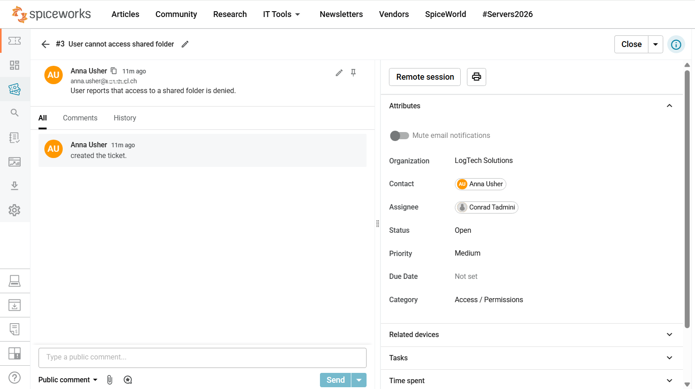
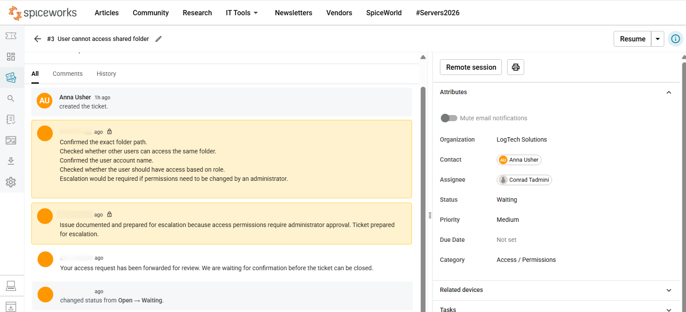

# Ticket 03: Shared Folder Access Issue

---

<table>
<tr>
<td width="300">

</td>
<td>
<em>Help Desk Ticket Case</em>
</td>
</tr>
</table>

**Ticket Category:** Access / Permissions  
**Audience:** IT Support / Service Desk   
**Priority:** Medium  
**Final Status:** Waiting / Escalated  
**Assignee:** Conrad Tadmini  
**Requester:** Anna Usher  

---

## The Issue

User reports that access to a shared folder is denied.

---

## Initial Assessment

The issue appeared to be related to shared folder access permissions.

The case was checked using the "4W" scope formula:

- **Who is affected?** One user
- **What is affected?** Access to a shared folder
- **When did it start?** Reported during the support request
- **What impact does it have?** Medium — one user affected; folder access requires review before the ticket can be closed.

The support check focused on confirming the folder path, affected user account, and whether the access issue required administrator approval.

---

## Troubleshooting Steps

The following steps were documented in the ticket notes:

- Confirmed the exact folder path.
- Checked whether other users could access the same folder.
- Confirmed the user account name.
- Checked whether the user should have access based on role.
- Documented that escalation would be required if permissions needed to be changed by an administrator.

---

## Likely Root Cause

The user did not have the required permissions to access the shared folder.

---

## Escalation Decision

The issue was documented and prepared for escalation because access permissions require administrator approval.

---

## Result

The access request was forwarded for review.

Final ticket status: **Waiting / Escalated**

---

## Screenshots

### Ticket Created

Initial access permissions ticket showing the user report, medium priority, access category, and open status.

---

### Ticket Escalated

Escalated access permissions ticket showing internal notes, escalation reason, user-facing update, and waiting status.

---

## Skills Demonstrated

- Checking the scope of a shared folder access issue
- Confirming folder path and affected user account
- Checking whether access should exist based on user role
- Recognizing when administrator approval is required
- Documenting escalation reason and waiting status
