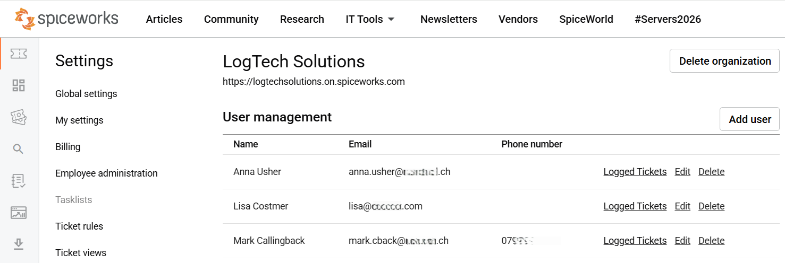
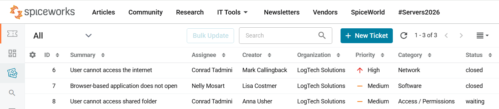

# Spiceworks Ticketing Practice

---

## Overview

This project documents simulated helpdesk tickets created in Spiceworks. 

The focus is on ticket workflow, support documentation, basic user-facing ticket notes, and escalation awareness.

---

## Ticket Cases

| Ticket | Scenario | Final Status |
|---|---|---|
| [Browser Application Issue](../tickets/01-browser-application.md) | User cannot open a browser-based work application. | Closed |
| [Network Internet Access Issue](../tickets/02-network-internet-access.md) | Websites do not load although Wi-Fi is connected | Closed |
| [Shared Folder Access Issue](../tickets/03-shared-folder-access.md) | User cannot access shared folder | Waiting / Escalated |

---

## Ticketing Practice Overview

### 1. User Setup

The simulated end users

---

### 2. Initial Ticket Queue

Three open tickets with different scenarios, assignees, priorities, categories, and open status

---

### 3. Final Ticket Status

The final ticket outcome

---

## Workflow Used

1. Issue intake
2. Ticket documentation
3. Scope check
4. Internal troubleshooting notes
5. Public user-facing ticket updates when needed
6. Resolution or escalation
7. Status update after confirmation

---

## Skills Demonstrated

- Interpreting user-reported support issues
- Checking issue scope
- Writing clear internal ticket notes
- Communicating user-facing updates
- Documenting resolution steps
- Recognizing when escalation is needed
- Updating ticket status based on outcome

---

## Privacy Note

The project uses simulated users, a fictional organization, and anonymized screenshots. No real user data is included.
