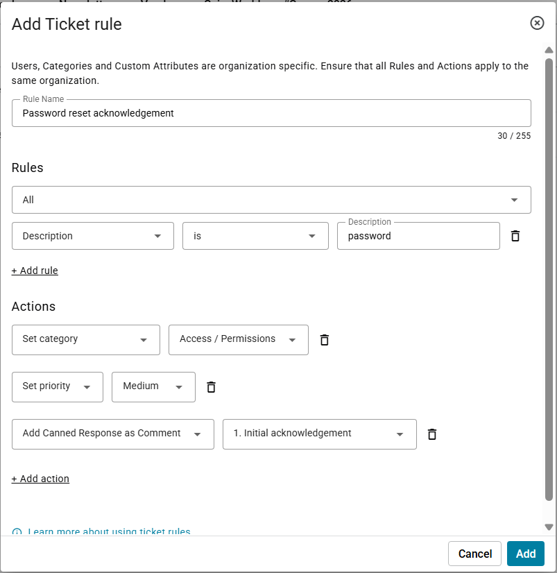
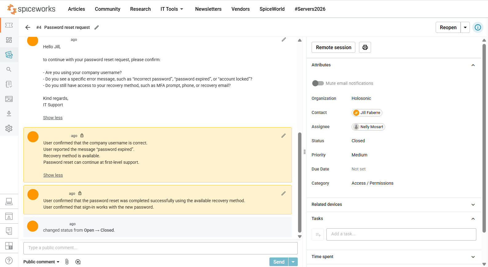

# Ticket 04 - Password Reset Request


---

<table>
<tr>
<td width="300">

</td>
<td>
<em>Workflow Efficiency Ticket Practice</em>
</td>
</tr>
</table>

**Ticket title:** Password Reset Request  
**Ticket Category:** Access / Permissions  
**Audience:** IT Support / Service Desk  
**Priority:** Medium  
**Final Status:** Closed  
**Assignee:** Nelly Mosart  
**Requester:** Jill Faberre  

---

## 1. Problem

**User report:**  
User reports that they cannot sign in because their password is not accepted.

The user requests help with a password reset.

---

## 2. Analysis

**Initial assessment:**  
This ticket was used to practice how Spiceworks can support faster and more consistent helpdesk work.

The support check focused on password reset handling, user confirmation, and first-level support documentation.

**Workflow efficiency used:**

- ticket rule usage for category and priority handling
- canned response usage for a standardized initial acknowledgement
- knowledge base usage for password reset guidance
- internal notes for technician documentation
- user confirmation before ticket closure

**Possible causes:**

- Expired password
- Incorrect username
- Missing recovery method
- Password reset requiring first-level support handling

---

## 3. Troubleshooting Steps

The following steps were documented in the ticket notes:

- A ticket rule was configured for password reset handling.
- The password reset request was categorized as Access / Permissions.
- The ticket priority was handled as Medium.
- An initial acknowledgement was inserted using a canned response.
- The Knowledge Base article **How to Request a Password Reset** was referenced.
- User-facing password reset guidance was provided based on the KB article.
- The company username was confirmed.
- The user reported the message “password expired”.
- The available recovery method was confirmed.
- The password reset was completed using the available recovery method.
- The user confirmed that sign-in works with the new password.

**Internal support note style used:**  
Short internal activity log using neutral, past-tense support documentation.

---

## 4. Resolution / Escalation

**Resolution:**  
The password reset was completed successfully using the available recovery method.

**Escalation:**  
No escalation was required.

---

## 5. Result

**User confirmation:**  
User confirmed that the password reset was completed successfully using the available recovery method.

User confirmed that sign-in works with the new password.

**Final status:**  
Closed

---

## 6. Screenshots

### Ticket Handling Step 1. - Ticket Rule

A ticket rule was configured for password reset handling. The rule supports consistent categorization and priority handling for this request type.



---

### Ticket Handling Step 2. - Canned Response and KB Reference

Ticket showing the password reset request, the initial acknowledgement inserted as a reusable response, and the KB article reference.

```text
Referenced KB article: How to Request a Password Reset.
User-facing password reset guidance was provided based on this article.
```


---

### Ticket Handling Step 3. - Knowledge Base Article

The Spiceworks Knowledge Base article **How to Request a Password Reset** was opened and used as support guidance for the password reset request.


---

### Ticket Handling Step 4. - Confirmation Notes and Resolution

The user`s confirmation was documented in the ticket:

```text
User confirmed that the company username is correct.  
User already reported the message “password expired”.  
Recovery method is available.  
Password reset can continue at first-level support.
```

The password reset result was also documented: 

```text
User confirmed that the password reset was completed successfully using the available recovery method.
User confirmed that sign-in works with the new password.
```

Ticket notes showing the password reset process, confirmation notes about the successful password reset and final status.



---

### Ticket Handling Step 5. - Ticket Closed

Password reset completed successfully using the available recovery method.  

Final ticket status: **Closed**

---

## Skills Demonstrated

- Using ticket rules for password reset handling
- Using canned responses for standardized user communication
- Referencing a knowledge base article during ticket handling
- Documenting user confirmation before ticket closure
Completing and closing a first-level password reset request
