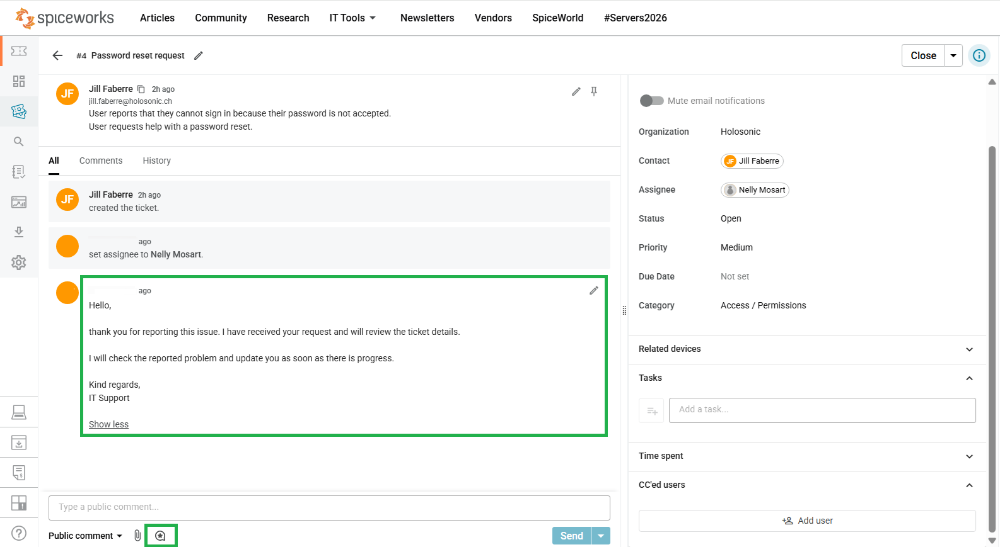
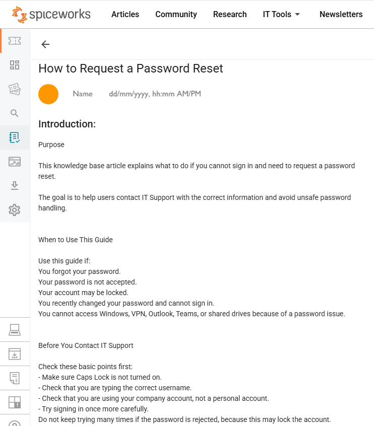
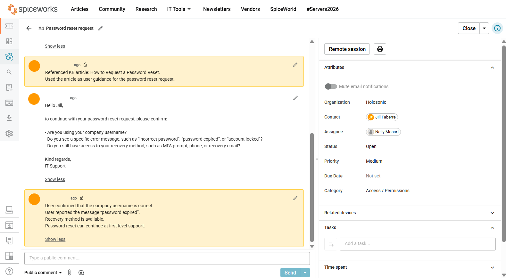

# Ticket 04 - Password Reset Request


---

<table>
<tr>
<td width="300">

</td>
<td>
<em>Workflow Efficiency Ticket Practice</em>
</td>
</tr>
</table>

**Ticket Category:** Access / Permissions  
**Audience:** IT Support / Service Desk  
**Priority:** Medium  
**Final Status:** Closed  
**Assignee:** Nelly Mosart  
**Requester:** Jill Faberre  

---

## The Issue

User reports that they cannot sign in because their password is not accepted.

The user requests help with a password reset.

---

## Workflow Efficiency Used

This ticket was used to practice how Spiceworks can support faster and more consistent helpdesk work.

The workflow included:

- ticket rule usage for category and priority handling
- canned response usage for a reusable initial acknowledgement
- knowledge base usage for password reset guidance
- internal notes for technician documentation
- user confirmation before ticket closure

---

## Ticket Handling Steps

### 1. Ticket Rule and Canned Response

The ticket was categorized as **Access / Permissions** and assigned **Medium** priority.

The initial acknowledgement was inserted using a reusable canned response.

### 2. Knowledge Base Reference

The Spiceworks Knowledge Base article **How to Request a Password Reset** was opened and used as support guidance.

The KB article was used as a support reference for user-facing password reset guidance. The relevant guidance was applied through the ticket communication and documented in the internal note.

Internal note documented:

```text
Referenced KB article: How to Request a Password Reset.
User-facing password reset guidance was provided based on this article.
```

---

### 3. User Information Confirmed

The user information was documented in the ticket:

```text
User confirmed that the company username is correct.
User already reported the message “password expired”.
Recovery method is available.
Password reset can continue at first-level support.
```

---

### 4. Resolution

The password reset was completed using the available recovery method.

The user confirmed that sign-in works with the new password.

---

## Result

Password reset completed successfully.

User confirmed that sign-in works with the new password.

Final ticket status: **Closed**

---

## Screenshots

### Canned Response Used

Ticket showing the password reset request and the initial acknowledgement inserted as a reusable canned response.



---

### Knowledge Base Article

Spiceworks Knowledge Base article used as support guidance for the password reset request.



---

### KB Reference and User Confirmation Notes

Ticket notes showing the referenced KB article and the documented user information needed to continue the password reset process.



---

### Ticket Closed

Closed password reset ticket showing successful completion and final status.


---

## Skills Demonstrated

- Handling a password reset request in a helpdesk ticket
- Using a canned response for consistent user communication
- Referencing a Spiceworks Knowledge Base article during ticket handling
- Documenting technician notes clearly
- Confirming required user information before resolution
- Closing the ticket after user confirmation
