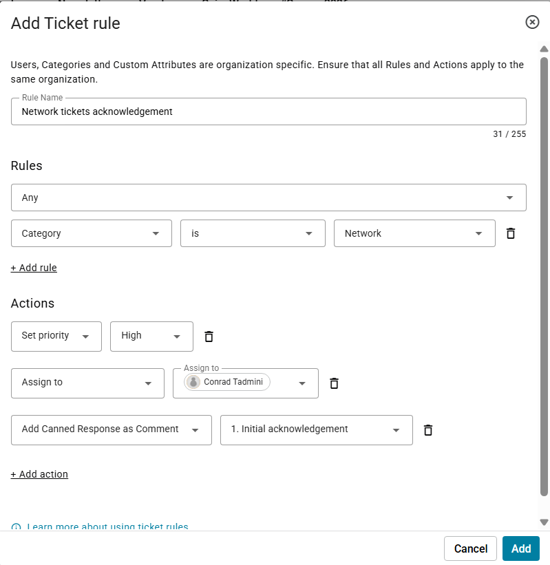
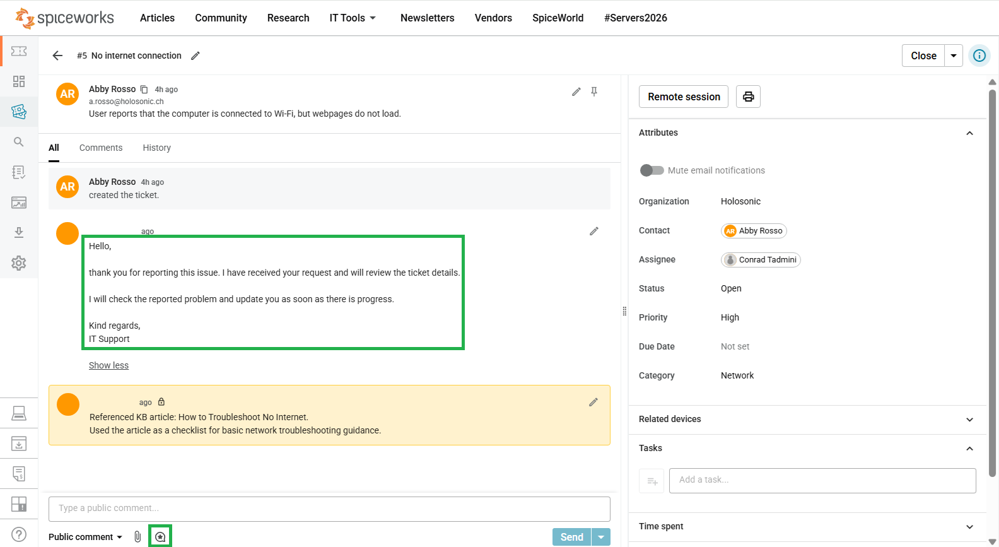
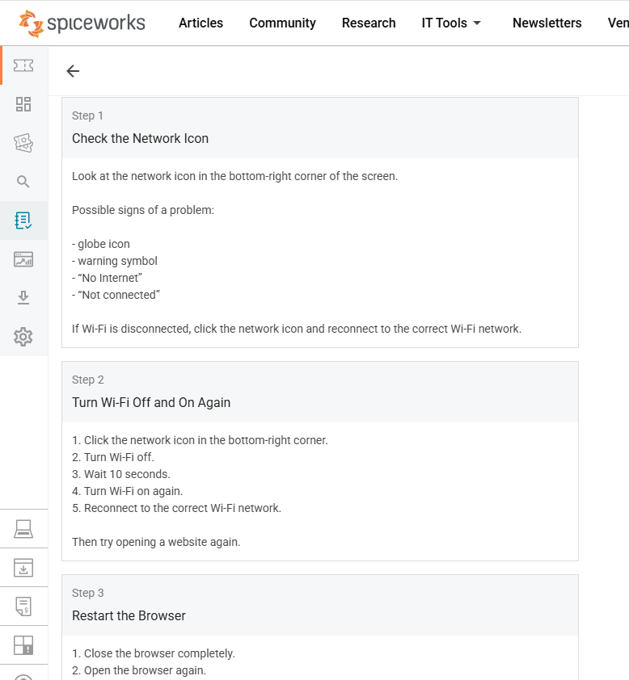
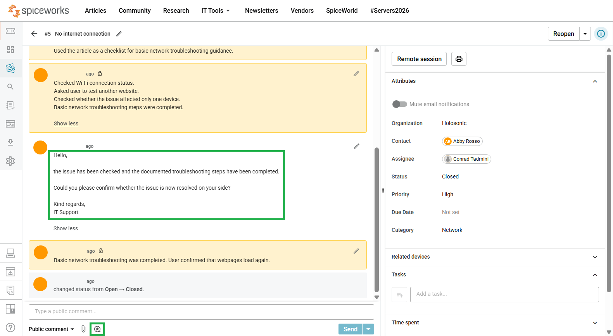

# Ticket 05 - No Internet Connection


---

<table>
<tr>
<td width="300">

</td>
<td>
<em>Workflow Efficiency Ticket Practice</em>
</td>
</tr>
</table>

**Ticket Category:** Network  
**Audience:** IT Support / Service Desk  
**Priority:** High  
**Final Status:** Closed  
**Assignee:** Conrad Tadmini  
**Requester:** End user  

---

## The Issue

User reports that the computer is connected to Wi-Fi, but webpages do not load.

---

## Workflow Efficiency Used

This ticket was used to practice how Spiceworks can support faster and more consistent helpdesk work.

The workflow included:

- ticket rule usage for network ticket handling
- canned response usage for a reusable initial acknowledgement
- knowledge base usage for basic network troubleshooting guidance
- internal support notes for documented troubleshooting steps
- resolution confirmation before ticket closure

---

## Ticket Handling and Evidence

### 1. Ticket Rule

A ticket rule was configured for network-related tickets. The rule supports consistent handling for network requests by setting the correct priority and assigning the ticket to the responsible support technician.



---

### 2. Canned Response and KB Reference

Ticket showing the no internet request, the initial acknowledgement inserted as a reusable canned response, and the KB article reference.

```text
Referenced KB article: How to Troubleshoot No Internet.
Used the article as a checklist for basic network troubleshooting guidance.
```



---

### 3. Knowledge Base Article

The Spiceworks Knowledge Base article **How to Troubleshoot No Internet** was opened and used as support guidance for the no internet issue.



---

### 4. Troubleshooting Notes and Resolution Confirmation

The troubleshooting steps were documented in the ticket:

```text
Checked Wi-Fi connection status.
Asked user to test another website.
Checked whether the issue affected only one device.
Basic network troubleshooting steps were completed.
```

A reusable resolution confirmation response was used to ask the user to confirm whether the issue was resolved.

```text
User confirmed that webpages load again.
Internet access restored after basic network troubleshooting.
```

Ticket notes showing the troubleshooting process, resolution confirmation, user confirmation, and final closed status.



---

### 5. Ticket Closed

Internet access was restored after basic network troubleshooting.

Final ticket status: **Closed**

---

## Skills Demonstrated

- Handling a network connectivity issue in a helpdesk ticket
- Using a ticket rule for network ticket handling
- Using a canned response for consistent user communication
- Referencing a Spiceworks Knowledge Base article during troubleshooting
- Documenting internal support notes clearly
- Confirming resolution with the user before closing the ticket
