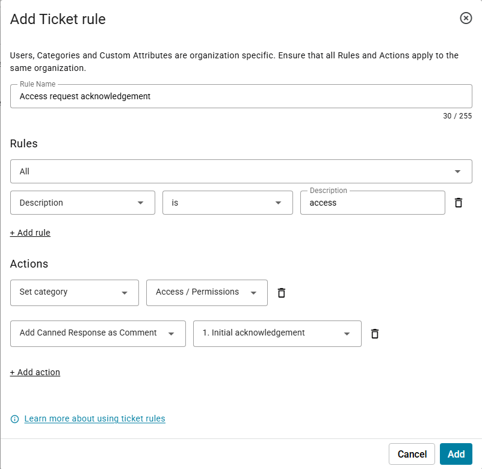
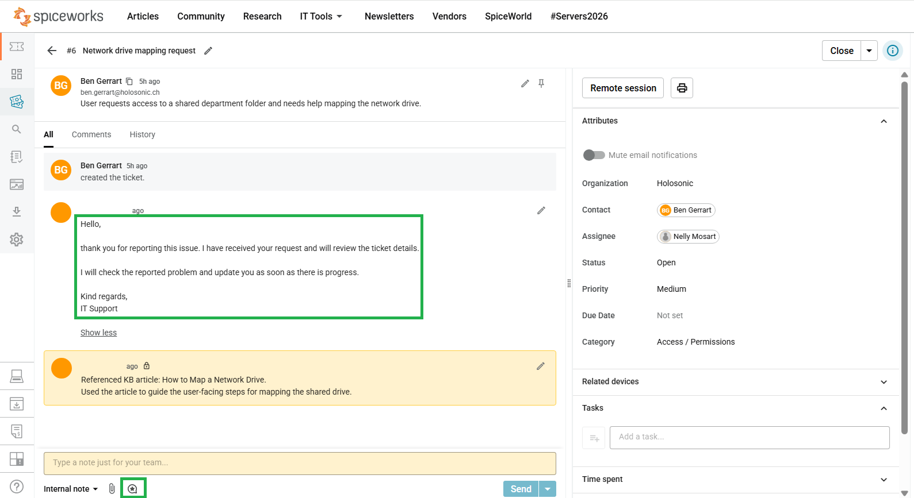
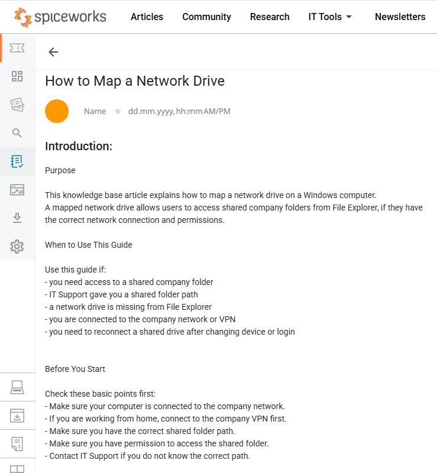
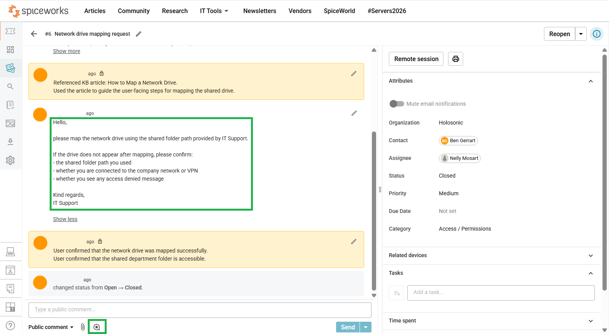

# Ticket 06 - Network Drive Mapping Request


---

<table>
<tr>
<td width="300">

</td>
<td>
<em>Workflow Efficiency Ticket Practice</em>
</td>
</tr>
</table>

**Ticket title:** Network Drive Mapping Request 
**Ticket Category:** Access / Permissions  
**Audience:** IT Support / Service Desk  
**Priority:** Medium  
**Final Status:** Closed  
**Assignee:** Nelly Mosart  
**Requester:** End user  

---

## 1. Problem

**User report:**  
User requests access to a shared department folder and needs help mapping the network drive.

---

## 2. Analysis

**Initial assessment:**  
This ticket was used to practice how Spiceworks can support faster and more consistent helpdesk work.

The support check focused on access-related request handling, network drive mapping guidance, and user guidance before ticket closure.

**Workflow efficiency used:**

- ticket rule usage for access-related ticket handling
- canned response usage for a standardized initial acknowledgement
- knowledge base usage for network drive mapping guidance
- internal support notes for documented KB usage
- user guidance before ticket closure

**Possible causes:**

- User needs instructions for mapping the network drive
- Shared folder path needs to be provided by IT Support
- User may not be connected to the company network or VPN
- Access denied message may require further permission review

---

## 3. Troubleshooting Steps

The following steps were documented in the ticket notes:

- A ticket rule was configured for access-related requests.
- The rule supported consistent handling for access and network drive mapping requests.
- The initial acknowledgement was inserted using a canned response.
- The Knowledge Base article **How to Map a Network Drive** was opened and used as support guidance.
- The KB article reference was documented in an internal support note.
- User-facing guidance was provided based on the KB article.
- The user was asked to confirm the shared folder path if the drive did not appear.
- The user was asked to confirm whether they were connected to the company network or VPN if the drive did not appear.
- The user was asked to confirm whether they saw an access denied message if the drive did not appear.
- The user confirmed that the network drive was mapped successfully.
- The user confirmed that the shared department folder is accessible.

**Internal support note style used:**  
Short internal activity log using neutral, past-tense support documentation.

---

## 4. Resolution / Escalation

**Resolution:**  
Network drive mapping was completed successfully.

**Escalation:**  
No escalation was required.

---

## 5. Result

**User confirmation:**  
User confirmed that the network drive was mapped successfully.

User confirmed that the shared department folder is accessible.

**Final status:**  
Closed

---

## 6. Screenshots

## Ticket Handling and Evidence

### 1. Ticket Rule

A ticket rule was configured for access-related requests. The rule supports consistent handling for access and network drive mapping requests.



### 2. Canned Response

A ticket rule was used for access-related request handling. The initial acknowledgement was inserted using a reusable canned response.



---

### 2. Knowledge Base Article

The Spiceworks Knowledge Base article **How to Map a Network Drive** was opened and used as support guidance for the network drive mapping request.



---

### 3. KB Internal Note

The KB article reference was documented in an internal support note.

```text
Referenced KB article: How to Map a Network Drive.
Used the article to guide the user-facing steps for mapping the shared drive.
```

---

### 4. User Guidance and Ticket Closure

User-facing guidance was provided based on the KB article.

```text
Hello,

please map the network drive using the shared folder path provided by IT Support.

If the drive does not appear after mapping, please confirm:
- the shared folder path you used
- whether you are connected to the company network or VPN
- whether you see any access denied message

Kind regards,
IT Support
```

The final confirmation was documented in the ticket.

```text
User confirmed that the network drive was mapped successfully.
User confirmed that the shared department folder is accessible.
```



---

### 5. Ticket Closed

Network drive mapping was completed successfully.

Final ticket status: **Closed**

---

## Skills Demonstrated
- Using ticket rules for access-related request handling
- Using canned responses for standardized user communication
- Referencing a knowledge base article during ticket handling
- Providing user-facing guidance based on KB content
- Requesting user confirmation before closing the ticket
