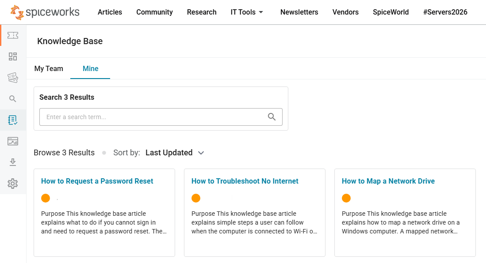
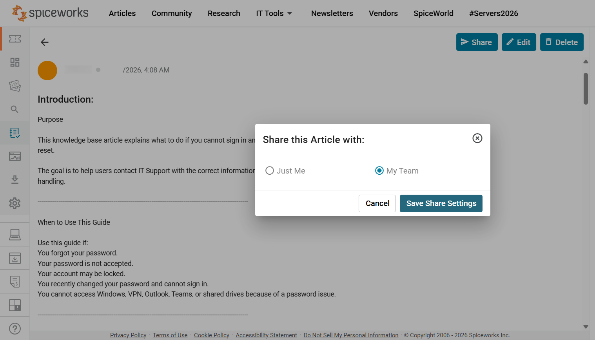
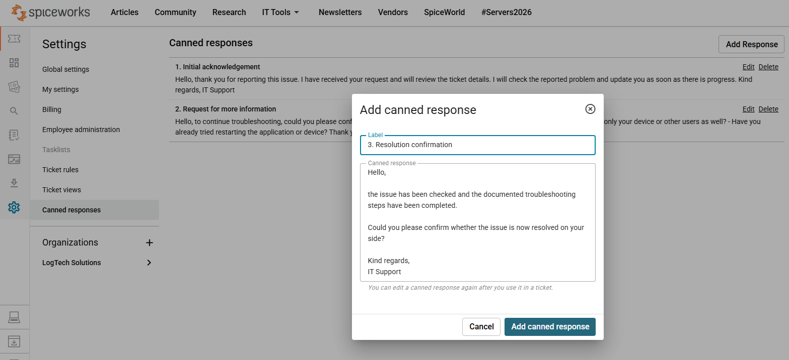
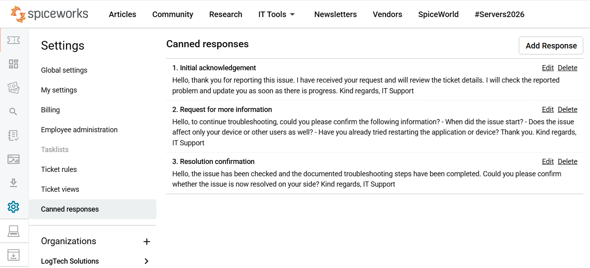
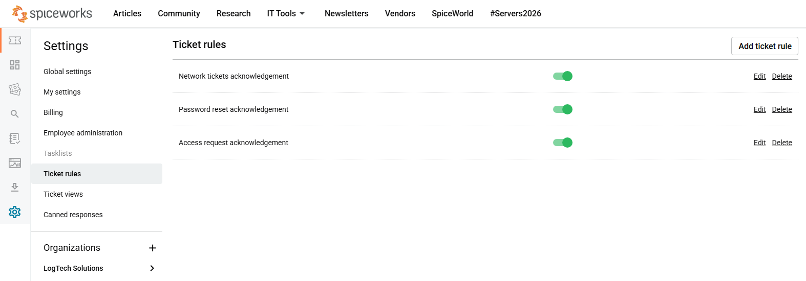
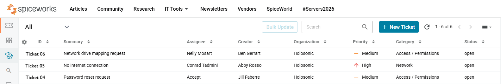
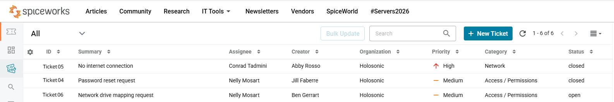
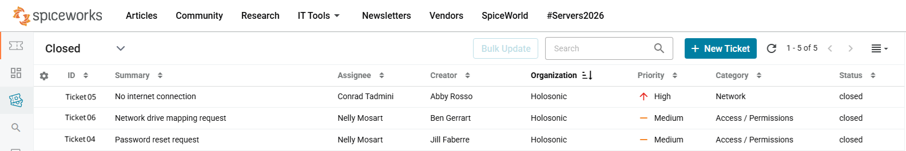

# Workflow Efficiency Ticketing Practice

---

## Purpose

This section documents the second stage of the Spiceworks ticketing practice.

The first stage focused on ticket workflow, support documentation, basic user-facing ticket notes, and escalation awareness.

This second stage focuses on workflow efficiency: 
- organizing tasks with custom ticket queues
- saving time with automated or standardized responses by reducing repeated manual writing
- creating built-in knowledge base articles and sharing them with the team
- setting ticket rules by categories, due dates, priorities etc.
- automating ticket assignments by routing common request types 
- filtering tickets based on multiple criteria to organize queues and track ticket progress

**The practice includes:**

1. canned responses  
2. knowledge base articles  
3. ticket rules  
4. ticket status tracking  

---

## Workflow-Efficiency Ticket Practice

| Ticket | Scenario | Focus | Final Status |
|---|---|---|---|
| [Password Reset Request](./04-password-reset-request.md) | User cannot sign in because the password is expired | Canned response, KB reference, user confirmation, closure | Closed |
| [No Internet Connection](./05-no-internet-connection.md) | User is connected to Wi-Fi, but webpages do not load | Network rule, KB reference, troubleshooting notes, closure | Closed |
| [Network Drive Mapping Request](./06-network-drive-mapping-request.md) | User needs help mapping a shared department folder | Access rule, KB reference, user guidance, closure | Closed |

---

## 1. Knowledge Base Articles

Three Spiceworks knowledge base articles were created and used during the workflow-efficiency ticket practice:

- **How to Request a Password Reset**
- **How to Troubleshoot No Internet**
- **How to Map a Network Drive**

Instead of pasting full articles into each ticket, the relevant guidance was applied through ticket communication and documented in internal support notes.

The built-in knowledge base articles can be shared with the team to support team productivity, avoid duplicate work on the same support topics, and make the guidance available to everyone in one central place. They can serve as centralized support resources for IT support teams.

---

## 2. Canned Responses

Reusable canned responses were created to support consistent communication with users.

The canned responses included:

1. Initial acknowledgement
2. Request for more information
3. Resolution confirmation

Canned responses were used manually during ticket handling to keep user communication clear and consistent.

---

## 3. Ticket Rules

Ticket rules were configured to support consistent handling of common request types.

The rule list included:

- Network tickets acknowledgement
- Password reset acknowledgement
- Access request acknowledgement

The rules supported consistent ticket handling by helping with request routing, priority handling, and categorization logic.

---

## 4. Ticket Status Views and Filters

The workflow-efficiency tickets were tracked from open status to final closure.

Initial ticket list showing the three workflow-efficiency tickets:

Interim ticket list showing that two tickets were closed and one ticket remained open:

Final ticket list filtered by closed status:

---

## Skills Demonstrated

- Handling common IT support requests in Spiceworks tickets
- Creating and using canned responses for general user communication
- Creating built-in knowledge based user guidance in Spiceworks
- Using knowledge base articles as centralized support resources during ticket handling and troubleshooting
- Setting ticket rules for structured categorization, priority handling, and assignment
- Documenting troubleshooting steps and internal support notes clearly
- Tracking ticket status by filtering 
- Requiring user confirmation before closing tickets

---

## Result

The workflow-efficiency practice shows how combined Spiceworks features can make structured IT support work more efficient.

Selected Spiceworks features used in this project:

- canned responses — for consistent communication
- knowledge base articles — for reusable guidance
- ticket rules — for structured handling
- ticket status views and filters — for tracking open and closed tickets
