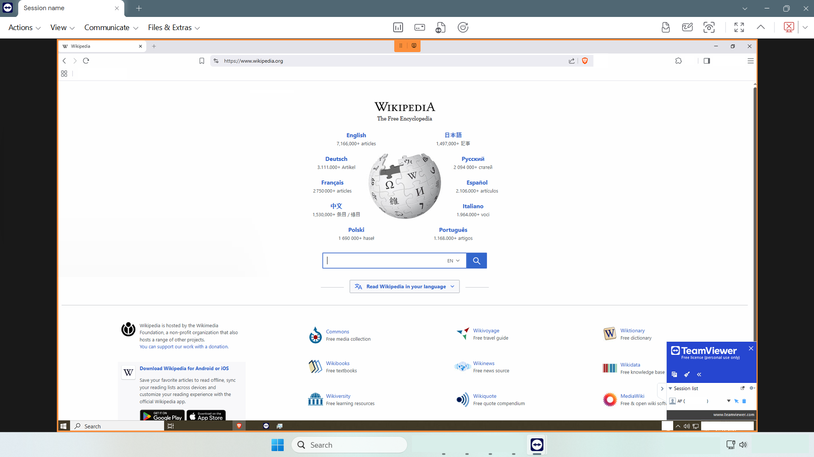
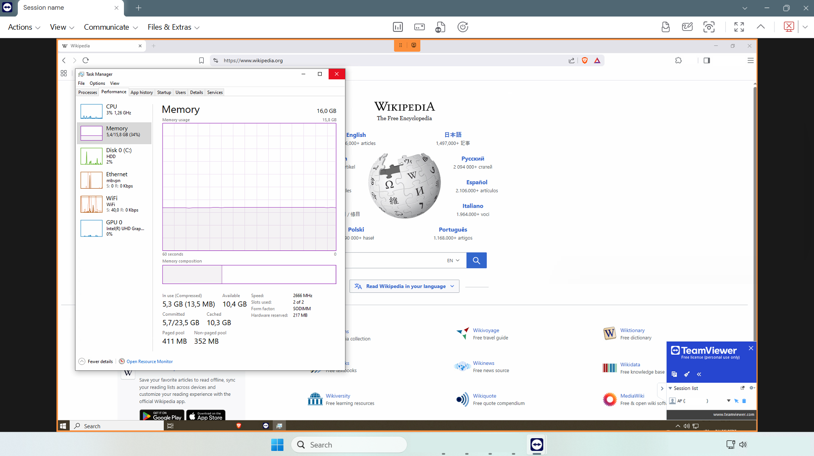
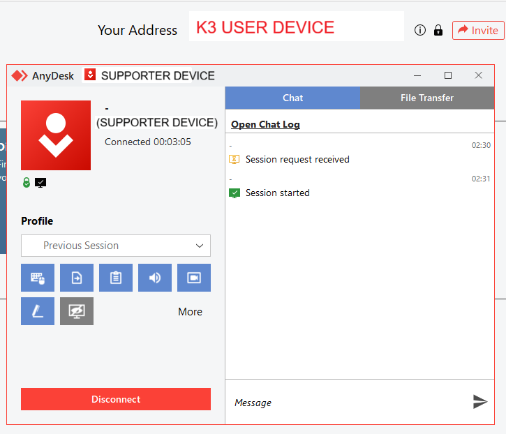
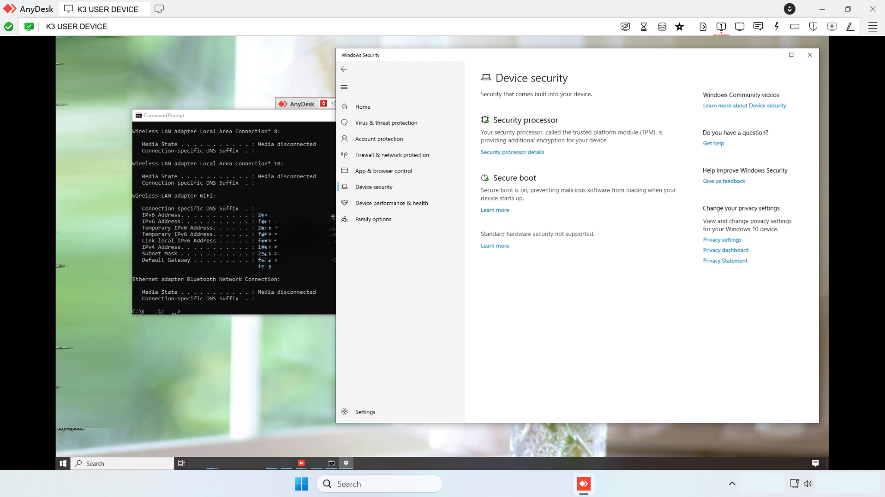
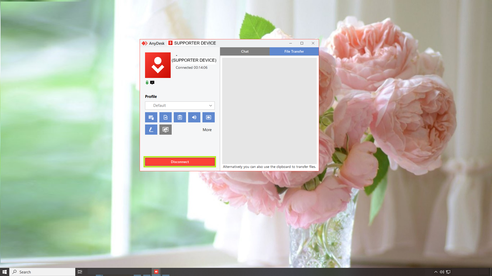
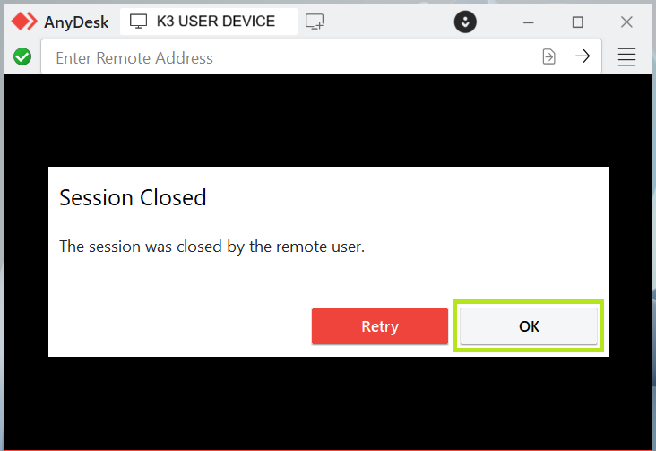

# Remote Support Tools Workflow – TeamViewer and AnyDesk

## Overview

This project documents the workflow of two access tools: TeamViewer and AnyDesk.

The focus is on remote session setup, user consent, supporter/user device roles, remote desktop access, and session closing.

The lab also helped clarify practical workflow differences between TeamViewer and AnyDesk.

## Objective

- connect a support technician device to a user device using remote support tools
- support users remotely with permission-based access
- collect relevant information before and during the session
- guide the user through basic support checks
- close the remote support session safely

## Lab Devices

| Role | Device | Operating System | Key Specs |
|---|---|---|---|
| Support technician device | HP Pavilion Laptop 15-eg0xxx | Windows 11 Pro | Intel Core i7-1165G7, 16 GB RAM |
| User device | HP Pavilion All-in-One 27-xa0xxx | Windows 10 Home 22H2 | Intel Core i5-9400T, 16 GB RAM |

## Tools Used

- TeamViewer
- AnyDesk

## Remote Support Security Rules

A serious remote support process should include:

- Use only approved remote support tools.
- Download tools only from official websites (if needed).
- Confirm user consent before starting the session.
- Allow the user to see what the supporter is doing.
- Do not ask the user to share passwords.
- Close the remote session after support is completed.

## General Remote Support Workflow

| Step | Who performs it | Purpose |
|---|---|---|
| Support request | User | The user reports an issue by phone, email, ticket, or self-service portal. |
| Initial assessment | Supporter | The supporter clarifies the issue, affected device, and whether remote support is needed. |
| User permission | Supporter / User | The supporter asks for explicit permission before accessing the user device. |
| Secure remote connection | Supporter / User | The session is started through an approved remote support tool, using a session code, invitation link, or remote address. |
| Remote access verification | Supporter | The supporter checks that the correct user device is visible and accessible. |
| Diagnostics or support check | Supporter | The supporter checks the relevant area, such as application access, browser behaviour, system settings, or performance indicators. |
| Communication during support | Supporter | The supporter explains relevant actions before making changes and keeps the user informed. |
| Resolution or result validation | User / Supporter | The supporter checks the result, and the user confirms whether the issue is resolved or the support check is complete. |
| Session closing | User or Supporter | The remote session is closed after support is completed. |
| Documentation | Supporter | The supporter documents what was checked, what was changed if anything, and the final result. |

## TeamViewer Workflow

1. Supporter creates a new remote support session.
2. Supporter receives a session code.
3. User enters the session code on the user device.
4. User waits for the supporter to start the session.
5. Supporter starts the session.
6. User sees that the session is active.
7. Supporter verifies remote desktop access.
8. Supporter performs a browser access check.
9. Supporter checks memory activity.
10. Supporter checks disk activity.
11. User has the option to close the session.
12. Supporter also has the option to end the session.
13. User confirms session closing.
14. Supporter returns to the managed device overview.

## AnyDesk Workflow

1. Supporter enters the user device AnyDesk address.
2. Supporter sends a connection request.
3. User accepts the session request.
4. Session starts.
5. Supporter verifies remote desktop access.
6. User or supporter closes the session.

For AnyDesk, the correct workflow in this lab was to enter the user device address on the support technician device. This made the laptop the supporter device and the All-in-One computer the user device receiving support.

## Screenshots

### TeamViewer Remote Support Session

| Step | Screenshot |
|---|---|
| Supporter starts a new remote support session |  |
| Supporter generates the session code |  |
| User enters the session code |  |
| User waits for the supporter to start the session |  |
| Supporter starts the session |  |
| User sees the active session |  |
| Supporter views the remote desktop |  |
| Browser access check |  |
| Task Manager memory check |  |
| Task Manager disk check |  |
| User has the option to close the session |  |
| Supporter can also end the session |  |
| User confirms session closing |  |
| Supporter device overview after the session |  |

### AnyDesk Remote Support Session

| Step | Screenshot |
|---|---|
| AnyDesk download page |  |
| Supporter enters the user address |  |
| Supporter sends connection request |  |
| User accepts the session request |  |
| AnyDesk session started |  |
| Supporter views the remote desktop |  |
| User has the option to close the session |  |
| Supporter confirms session closing |  |

## Skills Demonstrated

- Remote support tool setup
- Remote support session handling
- Permission-based remote access
- User consent confirmation
- TeamViewer remote session workflow
- AnyDesk remote session workflow
- Supporter vs. user device role awareness
- Remote desktop access verification
- Safe session closing from the user side
- Safe session closing from the supporter side

## Notes

No real customer environment was used. 
