# Remote Support Tools Workflow – TeamViewer and AnyDesk


## Overview

This project documents a simulated remote support scenario for practicing first-level IT support tasks.

The focus of this project is remote support preparation, user consent, guided troubleshooting, basic system checks, professional communication, ticket documentation, and escalation awareness.

The simulation was performed with two remote support tools:

- TeamViewer
- AnyDesk

The main scenario uses a support technician device to connect to a user device and perform basic troubleshooting checks on a browser-based application access issue.

## Objective

The objective of this project is to practice how to support users remotely, collect relevant information, document the case, guide the user through basic troubleshooting steps, and close the remote support session safely.

## Lab Devices

| Role | Device | Operating System | Key Specs |
|---|---|---|---|
| Support technician device | HP Pavilion Laptop 15-eg0xxx | Windows 11 Pro | Intel Core i7-1165G7, 16 GB RAM |
| User device | HP Pavilion All-in-One 27-xa0xxx | Windows 10 Home 22H2 | Intel Core i5-9400T, 16 GB RAM |

## Tools Used

- TeamViewer
- AnyDesk
- Windows Task Manager
- Web browser
- Ticketing documentation
- Knowledge base notes

## Course Tool Awareness

The course also introduced several remote support and remote access tools:

- Microsoft Remote Desktop
- Windows Remote Assistance
- Cisco WebEx
- Remote Desktop for macOS
- Virtual Network Computing (VNC)
- pcAnywhere as a legacy remote access tool

## Practice Scenario

### Browser-Based Application Access Issue

A user reports that they cannot access a browser-based work application during working hours.

The goal of the support session is to confirm the issue, request permission for remote access, check the user device, test browser access, review basic system performance, and document the result.

## Support Process

1. Receive the support request.
2. Ask clear questions to understand the problem.
3. Confirm the affected device, user, and application.
4. Ask for permission before starting remote access.
5. Start the remote support session.
6. Explain each action before making changes.
7. Check the browser and basic system status.
8. Review CPU, memory, disk, and network activity in Task Manager.
9. Test whether a browser-based website opens successfully.
10. Confirm the result with the user.
11. End the remote support session safely.
12. Document the steps taken.
13. Close or escalate the case.

## Troubleshooting Process Applied

| Course Step | Applied in This Simulation |
|---|---|
| Define the problem | User reports that a browser-based application cannot be accessed. |
| Gather detailed information | Ask when the issue started, what happens when the user opens the application, and whether other websites work. |
| Identify a probable cause | Possible browser issue, stuck process, basic connectivity issue, or device performance issue. |
| Devise a plan | Check browser access, review Task Manager, verify system performance, and test another website. |
| Make necessary checks | Open the browser, check CPU, memory, disk, and network activity, and confirm browser response. |
| Observe the results | Confirm whether the website or application opens normally. |
| Repeat the process | If the issue remains, continue with further browser, network, or account checks. |
| Document the changes | Record the troubleshooting steps and result in the ticket note. |

## Questions Asked

- What exactly happens when you try to access the browser-based application?
- Do you receive an error message?
- When did the issue start?
- Did anything change recently, such as an update, restart, browser change, or new software installation?
- Are other websites or web applications working normally?
- Is the issue happening in one browser only or in multiple browsers?
- May I start a remote support session to check the issue with you?

## Remote Support Steps

1. Confirmed the issue with the user.
2. Asked for permission before starting remote access.
3. Started a remote support session from the support technician device.
4. User entered the session code and waited for the session to start.
5. Support technician started the session.
6. Confirmed that the remote desktop of the user device was visible.
7. Opened a browser-based test page.
8. Opened Task Manager on the user device.
9. Checked memory usage.
10. Checked disk activity.
11. Confirmed that the device responded normally.
12. Confirmed that the browser-based page opened successfully.
13. Demonstrated that both the user and the support technician can end the remote session.
14. Closed the session safely.
15. Documented the result.

## Possible Root Cause

The browser session may have needed a restart, the browser process may have been stuck, or the issue may have been related to temporary browser state or basic system performance.

In this simulation, the browser-based test page opened successfully and Task Manager showed normal memory and disk activity during the remote session.

## Resolution

The user device was accessed remotely with permission. Browser access was tested, and Task Manager was used to review basic system performance.

The browser-based page opened successfully, and no high disk or memory usage was observed during the check.

## Verification

The user confirmed that the browser-based page opened successfully and the device responded normally after the remote support check.

## Ticket Documentation Example

```text
Issue:
User reported that a browser-based work application could not be accessed.

Affected device:
Computer 3 / K3 user device

Troubleshooting steps:
- Confirmed the issue with the user.
- Asked for permission to start a remote support session.
- Started a TeamViewer remote support session.
- User entered the session code and waited for the supporter to start the session.
- Connected to the user device remotely.
- Opened a browser-based test page.
- Opened Task Manager on the user device.
- Checked memory usage.
- Checked disk activity.
- Confirmed that system performance appeared normal during the session.
- Confirmed that browser access worked.
- Ended the remote session safely.
- Documented the support process.

Resolution:
Remote access was established successfully. Browser access was tested, and basic system performance was checked through Task Manager. The browser-based page opened successfully, and no abnormal disk or memory usage was observed during the check.

Status:
Resolved

Escalation:
Not required.
```

## Screenshots

### TeamViewer Remote Support Session

| Step | Screenshot |
|---|---|
| Supporter starts a new remote support session | 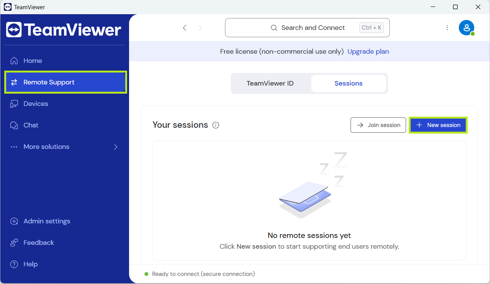 |
| Supporter generates the session code | 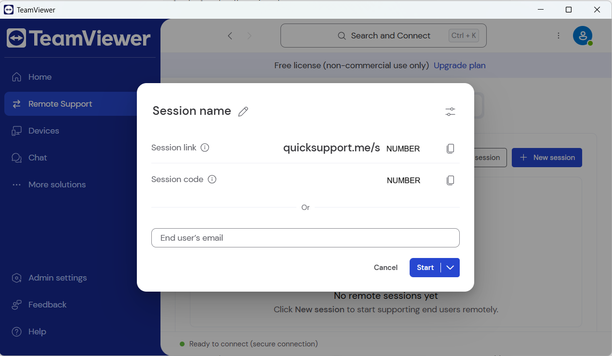 |
| User enters the session code | 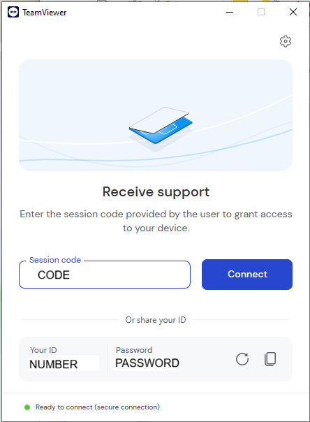 |
| User waits for the supporter to start the session | 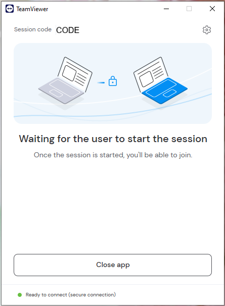 |
| Supporter starts the session | 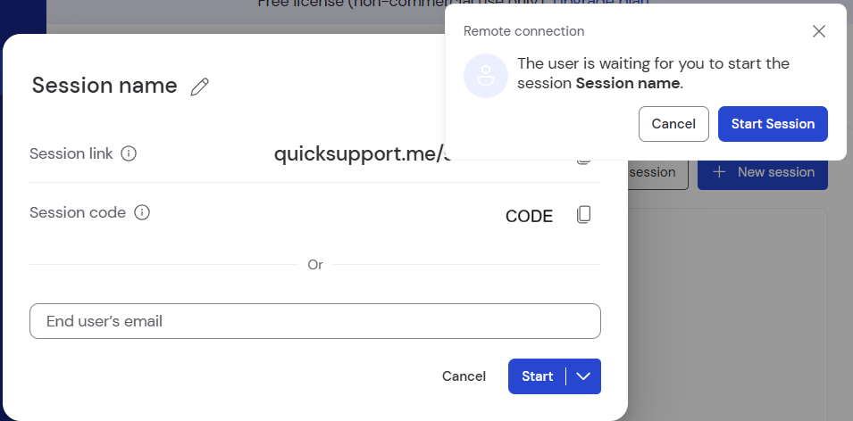 |
| User sees the active session | 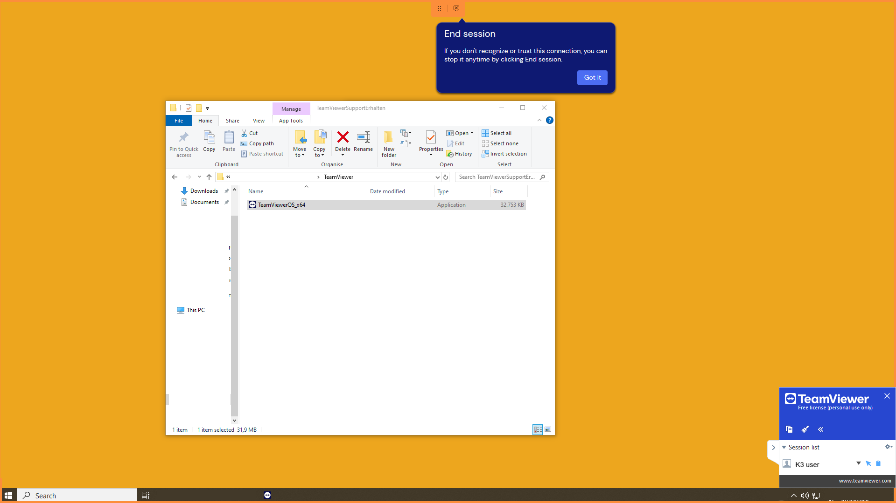 |
| Supporter views the remote desktop | 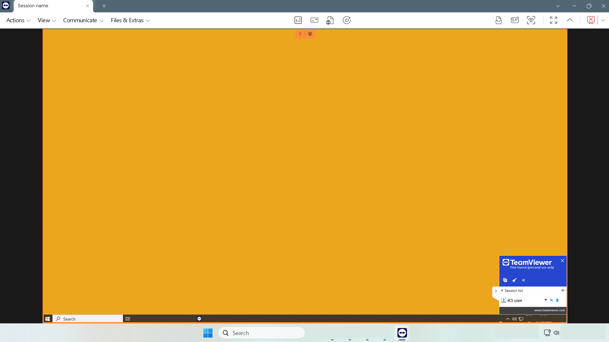 |
| Browser access check |  |
| Task Manager memory check |  |
| Task Manager disk check | 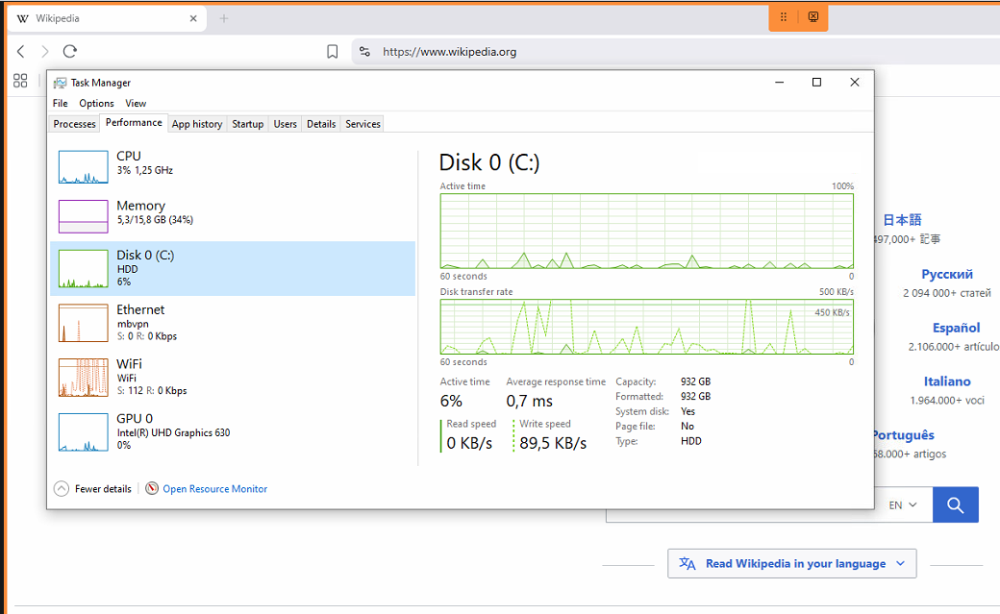 |
| User has the option to close the session | 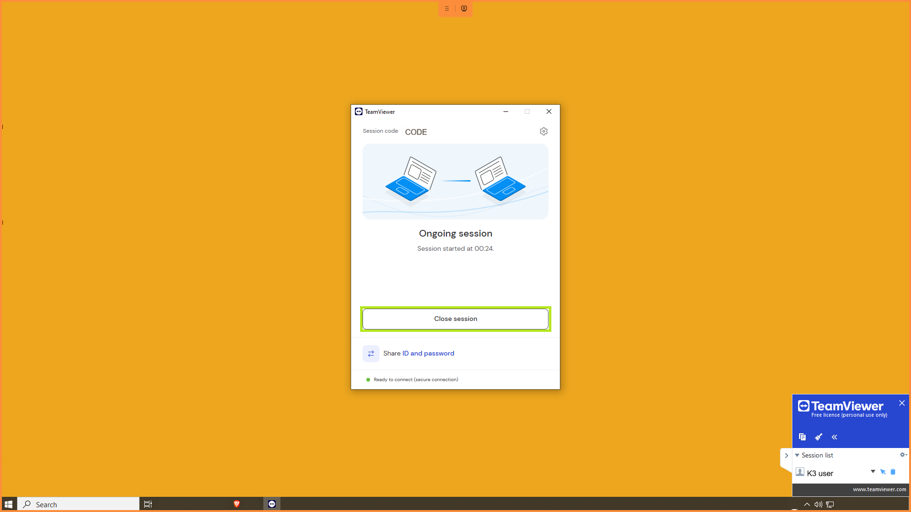 |
| Supporter can also end the session | 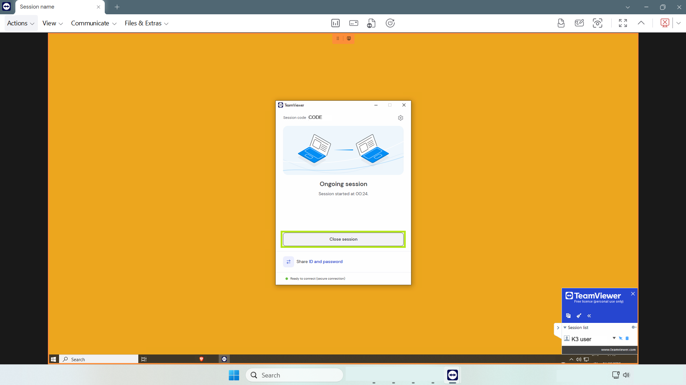 |
| User confirms session closing | 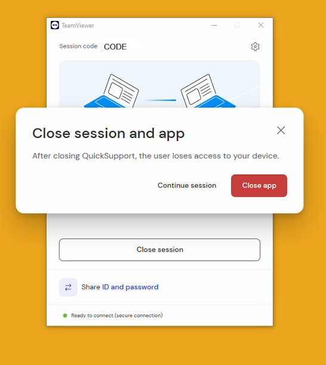 |
| Supporter device overview after the session | 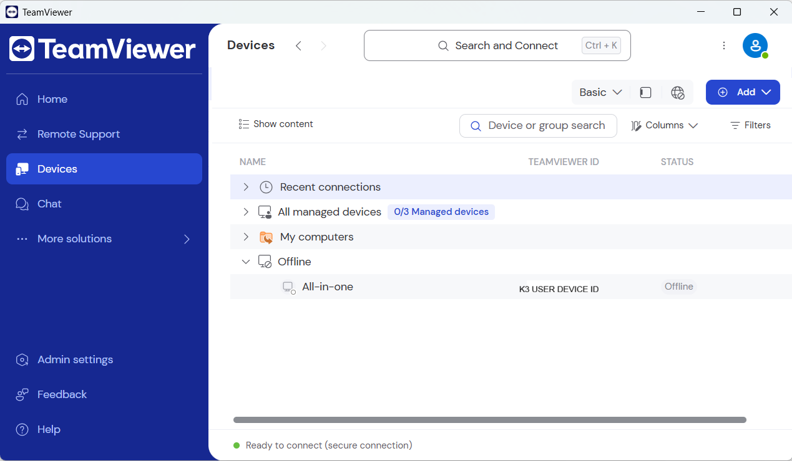 |

### AnyDesk Remote Support Session

| Step | Screenshot |
|---|---|
| AnyDesk download page |  |
| Supporter enters the user address | 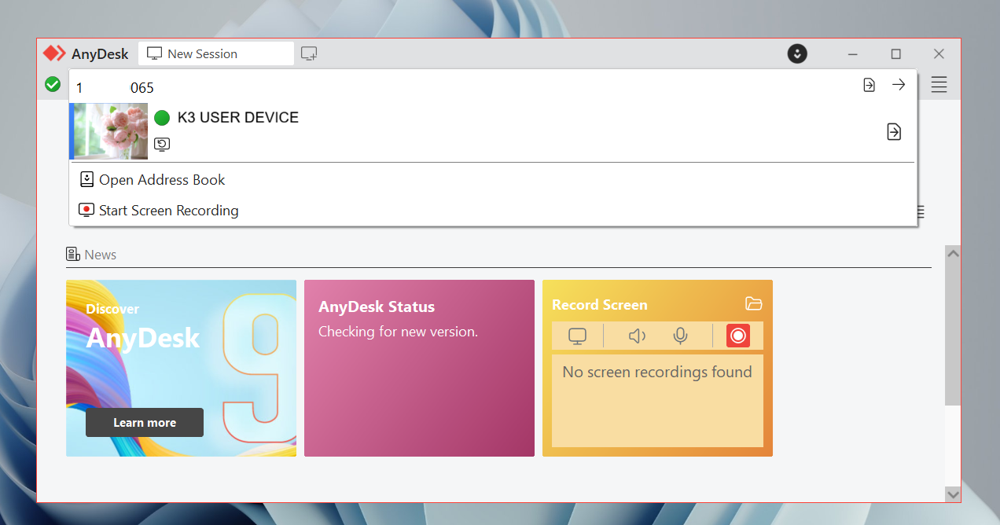 |
| Supporter sends connection request | 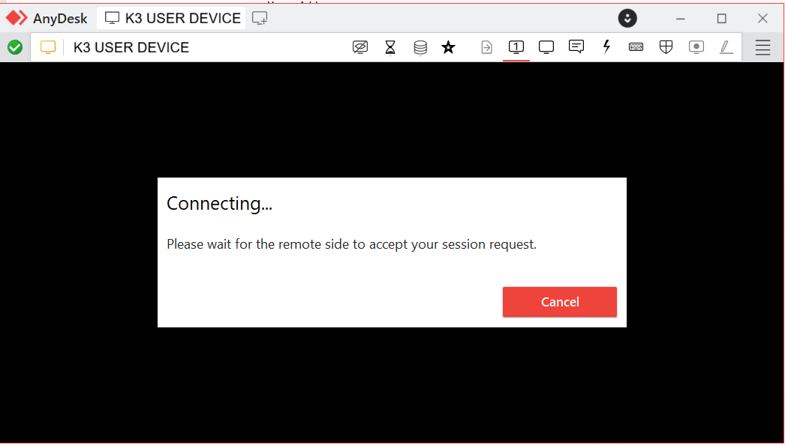 |
| User accepts the session request | 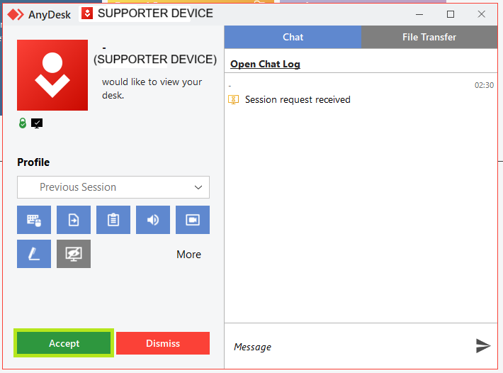 |
| AnyDesk session started |  |
| Supporter views the remote desktop |  |
| Basic security or system check |  |
| Session closed |  |
| Supporter returns to AnyDesk download page |  |

## Skills Demonstrated

- Remote support tool setup
- Remote support session handling
- Permission-based remote access
- User consent confirmation
- TeamViewer remote session workflow
- AnyDesk remote session workflow
- Supporter vs. user device role awareness
- Remote desktop access verification
- Browser access check on a remote device
- CPU, memory, and disk activity review
- Safe session closing from the user side
- Safe session closing from the supporter side

## Notes

This project documents the workflow of two remote support tools: TeamViewer and AnyDesk.

The focus is on remote session setup, user consent, supporter/user device roles, session closing.

The lab also helped clarify practical workflow differences between TeamViewer and AnyDesk.
