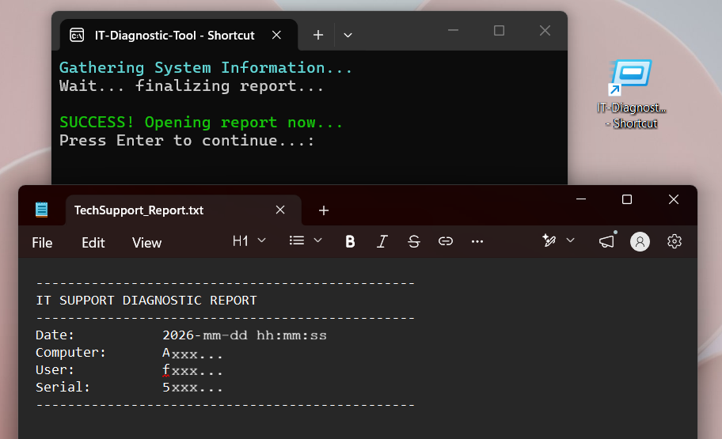
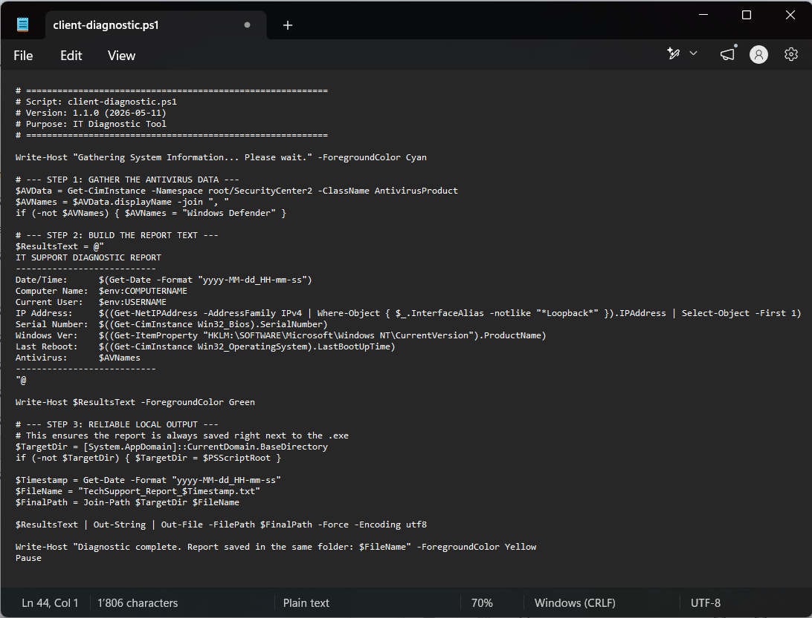
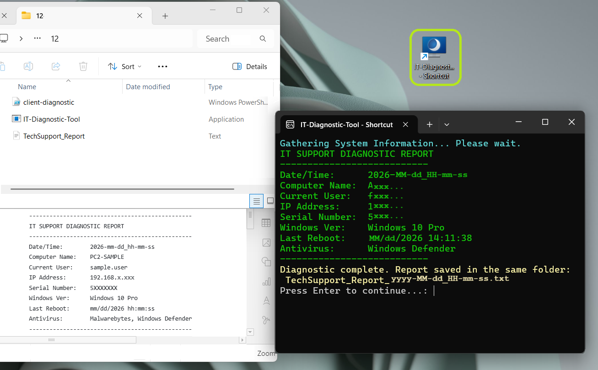

# IT Support Diagnostic Tool

---

**PowerShell automation for collecting support-relevant system details**

**Tool:** PowerShell

**Project concept:** One-click support metadata collection for IT support workflows.

**Project evolution:** script → executable workflow testing → troubleshooting and refinement → documentation → published PowerShell version

I developed this project by adapting and enhancing an initial PowerShell metadata collection script into a tested 1st Level Support workflow with local executable packaging and desktop shortcut testing. 

I tested it on multiple Windows systems, documented the troubleshooting process, and wrote both technician-facing and end-user-facing documentation.

---

## 📖 Project Overview

This project presents a one-click support information workflow built around a PowerShell script that only collects basic support-relevant system information and writes it quickly into a standardized report. It does not change system settings, delete anything, collect passwords, or modify security settings.

In a support situation, technicians often need basic device details before they can continue with troubleshooting or documentation. Instead of asking the user to manually look up details such as the computer name, IP address, serial number, Windows version, last reboot time, or antivirus product, the script creates a standardized text report as part of the support workflow.

The main development step was converting the script into a one-click executable (`.exe`) and testing it with a desktop shortcut, so a non-technical user would not need to open PowerShell manually.

The project includes:

- an initial PowerShell metadata collection script (`original-get-info.ps1`)
- a standardized text report format
- packaging the script as a one-click executable (`.exe`) and testing it with a desktop shortcut
- screenshots showing troubleshooting, testing, and validation
- a troubleshooting log documenting issues and fixes
- technician-facing SOP documentation
- end-user-facing knowledge base documentation
- a readable published PowerShell version [`it-diagnostic-tool.ps1`](it-diagnostic-tool.ps1) instead of a downloadable unsigned `.exe`

---

## 🎯 Project Goals

The primary goal of this tool is to **support the first information-gathering step** in an IT support request.

The tool collects basic system and network information that can support helpdesk work, remote support preparation, ticket documentation, and escalation handover.

By automating the collection of system details such as IP address, serial number, and last reboot time, the technician can skip manual data entry and begin the support session with the necessary technical context already available.

This can support faster handling of support requests and may positively impact MTTR (Mean Time to Resolution).

---

## ❓ The Problem

In 1st Level Support, valuable time can be lost guiding users through manual steps to find basic device information.

Technicians often need details such as:

- computer name
- IPv4 address
- hardware serial number for asset or warranty checks
- Windows version
- last reboot time / system uptime
- antivirus product

For non-technical users, these details are not always easy to find. This can slow down the first part of the support process and increase the chance of incorrect or incomplete ticket documentation.

---

## ✅ The Solution

The solution is a PowerShell-based support metadata collector.

The tool collects support-relevant system details and writes them into a standardized report file:

`TechSupport_Report_yyyy-MM-dd_HH-mm-ss.txt`

The report can then be shared with the IT technician or used for ticket documentation.

---

## 🔐 Security & Transparency Note

The user-friendly executable version was tested locally, but it is not published as a downloadable file in this repository.

Unsigned executables created from scripts may trigger heuristic antivirus detections, especially when they collect system and network information.

For transparency and trust, this repository provides the readable PowerShell source script as the main artifact instead of publishing the unsigned `.exe`. The script shows which commands are used and which system details are collected.

In a real support environment, the end user would use only an approved company-provided tool or follow the company-approved support process.

---

## 🔄 Support Workflow

### Public Repository

For this portfolio, the main public artifact is [`it-diagnostic-tool.ps1`](it-diagnostic-tool.ps1), which allows reviewers to inspect the script logic and see which system details are collected.

### Intended Use in 1st Level Support

In a real support environment, the technician would provide an approved runnable version of the tool or guide the user through the company-approved process.

1. A user contacts 1st Level Support with a slow PC, network issue, or unclear system problem.
2. The technician needs basic device information before continuing.
3. Instead of manually asking questions like “What is your computer name?” or “What is your IP address?”, the user runs the approved support information collector.
4. The tool creates a report named like:

   `TechSupport_Report_yyyy-MM-dd_HH-mm-ss.txt`

5. The user sends the report back to IT Support or attaches it to the support ticket.
6. The technician receives standardized device details without manually asking for each value.

This supports a more efficient and consistent first support interaction.

---

## 🧾 Sample Output

A sanitized sample report is included here:

[`sample-output/TechSupport_Report_sample.txt`](sample-output/TechSupport_Report_sample.txt)

The generated report contains fields such as:

- Date/Time
- Computer Name
- Current User
- IP Address
- Serial Number
- Windows Version
- Last Reboot
- Antivirus Product

---

## 📸 Screenshots

The main screenshots below show the user-friendly workflow, final validation, and second-computer test.

### One-Click Desktop Shortcut Test

### Final Path Handling

### Final Success Validation

### Security Check: No McAfee Entry

### Second Computer Validation

More process screenshots are documented in the [Troubleshooting Log](troubleshooting-log.md).

---

## 🧠 Technical Skills Demonstrated

- **Automation thinking:** used PowerShell to reduce repetitive manual collection of support-relevant system details.
- **PowerShell script testing and refinement:** worked with an AI-assisted PowerShell script, tested it, identified issues, and refined the workflow for IT support use. Used commands such as `Get-CimInstance`, `Get-NetIPAddress`, `Out-File`, and `Out-String`.
- **Windows support basics:** collected computer name, current user, IP address, serial number, Windows version, last reboot time, and antivirus product.
- **WMI/CIM awareness:** used Windows management queries to retrieve system and antivirus information.
- **Windows path handling:** worked with local folders, output paths, and report file creation during testing.
- **User Experience (UX):** tested a one-click executable and desktop shortcut to make the support workflow easier for non-technical users.
- **Testing discipline:** tested the workflow locally and on a second Windows computer.
- **Technical documentation:** created a README, SOP, user-facing knowledge base article, changelog, sample output, and troubleshooting log.
- **Security awareness:** decided to publish the readable `.ps1` source instead of requiring users to run an unsigned `.exe`.
- **Version control / GitHub:** managed the project in GitHub with source code, screenshots, sample output, and supporting documentation.

---

## ✨ Key Features

- **Low-Impact Support Check:** Designed for basic system information gathering without making configuration changes.
- **Support Metadata Collection:** Collects support-relevant system details such as computer name, current user, IP address, serial number, Windows version, last reboot time, and antivirus product.
- **Standardized Report Output:** Creates a report file named like `TechSupport_Report_yyyy-MM-dd_HH-mm-ss.txt`, which can be attached to a support ticket.
- **User-Friendly Workflow Tested:** Local `.exe` packaging and desktop shortcut testing were explored so a non-technical user would not need to open PowerShell manually.
- **Readable Public Source:** The public repository provides the `.ps1` script so reviewers can inspect what the tool collects.
- **Documentation Package:** Includes technician-facing SOP, user-facing KBA, troubleshooting log, changelog, screenshots, and sample output.

---

## 💼 Business Value

- **Challenge:** Support calls often lose time when users have to manually find device information.
- **Solution:** The tool collects support-relevant system information and writes it into a standardized report.
- **Result:** The report can be added to the support ticket as an attachment or used by the technician to document the case more accurately.

---

## 🔗 Links to supporting documents

- [Main PowerShell Script](it-diagnostic-tool.ps1)
- [Troubleshooting Log](troubleshooting-log.md)
- [SOP: Using and Maintaining the IT Diagnostic Tool](sop-it-diagnostic-tool.md)
- [User Guide: How to Run the IT Diagnostic Tool](ug-it-diagnostic-tool.md)
- [Changelog](CHANGELOG.md)
- [Sample Output](sample-output/TechSupport_Report_sample.txt)

---

## 🙏 Technical Credits

This project uses the [PS2EXE module](https://github.com/MScholtes/PS2EXE) created by Markus Scholtes. I used this open-source tool during local testing to compile the PowerShell script into an executable file.

---

## 🧾 License

This project is licensed under the MIT License. See the [LICENSE](LICENSE) file for details.
