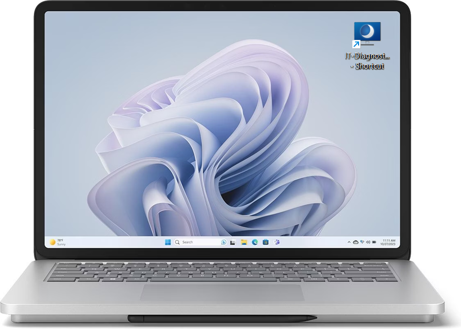

# User Guide: How to Run the IT Diagnostic Tool

---

 | *Internal User Guide*

**Document ID:** `UG-1001`
**Type:** User Guide
**Category:** Internal IT Support / Desktop Troubleshooting
**Target Audience:** All Employees (Non-Technical)
**Last Updated:** May 2026 

---

## Overview

To help IT Support understand your device faster, you may be asked to run the IT Diagnostic Tool during an active support request. 

The tool automatically generates a lightweight text report containing basic technical information about your computer. This helps you provide the information IT Support needs to investigate your issue.

#### Quick Process Overview

| Step | Action |
|---:|---|
| 1 | Find the desktop shortcut or the executable file in the local deployment folder. |
| 2 | Double-click the desktop shortcut or run the executable file directly. |
| 3 | Wait a few seconds until the diagnostic report is generated in the same folder. |
| 4 | Attach and send the final `.txt` file back to your assigned IT Support technician. |

---

### Before You Start
* Please use this tool **only** when explicitly instructed by an IT Support technician.
* Do not download or run diagnostic utilities from unverified external sources. In an enterprise environment, only utilize the approved tools provided through official TechLog Solutions channels.

---

 

### Step 1: Find and Open the Tool

The IT Diagnostic Tool is deployed to your workstation and can be accessed in one of two ways:

1. **Desktop Shortcut:** Locate the shortcut icon labeled **IT-Diagnostic Tool** on your main desktop screen.
2. **Local Folder:** Open Windows File Explorer (`Win + E`) and navigate to the local tools folder: `C:\Public\IT_Tools\IT_Diagnostic_Tool\`

*If you cannot locate the tool or shortcut on your device, contact IT Support before proceeding.*

---

### Step 2: Run the Application

1. Double-click either the **IT-Diagnostic Tool** desktop shortcut or the local executable file (**IT-Diagnostic-Tool.exe**).

> ℹ️ **Note on System Prompts:** Depending on your local account permissions, a standard Windows security prompt may appear asking for confirmation to execute the file. If this happens, stop and contact IT Support unless your technician has specifically confirmed that the prompt is expected.

2. A black command line window will open and collect basic support information. This process usually completes within 5 to 10 seconds.

3. When the process finishes, the window will display a message like:

`Diagnostic complete. Report saved in the same folder: TechSupport_Report_2026-01-10_14-06-50.txt`  
`Press Enter to continue...:`

4. Press **Enter** on your keyboard to close the window.

---

### Step 3: Locate & Send the Report

1. Look in the same folder where the executable file is stored for a new file named **TechSupport_Report_yyyy-MM-dd_HH-mm-ss.txt**.

   If you started the tool through a desktop shortcut, the report is still saved next to the executable file, not next to the shortcut.

2. Attach this text file to your support ticket or reply to your technician's email with the file attached.

3. You may delete the text file once the technician confirms they have received it.

---

## ℹ️ Privacy & Data Security Note

**TechLog Solutions** prioritizes employee data privacy. This utility is strictly a configuration reader:

* **Collected Data:** The report only logs baseline system variables:
  - Date/Time
  - Computer Name
  - Current User
  - IP Address
  - Serial Number
  - Windows Version
  - Last Reboot
  - Antivirus Product
* **Prohibited Access:** The tool does not collect personal files, photos, browser history, emails, saved passwords, or network traffic.
* **System Safety:** This script runs read-only commands. It does not modify system settings, delete application data, or alter local security parameters.

### ⚠️ Troubleshooting
* If the command window fails to open, no text file appears, or you are uncertain which file to attach, stop the process and contact IT Support directly. 
* Do not attempt to modify system directories or local registry files manually.
