# Troubleshooting Log – IT-Diagnostic-Tool

This document chronicles the sequential testing phases and technical challenges encountered during the development of the IT-Diagnostic-Tool project.

The purpose of this log is to show how the utility evolved from a baseline configuration script into a tested, fully validated, user-friendly desktop workflow, capturing how issues such as Desktop path ambiguity, script syntax errors, empty report output, and stale antivirus entries were isolated and resolved.

---

## 1. Troubleshooting Summary

| Functional Area | Technical Issue | Operational Outcome |
|---|---|---|
| **Desktop Output Path** | Saving directly to Desktop created location ambiguity in a Windows/OneDrive setup. | The output strategy was later changed so the report is saved next to the executable. |
| **Rebuild Preparation** | The `.ps1` script was revised, so the previous `.exe` no longer represented the current script version. | The previous executable was removed before compiling a new executable version. |
| **Executable Packaging** | The compiled executable exposed a syntax/quoting issue during testing. | The script was corrected and the executable workflow was tested again. |
| **Output Writing** | The report file was created, but the report content was empty during one test phase. | Output stream handling was adjusted using `Out-String` and explicit UTF-8 encoding. |
| **One-Click Workflow** | The workflow needed to be tested both directly and through a desktop shortcut. | The executable workflow was validated with and without a desktop shortcut. |
| **Antivirus Verification** | The report showed a stale McAfee entry from an old installation. | Windows antivirus reporting checks and vendor cleanup/removal steps were used, then the final report was verified again. |
| **Final Output Path** | A later null path issue appeared during executable testing. | `BaseDirectory` was used so the report is saved next to the running executable. |
| **Local Final Validation** | The final local version needed to confirm full report generation. | The final executable generated the expected report output. |
| **Second Computer Validation** | The tool needed to be tested outside the original laptop environment. | The workflow was validated on a second Windows computer. |

---

## 2. Chronological Troubleshooting Timeline

### 2.1 Desktop Output Path Investigation

The first operational challenge involved locating the generated report after execution. During early testing, the report was expected on the visible Desktop view, but it was not shown there. The output path was then checked and adjusted during testing to understand where the report was actually being saved.

| Step | Screenshot | Technical Observation |
|---:|---|---|
| 1 | [`ts-01-static-desktop-path.png`](screenshots/ts-01-static-desktop-path.png) 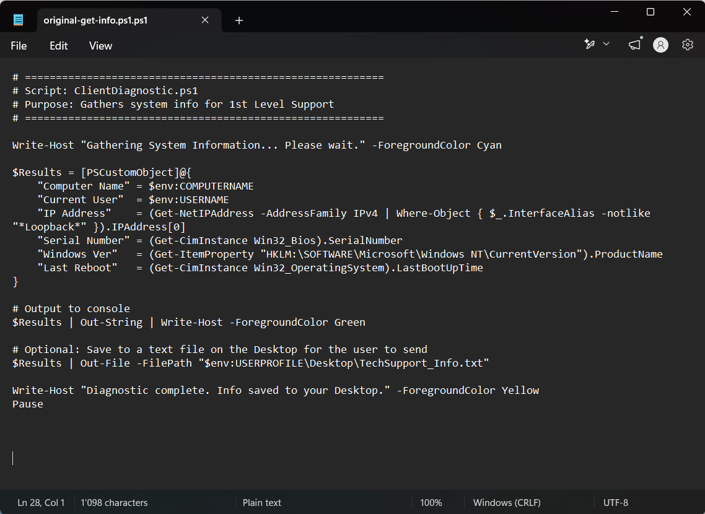 | Tested an early output path using the user profile Desktop location. |
| 2 | [`ts-02-active-desktop-path-test.png`](screenshots/ts-02-active-desktop-path-test.png) 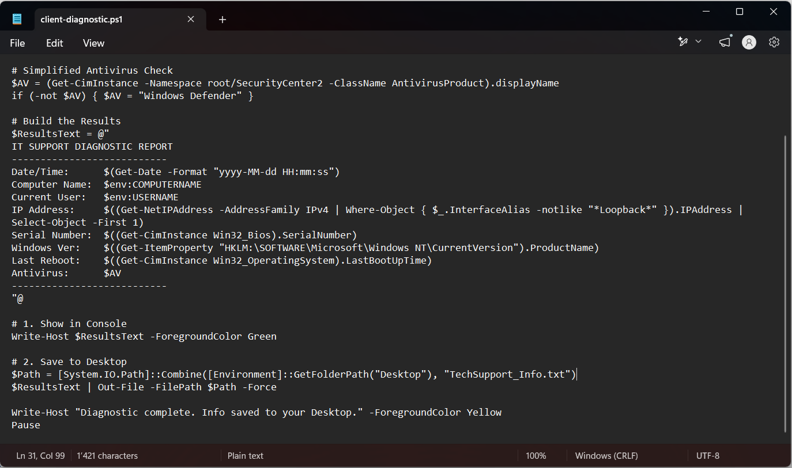 | Checked the Desktop path returned by Windows during report generation. |
| 3 | [`ts-03-onedrive-desktop-path-check.png`](screenshots/ts-03-onedrive-desktop-path-check.png) 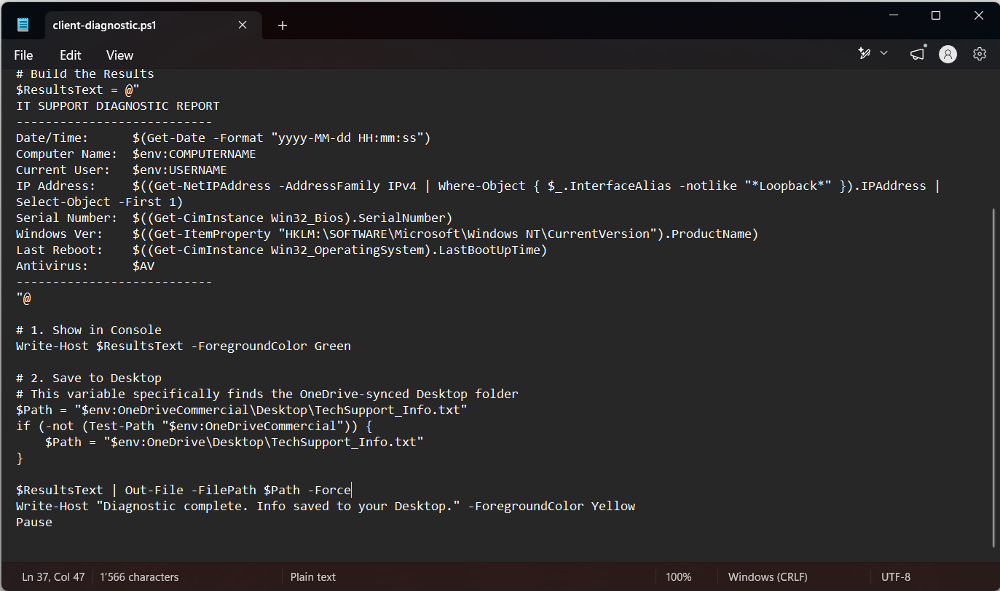 | Investigated how the script handled Desktop and OneDrive path behaviour. |
| 4 | [`ts-04-report-invisible-on-desktop.png`](screenshots/ts-04-report-invisible-on-desktop.png) 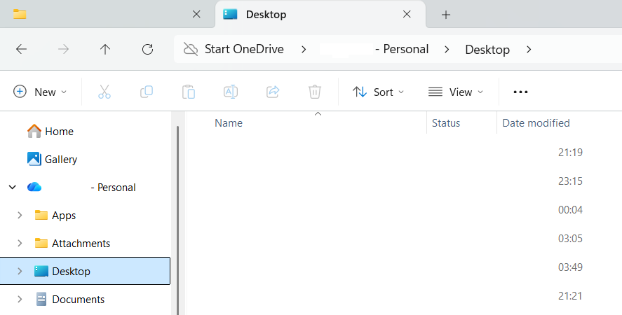 | The report was expected on the visible Desktop view, but it was not shown there after execution. |
| 5 | [`ts-05-report-visible-after-path-change.png`](screenshots/ts-05-report-visible-after-path-change.png) 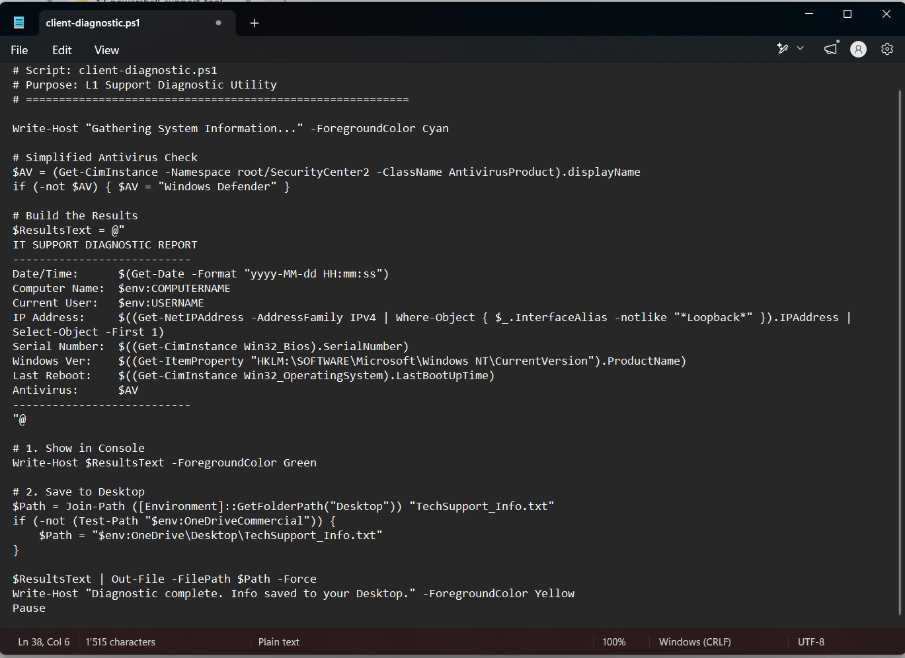 | The output path logic was adjusted during testing to handle Desktop / OneDrive path behaviour more explicitly. |
| 6 | [`ts-06-report-not-visible-found.png`](screenshots/ts-06-report-not-visible-found.png) 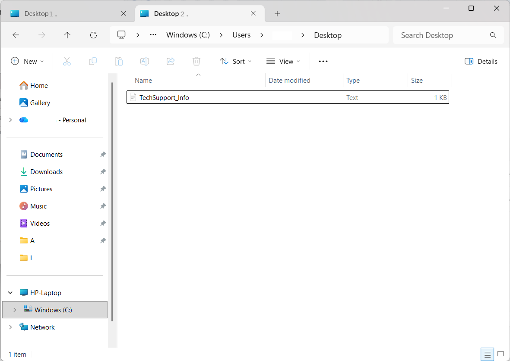 | The generated report was later found in the local Desktop folder, confirming that report creation had worked. |

**Result:**  
The report generation worked, but saving directly to “Desktop” created location ambiguity in this Windows/OneDrive setup. This led to the later decision to save the report next to the executable instead of relying on a Desktop path.

---

### 2.2 Rebuild Preparation and Script Update

After the first output-location issue, the PowerShell script was revised. Because a compiled `.exe` does not automatically reflect later changes made to the `.ps1` file, the previous executable was removed before recompiling the updated script.

| Step | Screenshot | Technical Observation |
|---:|---|---|
| 7 | [`ts-07-old-exe-deleted.png`](screenshots/ts-07-old-exe-deleted.png) 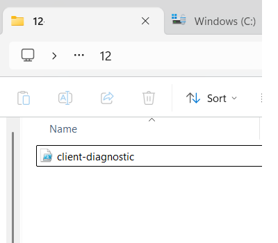 | Removed the previous executable to avoid testing a version that no longer matched the updated PowerShell script. |
| 8 | [`ts-08-script-updated.png`](screenshots/ts-08-script-updated.png) 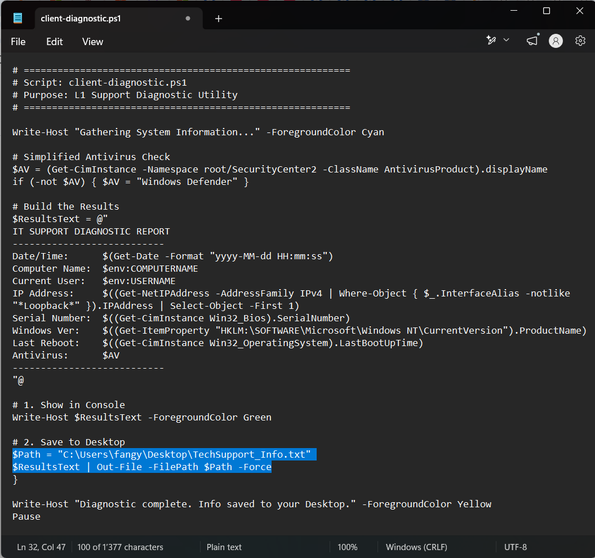 | Revised the PowerShell script after the output-location issue and prepared it for recompilation. |

**Result:**  
The next executable test was based on the revised PowerShell script, not on an earlier compiled version.

---

### 2.3 Script Syntax Issue During Test Run

The revised script was tested and returned a PowerShell parser error. The error was caused by a syntax issue in the script, not by missing administrator rights.

| Step | Screenshot | Technical Observation |
|---:|---|---|
| 9 | [`ts-09-script-parser-error.png`](screenshots/ts-09-script-parser-error.png) 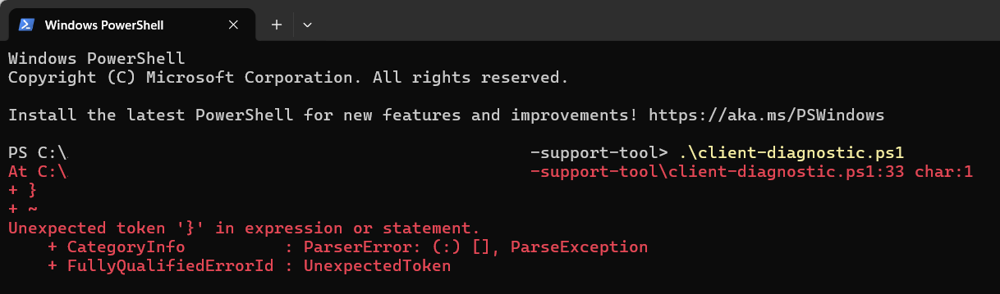 | PowerShell returned a parser error (`Unexpected token '}'`), showing that the script syntax needed to be corrected before continuing with executable testing. |

Once the syntax issue was corrected, PS2EXE was used during local testing to compile the PowerShell script into an executable file.

| Action | Purpose | Command |
|---|---|---|
| PS2EXE install | Install PS2EXE for the current user | `Install-Module -Name ps2exe -Scope CurrentUser -Force -AllowClobber -Verbose` |
| Module check | Verify that the module is available | `Get-Module -Name ps2exe` |
| Executable compilation | Compile the PowerShell script into an executable file | `Invoke-PS2EXE -InputFile .\it-diagnostic-tool.ps1 -OutputFile .\IT-Diagnostic-Tool.exe` |

**Result:**  
The syntax issue was corrected before continuing with executable testing. This step also showed that the raw `.ps1` script and the compiled `.exe` workflow both needed to be tested separately.

---

### 2.4 Empty Report / Output Writing Issue

During testing, the report file was created, but the expected text content was missing. The output-writing logic was adjusted and tested again until the generated report contained readable data.

| Step | Screenshot | Technical Observation |
|---:|---|---|
| 11 | [`ts-11-out-string-output-fix.png`](screenshots/ts-11-out-string-output-fix.png) 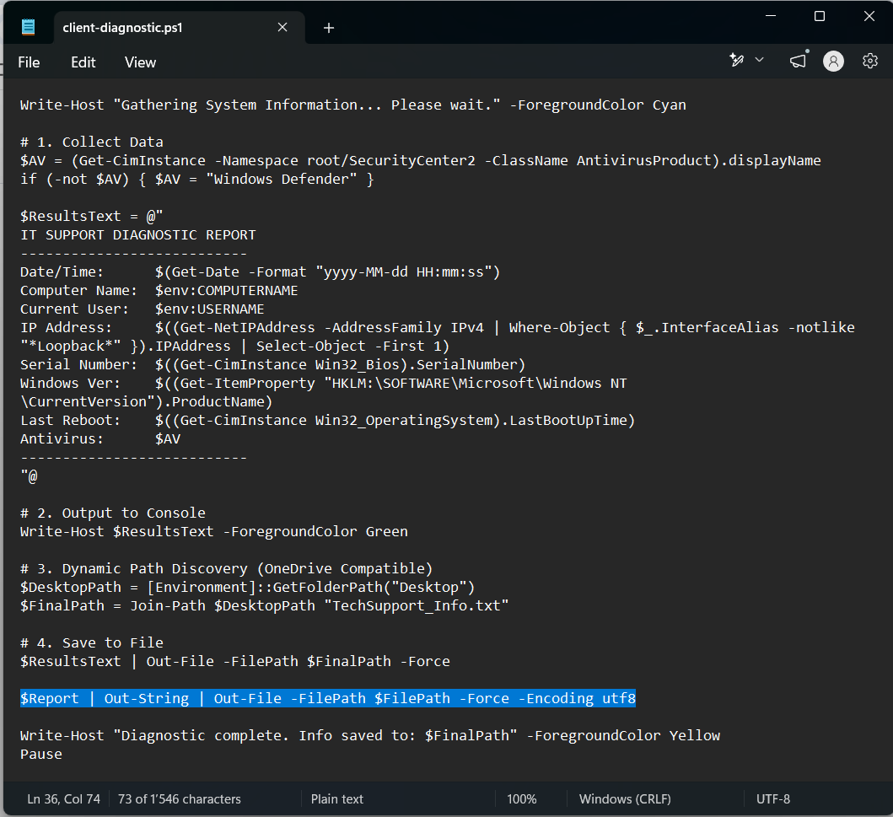 | Adjusted the output-writing logic using `Out-String`, `Out-File`, and UTF-8 encoding so the report content would be written as readable text. |
| 12 | [`ts-12-empty-report-debugging.png`](screenshots/ts-12-empty-report-debugging.png) 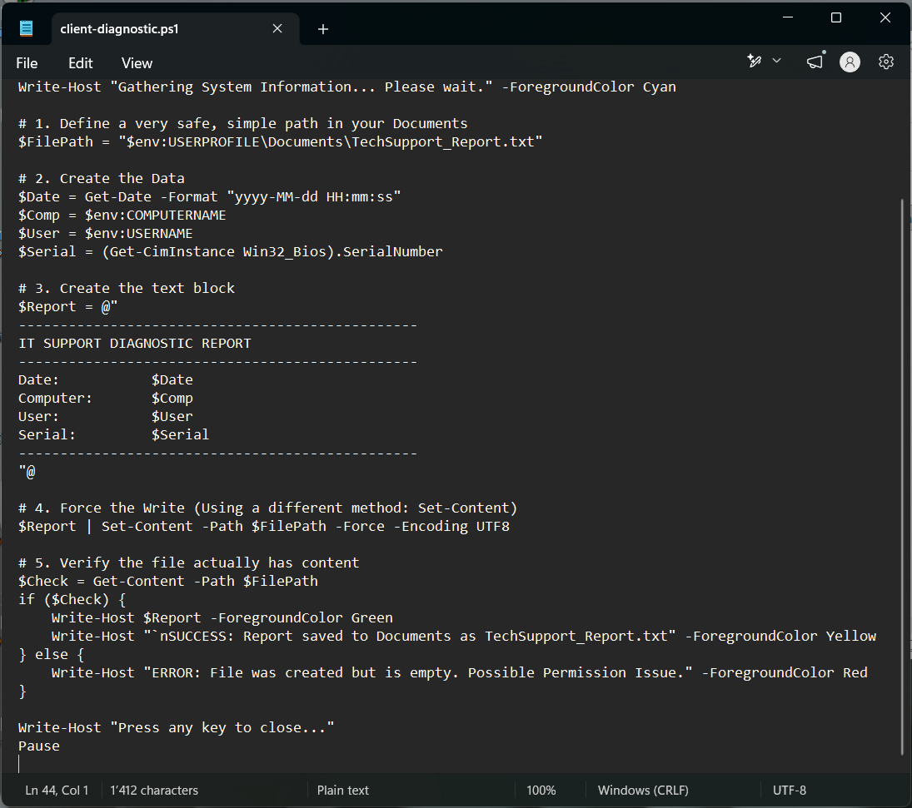 | Tested an alternative write method and added a content check after file creation to verify whether the report actually contained text. |
| 13 | [`ts-13-raw-script-test.png`](screenshots/ts-13-raw-script-test.png) 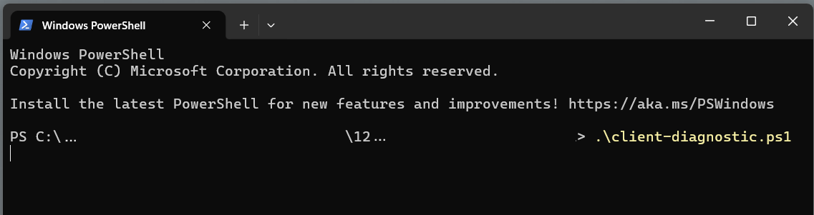 | Ran the raw PowerShell script directly to check whether the issue came from the script itself or from the executable workflow. |
| 14 | [`ts-14-report-content-fixed.png`](screenshots/ts-14-report-content-fixed.png) 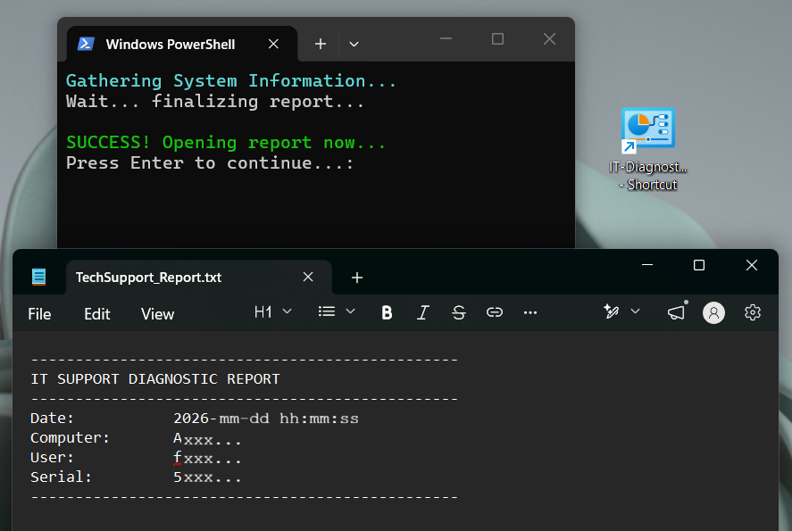 | After adjusting the output handling, the report opened successfully and displayed readable content. |

The following output-writing commands were used during this troubleshooting phase:

| Action | Purpose | Command / Code |
|---|---|---|
| Convert output to text | Convert the report object/output into readable string content | `Out-String` |
| Write report to file | Write the generated report content into a `.txt` file | `Out-File -FilePath $FinalPath -Force -Encoding utf8` |
| Alternative write test | Test another writing method during debugging | `Set-Content -Path $FilePath -Force -Encoding UTF8` |
| Verify file content | Check whether the created file actually contained text | `Get-Content -Path $FilePath` |

**Result:**  
The empty report issue was resolved by changing the output-writing method and verifying that the generated text file contained readable report content.

---

### 2.5 One-Click Executable Workflow Test

After the report output issue was corrected, the executable workflow was tested again. The goal was to confirm that the tool could be run directly and also through a desktop shortcut without requiring the user to open PowerShell manually.

| Step | Screenshot | Technical Observation |
|---:|---|---|
| 15 | [`ts-15-exe-run-without-desktop-icon.png`](screenshots/ts-15-exe-run-without-desktop-icon.png) 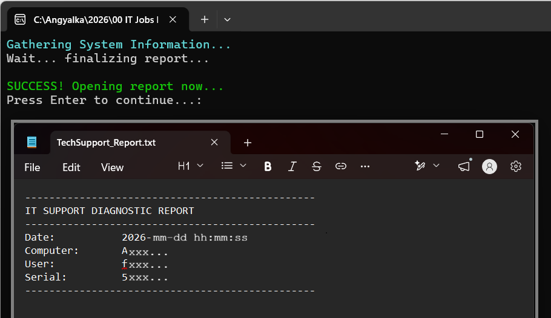 | The executable was run directly from its folder and successfully generated/opened the report. |
| 16 | [`ts-16-one-click-desktop-shortcut-success.png`](screenshots/ts-16-one-click-desktop-shortcut-success.png)  | The executable was run through a desktop shortcut and successfully generated the report. |

**Result:**  
The executable workflow worked both when started directly and when started through a desktop shortcut. This confirmed that the tool could support a simple one-click user workflow.

---

### 2.6 Antivirus Output and Verification

A stale McAfee entry first appeared during report testing. For readability, the initial finding and the later verification steps are documented together in this section.

The generated report showed a McAfee entry from an old installation, although McAfee was no longer actively installed. This triggered a separate verification step to compare the report output with what Windows reported about antivirus products.

| Step | Screenshot | Technical Observation |
|---:|---|---|
| 10 | [`ts-10-antivirus-output-shows-mcafee.png`](screenshots/ts-10-antivirus-output-shows-mcafee.png) 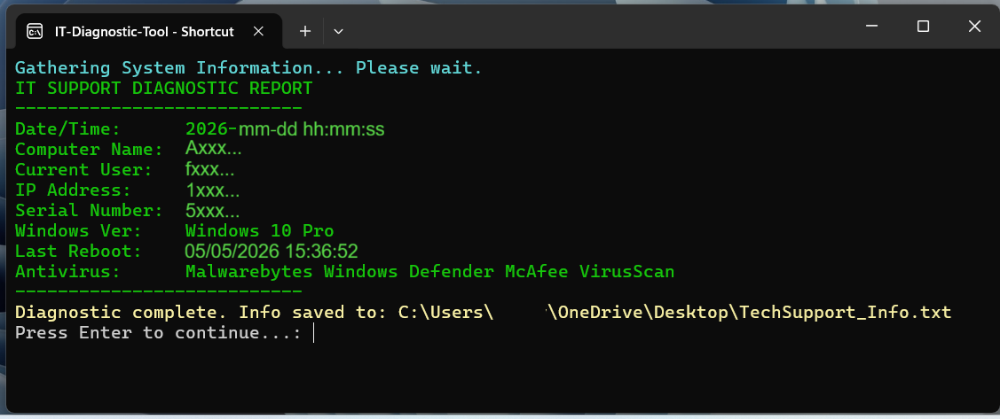 | The generated report showed `Malwarebytes`, `Windows Defender`, and `McAfee VirusScan` in the antivirus field. |
| 17 | [`ts-17-antivirus-check-before.png`](screenshots/ts-17-antivirus-check-before.png) 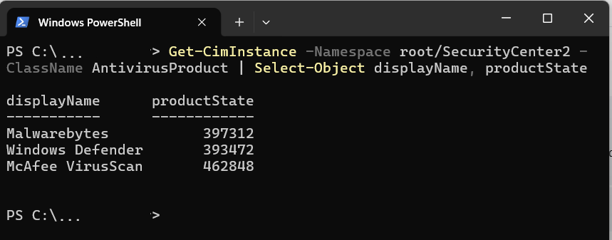 | A PowerShell check showed `Malwarebytes`, `Windows Defender`, and `McAfee VirusScan`, with product state values. |
| 18 | [`ts-18-mcafee-present-after-restart.png`](screenshots/ts-18-mcafee-present-after-restart.png) 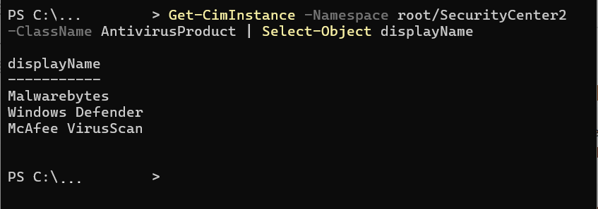 | A second PowerShell check still showed `McAfee VirusScan` together with `Malwarebytes` and `Windows Defender`. |
| 19 | [`ts-19-mcafee-wmi-details.png`](screenshots/ts-19-mcafee-wmi-details.png) 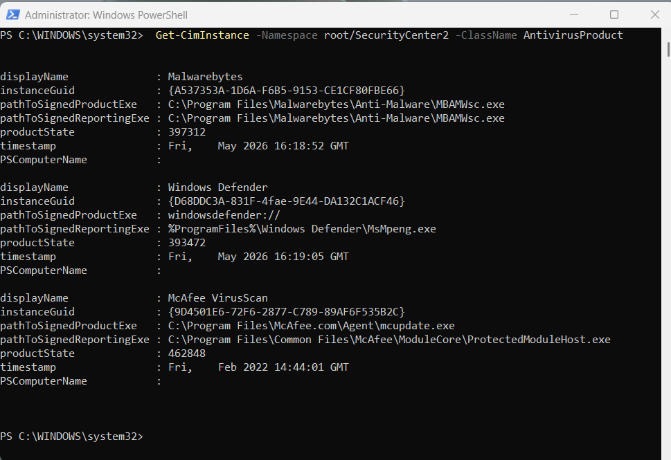 | A detailed `SecurityCenter2` query showed antivirus product entries, including paths and product state values for Malwarebytes, Windows Defender, and McAfee VirusScan. |
| 20 | [`ts-20-mcafee-removed-cmd-check.png`](screenshots/ts-20-mcafee-removed-cmd-check.png) 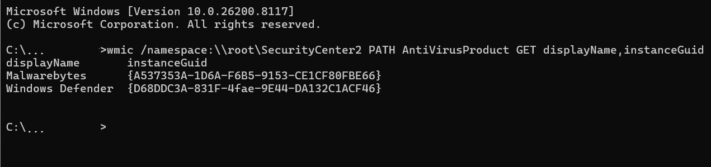 | A CMD check after cleanup/removal steps showed only `Malwarebytes` and `Windows Defender`. |
| 21 | [`ts-21-no-mcafee-final-check.png`](screenshots/ts-21-no-mcafee-final-check.png) 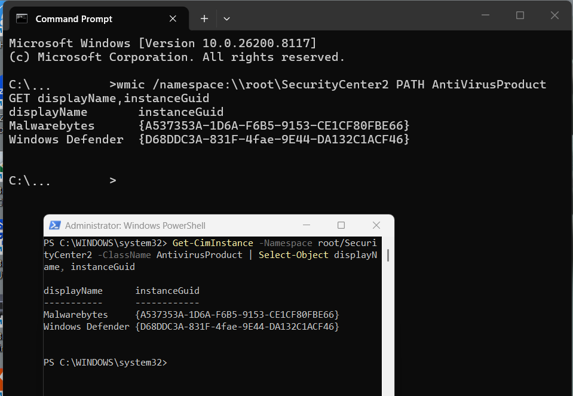 | CMD and PowerShell checks both showed only `Malwarebytes` and `Windows Defender`, confirming that the old McAfee entry was no longer reported. |
| 22 | [`ts-22-no-mcafee-final-report.png`](screenshots/ts-22-no-mcafee-final-report.png) 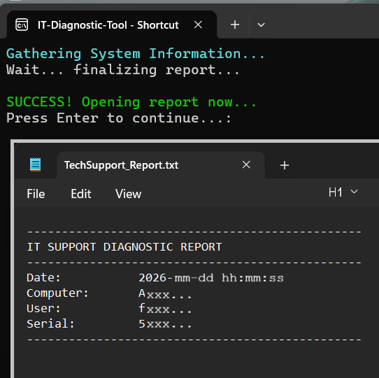 | The final generated report no longer showed the stale McAfee entry. |

The following commands were used to compare the report output with what Windows reported about antivirus products.

| Action | Purpose | Command |
|---|---|---|
| CMD antivirus query | Check antivirus products reported by Windows using Command Prompt | `wmic /namespace:\\root\SecurityCenter2 path AntivirusProduct get displayName` |
| PowerShell antivirus query | Check antivirus products reported by Windows using PowerShell | `Get-CimInstance -Namespace root/SecurityCenter2 -ClassName AntivirusProduct \| Select-Object displayName` |

**Result:**  
The stale antivirus entry was verified instead of assumed. After vendor cleanup/removal steps and repeated checks, the final report no longer showed the old McAfee entry.

---

### 2.7 Final Null Path Issue and BaseDirectory Fix

The earlier Desktop-output tests showed that saving reports directly to Desktop could create location ambiguity. During final executable testing, a separate null path issue appeared. The output strategy was changed to use BaseDirectory, so the report would be saved next to the running executable.

| Step | Screenshot | Technical Observation |
|---:|---|---|
|   23 | [`ts-23-null-path-error.png`](screenshots/ts-23-null-path-error.png) 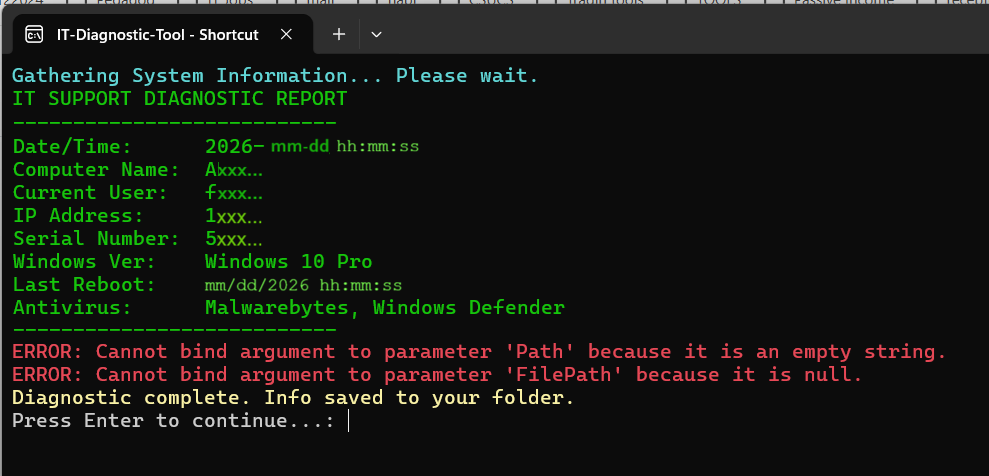 | A null path issue appeared during executable testing, preventing the report path from being handled correctly. |
|   24 | [`ts-24-basedirectory-fix.png`](screenshots/ts-24-basedirectory-fix.png) 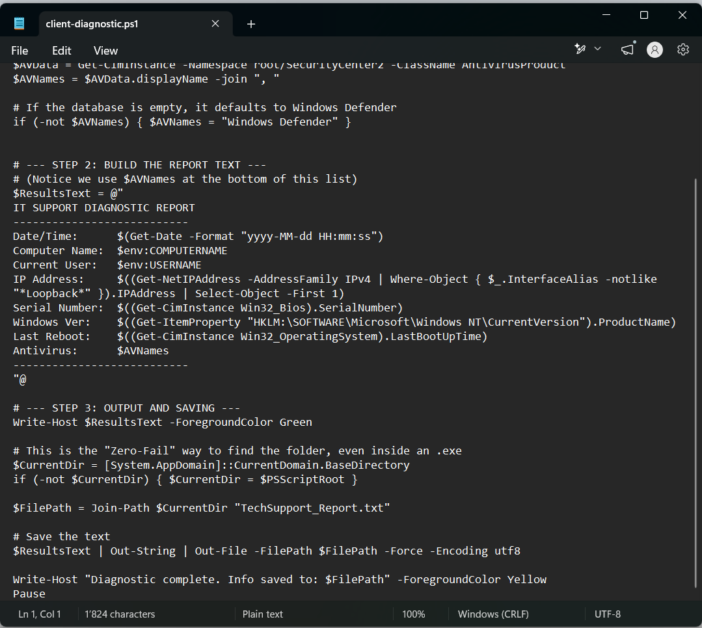       | Updated the output logic to use `BaseDirectory`, so the report would be saved next to the running executable.  |

**Result:**  
The final output strategy was changed to save the report next to the executable. This avoided Desktop path ambiguity and made the report location clearer after each run.

---

### 2.8 Final Successful Result

After the output path and report-writing issues were corrected, the executable was tested again to confirm that it generated the expected report.

| Step | Screenshot | Technical Observation |
|---:|---|---|
| 25 | [`ts-25-final-success.png`](screenshots/ts-25-final-success.png)  | Confirmed that the executable generated the expected report successfully. |

**Result:**  
The standalone executable successfully generated the target report and met the expected test outcome.

---

### 2.9 Second Computer Validation

To verify that the tool also worked outside the original laptop environment, it was tested on a second Windows computer.

| Step | Screenshot | Technical Observation |
|---:|---|---|
| 26 | [`ts-26-second-computer-folder-created.png`](screenshots/ts-26-second-computer-folder-created.png) 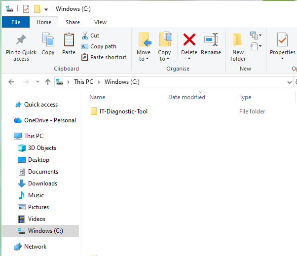 | Created a local test folder on PC3 for the test run. |
| 27 | [`ts-27-second-computer-tool-folder.png`](screenshots/ts-27-second-computer-tool-folder.png) 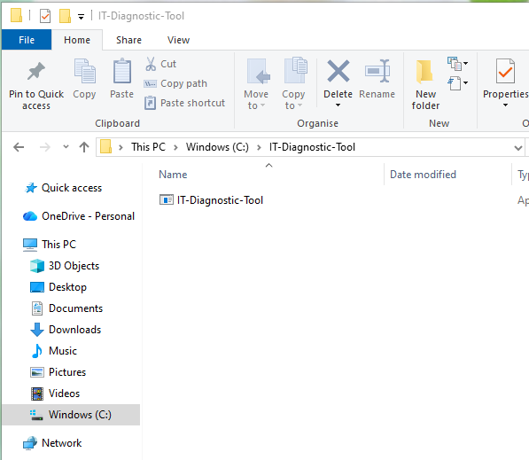 | Placed the executable in the PC3 test folder before running it. |
| 28 | [`ts-28-second-computer-success.png`](screenshots/ts-28-second-computer-success.png) 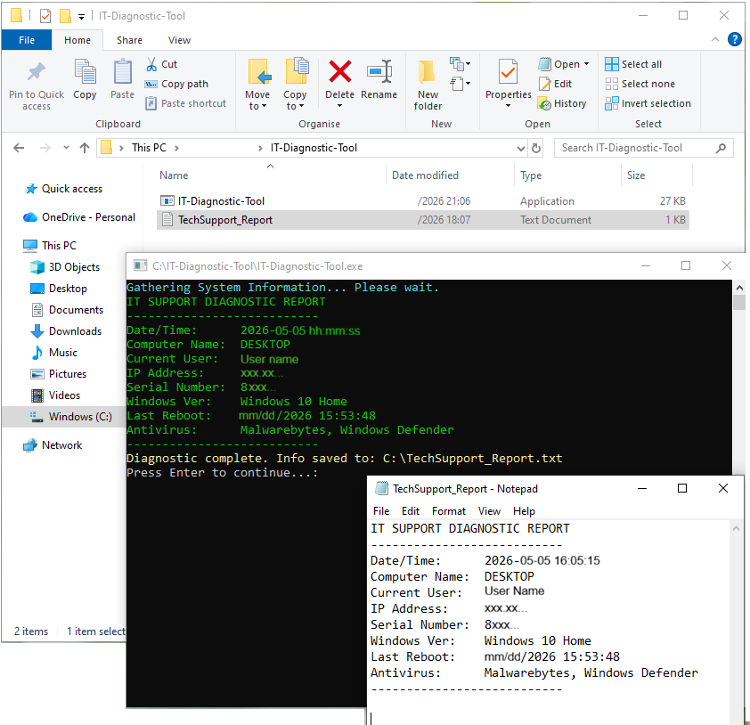 | Ran the executable on PC3 and generated the expected report output. |

**Result:**  
The tool was successfully tested on a second Windows computer and generated the expected report output.

---

## 3. Practical Notes for Future Use

- When testing a PowerShell script as an executable, verify the `.exe` separately from the raw `.ps1` script. A script can behave differently after packaging.

- Keep a visible completion step, such as `Pause`, if the tool is intended to be run by a user through a one-click executable. This gives the user time to read the success message and see where the report was saved.

- Avoid relying only on Desktop paths for report output. On systems where the visible Desktop is managed through OneDrive, a report may be saved correctly to the local Desktop folder but still appear missing from the user’s visible Desktop view. Saving the report next to the executable was the clearer and more predictable output strategy in this project.

- If antivirus information appears unexpected, compare the report output with what Windows reports and with the actual security tools installed on the device. Old antivirus entries can remain visible after previous installations.

---

## 4. Final Public Decision

The executable workflow was tested locally to validate a user-friendly support process.

Because unsigned executables can trigger antivirus, heuristic, or SmartScreen warnings, the public GitHub version provides the readable PowerShell script (`it-diagnostic-tool.ps1`) instead of the unsigned executable (`IT-Diagnostic-Tool.exe`).
