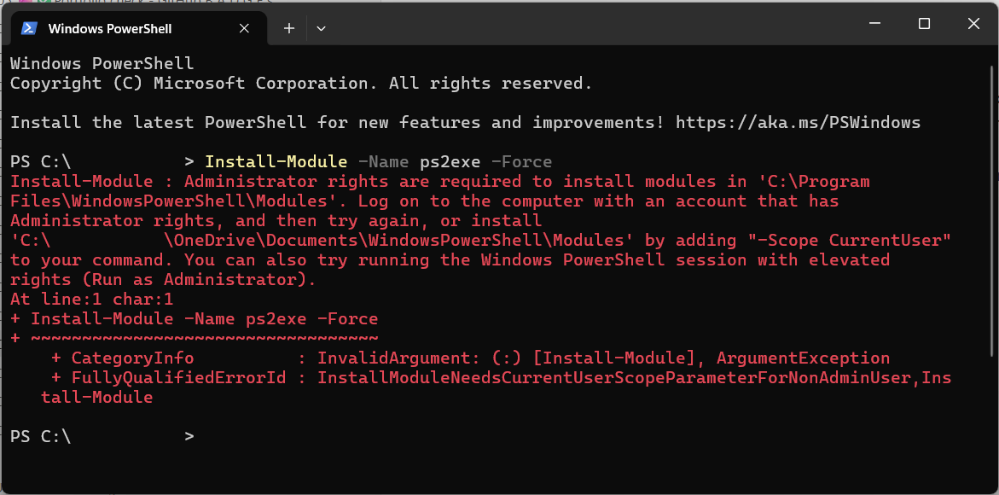
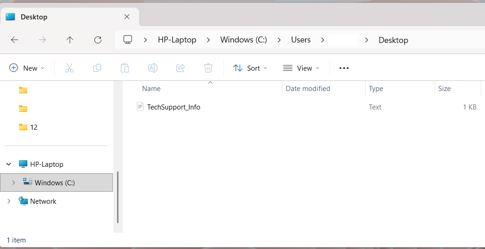
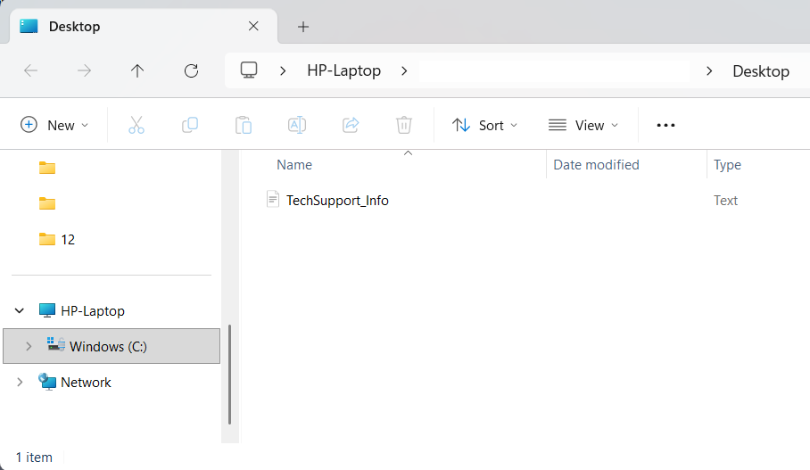

# Troubleshooting Log – IT-Diagnostic-Tool

This log documents the sequential troubleshooting milestones encountered during the development of the IT-Diagnostic-Tool project.

The purpose of this file is to show how the project evolved from an initial support information script into a tested one-click support workflow, including executable packaging, output-location fixes, report-generation issues, antivirus verification, and second-computer validation.

---

## 1. Troubleshooting Summary

| Area | Issue | Final Outcome |
|---|---|---|
| Output location | Reports were difficult to locate because Desktop paths and OneDrive redirection created confusion. | Final output strategy saves the report next to the running tool. |
| EXE testing | The executable workflow exposed a syntax issue during testing. | Script logic was corrected and retested within `it-diagnostic-tool.ps1`. |
| Antivirus detection | The report showed a stale McAfee entry from an old installation, although McAfee was no longer actively installed. | The McAfee cleanup tool was used to remove possible leftover components, and the final report was checked again. |
| Report content | A report file was created, but content was missing during one phase. | Output handling was corrected and report content was verified. |
| Local executable workflow | The executable was tested as a one-click support tool, including runs with and without a desktop shortcut. | The executable workflow was validated locally, but the public repository provides the readable PowerShell version (`it-diagnostic-tool.ps1`). |
| Final path handling | A later path issue appeared during executable testing. | The final output strategy was changed so the report is saved next to the running tool. |
| Second computer validation | The tool needed to be tested outside the original laptop environment. | Successful validation was completed on a second Windows computer. |

| Functional Area | Technical Issue | Operational Outcome |
|---|---|---|
| **Output Path Handling** | Target reports were prone to directory path redirection conflicts caused by cloud-synced OneDrive configurations. | Implemented execution-relative directory tracking (`BaseDirectory`) to enforce a local save alongside the tool. |
| **Executable Packaging** | The encapsulated binary package exposed a console-specific syntax restriction during validation. | Refactored internal script quotation parameters to allow stable, error-free standalone execution. |
| **WMI Data Validation** | Local system telemetry logs continually generated an obsolete, stale McAfee antivirus registration entry from an old deployment. | Utilized specialized vendor extraction tools to clear orphaned security center records from the WMI namespace. |
| **Output Buffer Handling** | The tool generated a valid file structure, but the system configuration text stream payload failed to initialize properly. | Restructured the variable output pipeline using explicit data cast strings to eliminate empty log file bugs. |
| **Deployment Scenario** | Validated the utility across varied desktop launching profiles to ensure seamless execution paths for non-technical users. | Confirmed uniform, automated file creation whether executed directly or launched via a standard desktop shortcut. |
| **Multi-Host Validation** | Needed to verify script execution reliability and output accuracy outside of the primary development workstation. | Conducted environment-agnostic validation testing across secondary and tertiary Windows hosts. |

output path → EXE syntax → stale McAfee output → empty report/content fix → one-click EXE workflow → antivirus verification/final path handling → PC3 validation

**Result:**  
The output strategy needed to avoid depending only on the visible Desktop path. This later led to the final decision to save the report next to the running script or executable.

---

## 2. Chronological Troubleshooting Timeline

### 2.1 Output Location and Desktop / OneDrive Path Confusion

The first major issue was report location. The script needed to create a report file that the user could actually find. During testing, Desktop paths and OneDrive redirection made this less reliable than expected.

| Step | Screenshot | What happened |
|---:|---|---|
| 0 | `ts-00-permission-error.png` | Attempted module installation without administrative privileges, resulting in an access block. |
| 1 | `ts-01-static-desktop-path.png` | Early attempt to change the output location to a Desktop path. |
| 2 | `ts-02-active-desktop-path-test.png` | Tested the active Desktop path to understand where the file was being created. |
| 3 | `ts-03-onedrive-desktop-path-check.png` | Checked OneDrive Desktop redirection as a possible reason for the confusing output location. |
| 4 | `ts-04-report-not-visible.png` | The report was not visible where expected. |
| 5 | `ts-05-report-visible-after-path-change.png` | A path change made the report visible to the user. |
| 6 | `ts-06-report-invisible-again.png` | The report visibility problem repeated, showing that the Desktop-based approach was not reliable enough. |

**Result:**  
The output strategy needed to avoid depending only on the visible Desktop path. This later led to the final decision to save the report next to the running script or executable.

---

### 2.2 Rebuild Preparation and Script Update

After the output-location issues, the executable was rebuilt and the script was updated for the next test phase.

| Step | Screenshot | What happened |
|---:|---|---|
| 7 | `ts-07-old-exe-deleted.png` | The old executable was deleted before rebuilding. |
| 8 | `ts-08-script-updated.png` | The PowerShell script was updated before the next packaging attempt. |

**Result:**  
The project moved into a new test cycle with an updated script and a clean executable rebuild.

---

### 2.3 EXE / Script Syntax Issue

During executable testing, the tool crashed because of a script syntax problem.

| Step | Screenshot | What happened |
|---:|---|---|
| 9 | `ts-09-exe-syntax-error.png` | The executable crashed because of a syntax issue in the script. |

**Result:**  
The issue showed that packaging a script into an executable is not only a conversion step. The packaged version must also be tested because script errors can appear differently when the tool is run as an `.exe`.

---

### 2.4 Antivirus Output Showed an Old Entry

During testing, the generated report showed an antivirus entry that did not match the expected active antivirus state.

| Step | Screenshot | What happened |
|---:|---|---|
| 10 | `ts-10-antivirus-output-shows-mcafee.png` | The report output showed an old antivirus product entry. |

**Result:**  
This triggered a deeper check of antivirus product registration through Windows SecurityCenter2 / WMI.

---

### 2.5 Empty Report / Output Writing Issue

Another issue appeared when the report file was created, but the expected text content was missing or incomplete.

| Step | Screenshot | What happened |
|---:|---|---|
| 11 | `ts-11-out-string-output-fix.png` | The output-writing logic was adjusted using `Out-String`. |
| 12 | `ts-12-empty-report-debugging.png` | The report file existed, but the content was still missing during this phase. |
| 13 | `ts-13-raw-script-test.png` | The raw PowerShell script was tested directly to separate script behavior from executable behavior. |
| 14 | `ts-14-report-content-fixed.png` | Adjusted the output stream handling in the code, the report content is no longer empty and generates correctly. |

**Result:**  
Testing the script directly helped confirm that the report-generation logic worked before continuing with executable testing.

---

### 2.6 One-Click Executable Workflow Test

The one-click executable workflow was part of the project from an early stage. During testing, the executable was run both directly and through a desktop shortcut to confirm that a non-technical user would not need to open PowerShell manually.

| Step | Screenshot | What happened |
|---:|---|---|
| 15 | `ts-15-exe-run-without-desktop-icon.png` | The executable was tested directly, without using the desktop shortcut. |
| 16 | `ts-16-one-click-desktop-shortcut-success.png` | The executable was tested through the desktop shortcut, confirming the one-click user workflow. |

---

### 2.7 Antivirus / SecurityCenter2 Verification

After the old antivirus entry appeared in the report, the antivirus registration was checked more directly.

| Step | Screenshot | What happened |
|---:|---|---|
| 17 | `ts-17-antivirus-check-before.png` | Antivirus product data was checked directly. |
| 18 | `ts-18-mcafee-present-after-restart.png` | The old antivirus entry was still visible during deeper checking. |
| 19 | `ts-19-mcafee-wmi-details.png` | WMI / SecurityCenter2 details were checked. |
| 20 | `ts-20-mcafee-removed-cmd-check.png` | A command-line check no longer found the old antivirus entry. |
| 21 | `ts-21-no-mcafee-final-check.png` | A final check confirmed that the old entry was no longer present. |
| 22 | `ts-22-no-mcafee-final-report.png` | The generated support report no longer showed the old antivirus entry. |

**Result:**  
The antivirus output was verified instead of assumed. The final report reflected the corrected antivirus state.

---

### 2.8 Final Null Path Issue and BaseDirectory Fix

After the antivirus issue was resolved, a later executable-path issue appeared. The running executable had a path-related problem, which affected where the report should be saved.

| Step | Screenshot | What happened |
|---:|---|---|
| 23 | `ts-23-null-path-error.png` | A null path issue appeared during executable testing. |
| 24 | `ts-24-basedirectory-fix.png` | The script was adjusted to use `BaseDirectory` so the report is saved next to the running file. |

**Result:**  
The final output strategy was changed so the report is saved next to the running script or executable. This solved the earlier report-location confusion more reliably than depending on Desktop paths.

---

### 2.9 Final Successful Result

After the path/output fixes, the tool successfully created the report in the expected location.

| Step | Screenshot | What happened |
|---:|---|---|
| 25 | `ts-25-final-success.png` | Final successful result after the path and output fixes. |

**Result:**  
The local workflow successfully created the support report and confirmed the final output behavior.

---

### 2.10 Second Computer Validation

The final validation step was to test the tool on a second Windows computer. This checked that the workflow was not only working on the original laptop.

| Step | Screenshot | What happened |
|---:|---|---|
| 26 | `ts-26-second-computer-folder-created.png` | A clean test folder was created on PC3. |
| 27 | `ts-27-second-computer-tool-folder.png` | The tool was placed in the PC3 test folder. |
| 28 | `ts-28-second-computer-success.png` | The tool ran successfully on PC3 and generated the report. |

**Result:**  
The workflow was validated on a second Windows system.

---

## 3. Final Public Decision

The local executable workflow was useful for testing a user-friendly process. A non-technical user should not need to open PowerShell manually during a normal support request.

However, unsigned executables can trigger antivirus, heuristic, or SmartScreen warnings, especially when they collect system and network information.

For this reason, the public GitHub version provides the readable PowerShell script instead of publishing the unsigned `.exe`.

---

## 4. Key Lessons Learned

| Lesson | Explanation |
|---|---|
| Output location matters | Desktop / OneDrive redirection can create confusion, so the tool was forced to save the report locally in the executable's directory (`BaseDirectory` tracking), even when launched via a desktop shortcut. |
| Executable testing is necessary | Standalone binaries can close instantly upon completion, requiring a `Pause` step to keep the window open so the user can read the success message. |
| Report content must be verified | Creating a file is not enough. The content must also be checked. |
| Antivirus data should be verified | Stale or unexpected antivirus entries can appear through Windows security registration data. |
| Public artifacts should be transparent | For a portfolio, readable source is safer and more trustworthy than an unsigned executable download. |
| Documentation is part of support quality | README, SOP, KBA, changelog, sample output, and troubleshooting notes make the project more useful and professional. |

---

## ✍️ Screenshot Set Used in This Log ✍️✍️✍️✍️✍️✍️✍️✍️✍️✍️✍️✍️✍️✍️✍️✍️✍️✍️✍️✍️✍️✍️✍️✍️✍️✍️✍️✍️✍️

| New filename | Original filename |
|---|---|
| `ts-00-permission-error.png` | `01-Laptop-Install-Module -Name ps2exe -Force` |
| `ts-01-static-desktop-path.png` | `20-Laptop-changed-output-file-location-local-desctop.png` |
| `ts-02-active-desktop-path-test.png` | `20-Laptop-changed-output-file-location-local-desctop-try-again-and-again-and-again-active-desktop.png` |
| `ts-03-onedrive-desktop-path-check.png` | `20-Laptop-changed-output-file-location-local-desctop-try-again-and-again-and-again-one-drive-desctop-real.png` |
| `ts-04-report-not-visible.png` | `21-Laptop-file-desctop-laptop-invisible.png` |
| `ts-05-report-visible-after-path-change.png` | `22-Laptop-changed-output-file-location-local-desctop-user-can-see.png` |
| `ts-06-report-invisible-again.png` | `23-Laptop-file-desctop-laptop-invisible-again.png` |
| `ts-07-old-exe-deleted.png` | `24-Laptop-deleted-old-exe-file.png` |
| `ts-08-script-updated.png` | `25-Laptop-Update-the-recipe-client-diagnostic_ps1.png` |
| `ts-09-exe-syntax-error.png` | `29-Laptop-exe-crashing-because-syntax-problem.png` |
| `ts-10-antivirus-output-shows-mcafee.png` | `33-Laptop-mcafee-present.png` |
| `ts-11-out-string-output-fix.png` | `34-Laptop-ne-command-line-for-report-out-string.png` |
| `ts-12-empty-report-debugging.png` | `35-Laptop-no-text-in-file-ultimate-script.png` |
| `ts-13-raw-script-test.png` | `37-running-powershell-script.png` |
| `ts-14-report-content-fixed.png` | `38-powershell-success-notpad-report-with-data.png` |
| `ts-15-exe-run-without-desktop-icon.png`| `41-test-with-exe-file-not-desctop-icon-rsult-success.png` |
| `ts-16-one-click-desktop-shortcut-success.png` | `44-Laptop-icon-successfuly-runs-report-data-ok.png` |
| `ts-17-antivirus-check-before.png` | `50-Laptop-antivirus-check.png` |
| `ts-18-mcafee-present-after-restart.png` | `52-Laptop-after-restart-deep-search-mcafee-present.png` |
| `ts-19-mcafee-wmi-details.png` | `54-Laptop-InstanceID-results.png` |
| `ts-20-mcafee-removed-cmd-check.png` | `58-Laptop-cmd-to-find-id-but-no-mcafee.png` |
| `ts-21-no-mcafee-final-check.png` | `59-Laptop-no-mcafee-at all.png` |
| `ts-22-no-mcafee-final-report.png` | `60-Laptop-no-mcafee-in-tech-support-siagnostics.png` |
| `ts-23-null-path-error.png` | `63-Laptop-null-variable.png` |
| `ts-24-basedirectory-fix.png` | `64-Laptop-new-ps1-file.png` |
| `ts-25-final-success.png` | `68-Laptop-success-finaly.png` |
| `ts-26-second-computer-folder-created.png` | `01-PC3-new-folder-on-c.png` |
| `ts-27-second-computer-tool-folder.png` | `02-PC3-diagnostic-tool-in-folder.png` |
| `ts-28-second-computer-success.png` | `03-PC3-diagnostic-successful.png` |
